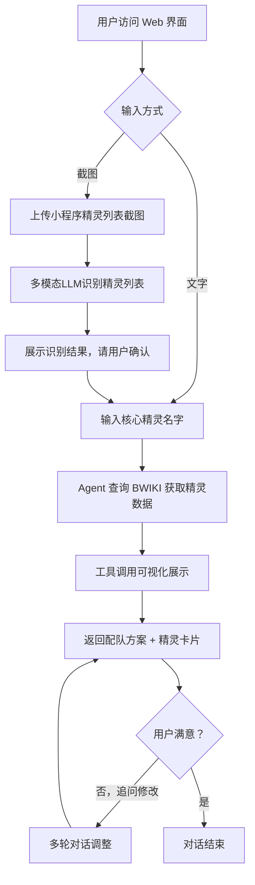

# 产品需求文档 (PRD) v2.0

**项目名称**: 洛克王国世界配队 Agent（RoCo Team Builder）
**功能名称**: AI 驱动的精灵配队与培养助手
**文档状态**: 草稿 (Draft)
**版本号**: 1.0
**负责人**: Genesis Agent
**创建日期**: 2026-04-07

---

## 1. 执行摘要 (Executive Summary)

洛克王国世界玩家无法围绕自己喜爱的精灵获得个性化配队建议。本产品是一个公开 Web AI Agent，让玩家输入/上传自己拥有的精灵，获得针对性配队、技能调优和精灵百科查询服务。

---

## 2. 背景与上下文 (Background & Context)

### 2.1 问题陈述 (Problem Statement)
- **当前痛点**: 网上配队攻略均为通用 T0 推荐，不适配玩家心爱的特定精灵；玩家不知道如何围绕 1-3 只核心精灵合理搭配其余队员；技能配置调整缺乏针对性指导。
- **影响范围**: 所有中轻度洛克王国世界玩家，尤其是不愿照搬强势阵容、想玩自己喜欢的精灵的玩家。
- **业务影响**: 玩家因无法高效配队而降低游戏体验，导致游玩意愿下降。

### 2.2 核心机会 (Opportunity)
提供真正个性化的配队建议（基于玩家实际拥有的精灵），填补通用攻略与个人需求之间的鸿沟。游戏公测于 2026-03-26，处于用户爆发期，工具时效性强。

### 2.3 竞品与参考 (Reference & Competitors)
- **通用攻略站（游民星空/TapTap）**: 强度排行、T0 推荐，无个性化，无交互
- **B站攻略视频**: 内容丰富但无法实时查询，无针对性
- **我们的护城河**: 实时 BWIKI 数据 + 多模态（截图识别精灵列表）+ 基于玩家实际拥有精灵的个性化推理

---

## 3. 目标与范围 (Goals & Non-Goals)

### 3.1 目标 (Goals)
- **[G1]**: 用户输入核心精灵名字（或上传截图），Agent 返回完整配队建议（含定位说明和打法思路），响应速度取决于所选 LLM 模型能力
- **[G2]**: 精灵数据实时来自 BWIKI，确保与游戏当前版本的精灵技能/种族值一致
- **[G3]**: 支持多用户并发访问，单用户会话内上下文隔离，支持多轮追问修改
- **[G4]**: 截图精灵识别基于多模态 LLM，识别质量与所选模型能力正相关，现阶段主流多模态模型（GPT-4o/Gemini 1.5 Pro 级别）可覆盖绝大多数常规截图场景
- **[G5]**: 公开部署到公网，用户无需安装任何客户端，浏览器直接访问
- **[G6]**: Agent 具备基础游戏问答能力，不仅限于配队，也能回答属性克制、机制规则、精灵培养等通用问题

### 3.2 非目标 (Non-Goals)
- **[NG1]**: v1 不做个体值（天分数值）分析，仅基于种族值/系别/技能/血脉推理
- **[NG2]**: 不做用户账号体系（登录/注册/历史记录持久化），会话结束即清除
- **[NG3]**: 不做自动化实时游戏数据爬取调度，基础世界观知识（克制表/机制）由开发者手动维护更新
- **[NG4]**: 不做精灵强度 Tier List 生成或排行榜，专注个性化配队而非客观强度评价
- **[NG5]**: 不做 PVP 对战预测/对手分析，仅聚焦己方配队优化
- **[NG6]**: 不做移动端原生 App，仅 Web 端（响应式布局兼顾移动浏览器）
- **[NG7]**: 不在服务端存储用户 API Key，用户密钥仅保存在用户本地浏览器（localStorage），不上传云端

---

## 4. 用户故事与需求清单 (User Stories)

### US-001: 围绕核心精灵获得个性化配队 [REQ-001] (优先级: P0)

- **故事描述**: 作为一个洛克王国世界玩家，我想要告诉 Agent 我喜欢哪 1-3 只精灵，让它围绕这些精灵为我推荐完整的 6 只配队，以便于我能用自己心爱的精灵打出有竞争力的阵容。
- **用户价值**: 告别通用攻略，得到真正属于自己的配队方案。
- **独立可测性**: 输入"我想围绕恶魔狼和翼王配一套PVP队"，验证返回包含：6只精灵名称、各自定位说明、整体打法思路、至少一条针对核心精灵弱点的补位说明。
- **涉及系统**: `agent-backend-system`, `data-layer-system`, `web-ui-system`
- **验收标准 (Acceptance Criteria)**:
  - [ ] **Given** 用户输入 1-3 只核心精灵名字，**When** 发送消息，**Then** Agent 返回含 6 只精灵的配队方案，并说明每只精灵的定位和选取理由（响应速度取决于所选 LLM）。
  - [ ] **Given** 推荐精灵中有用户未拥有的，**When** Agent 生成推荐时，**Then** 主动询问用户是否拥有该精灵，并在用户回答"没有"后切换为其他候选。
  - [ ] **异常处理**: 当用户输入的精灵名在 BWIKI 中查询不到时，Agent 反馈"未找到该精灵，请确认名字是否正确"并给出相似名称建议（模糊匹配）。
- **边界与极限情况**:
  - 用户输入 6 只核心精灵（已满员）：Agent 仅分析现有队伍合理性，不强行替换
  - 用户输入的精灵尚未进化：Agent 将其视为进化后形态纳入推荐，并说明需要进化

---

### US-002: 上传精灵列表截图，从已有精灵中组队 [REQ-002] (优先级: P0)

- **故事描述**: 作为一个玩家，我想要截图我在小程序里的精灵列表并上传给 Agent，让它从我实际拥有的精灵中为我推荐最优配队，以便于我不需要手动整理精灵名单。
- **用户价值**: 零门槛输入，Agent 自动识别我有什么精灵，推荐切实可用的队伍。
- **独立可测性**: 上传包含至少 10 只精灵名字的截图，验证 Agent 识别精灵名称列表（识别质量取决于所选多模态模型），并基于识别结果给出配队建议。
- **涉及系统**: `agent-backend-system`, `data-layer-system`, `web-ui-system`
- **验收标准 (Acceptance Criteria)**:
  - [ ] **Given** 用户上传小程序精灵列表截图，**When** Agent 收到图片，**Then** 调用多模态 LLM 识别精灵名称列表，展示已识别的精灵清单并请用户确认。
  - [ ] **Given** 用户确认精灵列表，**When** 发送确认，**Then** Agent 基于列表内精灵推荐配队，不推荐列表外的精灵（除非用户要求）。
  - [ ] **异常处理**: 截图中精灵名字模糊/遮挡导致识别失败时，Agent 列出不确定项并请用户手动补充。
- **边界与极限情况**:
  - 截图包含未进化精灵：识别为进化前形态，推荐时标注"需进化后使用"
  - 截图精灵数量极少（仅 1-2 只）：Agent 说明精灵不足以组成完整队伍，建议补充或混合输入

---

### US-003: 调优当前队伍的技能配置 [REQ-003] (优先级: P1)

- **故事描述**: 作为一个玩家，我想要告诉 Agent 我现在 6 只精灵的名字，让它分析当前技能配置是否合理并给出调整建议，以便于我在不换精灵的前提下提升队伍强度。
- **用户价值**: 不换阵容也能提升战斗力，低成本优化现有队伍。
- **独立可测性**: 输入 6 只精灵名字，验证 Agent 返回：每只精灵的推荐技能配置（4技能）、配置理由、精灵之间的协作点（如连招/补位）。
- **涉及系统**: `agent-backend-system`, `data-layer-system`, `web-ui-system`
- **验收标准 (Acceptance Criteria)**:
  - [ ] **Given** 用户输入当前 6 只精灵名字，**When** 请求技能调优，**Then** Agent 针对每只精灵给出推荐的 4 技能组合及理由。
  - [ ] **Given** Agent 给出技能建议后，**When** 用户说"第三只我不想换技能"，**Then** Agent 保留该精灵技能不变，仅调整其余精灵建议。
  - [ ] **异常处理**: 用户指定的技能该精灵学不了（血脉不匹配）时，Agent 说明原因并推荐替代技能。
- **边界与极限情况**:
  - 用户只提供精灵名字、未说明场景（PVE/PVP）：Agent 主动询问场景再给建议
  - 用户队伍有重复系别覆盖/明显短板：Agent 在技能建议中顺带指出结构问题

---

### US-004: 查询单只精灵的详细资料 [REQ-004] (优先级: P1)

- **故事描述**: 作为一个玩家，我想要查询任意精灵的种族值、技能、系别、血脉类型和进化链，以便于我在培养或配队前做出有据可依的决策。
- **用户价值**: 随时获取精灵完整数据，无需自己去 BWIKI 翻查。
- **独立可测性**: 输入"告诉我火神的资料"，验证 Agent 返回：种族值 6 维数据、系别、可学技能列表、血脉类型、进化链、BWIKI 跳转链接，并在对话中展示精灵卡片 UI。
- **涉及系统**: `agent-backend-system`, `data-layer-system`, `spirit-card-system`, `web-ui-system`
- **验收标准 (Acceptance Criteria)**:
  - [ ] **Given** 用户询问某精灵资料，**When** Agent 调用 get_spirit_info，**Then** 在对话中渲染精灵卡片（含种族值图表/数值、系别标签、技能列表），卡片底部附 BWIKI 对应页面链接。
  - [ ] **Given** 精灵有多个进化分支，**When** 展示进化链，**Then** 列出所有分支及进化条件。
  - [ ] **异常处理**: BWIKI 请求超时（>5s），Agent 说明数据暂时无法获取并提供 BWIKI 链接供用户自行查看。
- **边界与极限情况**:
  - 用户输入精灵简称或别名（如"水狗"）：Agent 尝试模糊匹配，若有多个候选则列出让用户确认

---

### US-005: 多轮对话追问修改配队方案 [REQ-005] (优先级: P1)

- **故事描述**: 作为一个玩家，我想要在 Agent 给出配队建议后，继续追问修改（如"把第三只换成我的鳗尾兽"），让它实时调整方案，以便于我能反复打磨出真正满意的配队。
- **用户价值**: 配队是迭代过程，一次对话内多轮修改，无需重新开始。
- **独立可测性**: 先获取一次配队建议，再说"把第4位换成幽灵犬"，验证 Agent 仅替换第4位并重新分析队伍平衡性，其余5位保持不变。
- **涉及系统**: `agent-backend-system`, `web-ui-system`
- **验收标准 (Acceptance Criteria)**:
  - [ ] **Given** Agent 已给出配队方案，**When** 用户要求替换某位精灵，**Then** Agent 更新方案并重新分析整队平衡性（弱点覆盖/速度档位）。
  - [ ] **Given** 会话内已确认用户拥有的精灵列表，**When** 用户追问，**Then** Agent 记住该列表，不重复询问。
  - [ ] **异常处理**: 会话超时（30分钟无操作）后上下文清除，用户再次发送消息时 Agent 友好提示需重新输入信息。
- **边界与极限情况**:
  - 会话内上下文长度过长（超过 LLM 上下文窗口）：自动压缩早期对话历史，保留核心精灵列表和最新配队状态

---

## 5. 用户体验与设计 (User Experience)

### 5.1 关键用户旅程 (Key User Flows)

### 5.2 交互规范 (Design Guidelines)
- **视觉风格**: ChatGPT 风格对话界面（Open WebUI），深色/浅色主题均支持
- **工具调用展示**: 每次工具调用在对话中以折叠卡片展示（工具名+输入+输出），可点击展开，提供"终端感"
- **精灵卡片**: 内嵌在消息中，展示系别色标签、种族值数值/雷达图、4技能列表、BWIKI 跳转链接
- **平台兼容**: 主要面向桌面浏览器，响应式布局兼顾移动浏览器（不做原生App）

---

## 6. 约束与限制 (Constraint Analysis)

### 6.1 技术约束 (Technical Constraints)
- **LLM 依赖**: 截图识别需多模态模型（GPT-4o / Gemini 1.5 Pro），文字推理可用成本更低模型
- **BWIKI 访问**: CC BY-NC-SA 4.0，非商业使用需署名；实时查询需做本地缓存避免频繁请求
- **数据时效**: BWIKI 精灵数据由社区维护，可能落后游戏版本；预载的克制表/机制需手动维护
- **并发规模**: `[ASSUMPTION]` v1 目标支持 50 并发会话，Open WebUI + Docker 部署单机可满足

### 6.2 安全与合规 (Security & Compliance)
- **数据安全**: 不持久化任何用户输入（精灵名单、截图），会话结束即清除
- **LLM API Key — 双轨架构**:
  - **内置模型轨道**: 部署者在服务端通过环境变量配置 API Key，不暴露给前端，用于提供开箱即用体验
  - **用户自带 Key 轨道 (BYOK)**: 用户在前端自行输入并配置自己的 LLM API Key 和模型，Key 仅存储在用户本地浏览器（`localStorage`），**不经过服务端，不上传云端**；请求由前端直接发往 LLM Provider 或通过无状态代理转发
  - **防薅保护**: 内置模型轨道可配置每 IP/会话的 Token 用量限额，超限提示用户切换自带 Key
- **版权合规**: BWIKI 数据遵循 CC BY-NC-SA 4.0，界面注明数据来源；精灵卡片内嵌 BWIKI 链接

### 6.3 时间与资源 (Time & Resources)
- **交付目标**: `[ASSUMPTION]` 个人开发，无硬性 Deadline，按模块迭代交付
- **费用控制**: `[ASSUMPTION]` LLM API 调用费用由部署者承担；v1 不做用量计费，需关注 API 费用

---

## 7. 成功指标 (Success Metrics)

| 核心指标 | 目标值 | 测量方式 |
|---------|--------|---------|
| 配队响应时间 | 取决于所选 LLM，流式输出确保首 token < 3s | 前端计时日志 |
| 截图识别精灵名称准确率 | 取决于所选多模态模型，GPT-4o 级别预期 > 90% | 人工抽样评估 |
| BWIKI 查询成功率 | ≥ 99%（含缓存兜底） | 工具调用日志 |
| 会话隔离正确率 | 100% | 集成测试 |

---

## 8. 完成标准 (Definition of Done)

- [ ] 所有 P0 User Story（REQ-001, REQ-002）验收标准全部通过
- [ ] 所有 P1 User Story（REQ-003, REQ-004, REQ-005）验收标准全部通过
- [ ] 多用户并发会话隔离测试通过（≥ 10 并发）
- [ ] BWIKI 缓存层生效，重复查询不重复请求外部接口
- [ ] 精灵卡片 UI 在 Chrome/Firefox/Safari 均正常渲染
- [ ] LLM API Key 通过环境变量注入，无硬编码
- [ ] BWIKI 数据来源在界面中注明（CC BY-NC-SA 4.0）
- [ ] Docker Compose 部署文档完整，从克隆到运行 < 10 分钟

---

## 9. 附录 (Appendix)

### 9.1 术语表 (Glossary)
参见 `.anws/v1/concept_model.json` 中的 `glossary` 字段。

### 9.2 参考资料 (References)
- BWIKI 精灵图鉴: https://wiki.biligame.com/rocom/精灵图鉴
- BWIKI 首页: https://wiki.biligame.com/rocom/首页
- 属性克制参考: https://www.gamersky.com/handbook/202603/2110424.shtml
- Open WebUI Rich UI 文档: https://docs.openwebui.com/features/extensibility/plugin/development/rich-ui/
- OpenAI Agents SDK: https://github.com/openai/openai-agents-python
