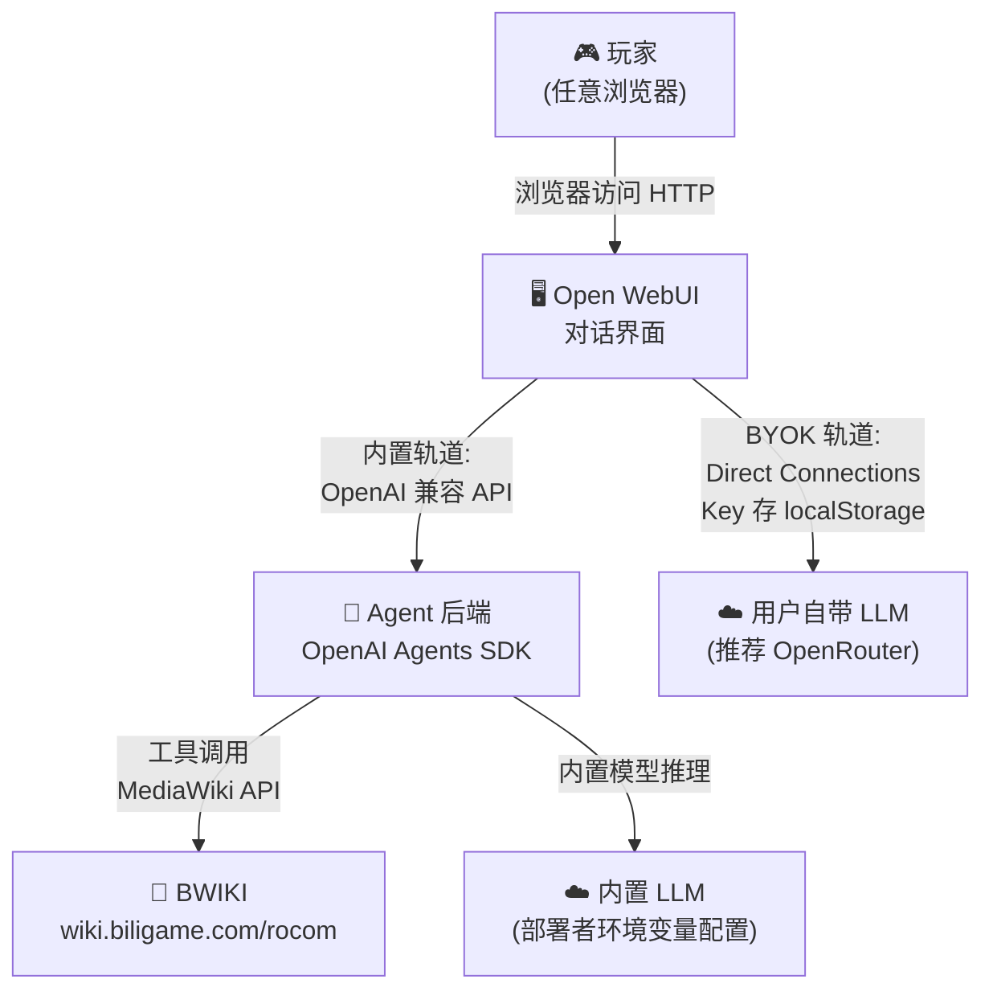
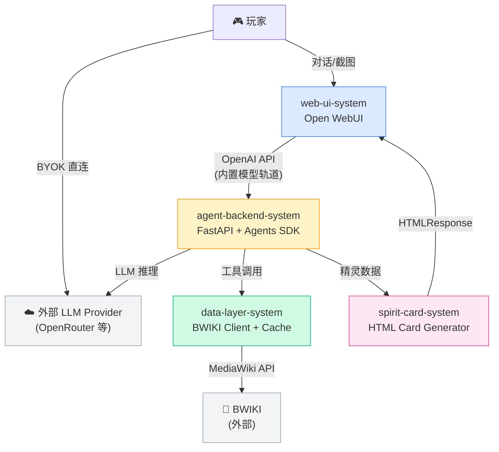

# 系统架构总览 (Architecture Overview)

**项目**: 洛克王国世界配队 Agent（RoCo Team Builder）
**版本**: 1.0
**日期**: 2026-04-07
**ADR 参考**: `03_ADR/ADR_001_TECH_STACK.md`

---

## 1. 系统上下文 (System Context)

### 1.1 C4 Level 1 - 系统上下文图



> **注**: BYOK 路径中，Key 由 Open WebUI 前端直接持有并发出请求，**不经过 Agent 后端服务端**。官方 OpenAI API 有 CORS 限制，推荐用户配置 OpenRouter 作为统一入口（详见 ADR-001）。

### 1.2 关键用户 (Key Users)
- **玩家（终端用户）**: 浏览器访问 Web 界面，输入精灵名字/上传截图，获取配队建议
- **部署者（管理员）**: 通过环境变量配置内置 LLM API Key，管理 Open WebUI 设置和用量限制

### 1.3 外部系统 (External Systems)
- **BWIKI** (`wiki.biligame.com/rocom/api.php`): MediaWiki API，精灵实时数据来源，CC BY-NC-SA 4.0
- **LLM Provider（内置）**: 部署者配置，用于提供开箱即用体验（推荐 OpenRouter）
- **LLM Provider（BYOK）**: 用户自带，通过 Direct Connections 从浏览器直连，Key 不经服务端

---

## 2. 系统清单 (System Inventory)

### System 1: Web UI 系统
**系统 ID**: `web-ui-system`

**职责**:
- 提供 ChatGPT 风格的对话界面（深色/浅色主题）
- 管理 BYOK（Direct Connections，用户 API Key 仅存 localStorage）
- 渲染 Rich UI 精灵卡片（工具调用返回的 HTML 内嵌在消息中）
- 展示工具调用折叠卡片（工具名/输入/输出可展开）
- 用量管理（内置模型轨道的 Token 配额显示）

**边界**:
- **输入**: 用户文字消息、截图上传、API Key 配置
- **输出**: OpenAI 兼容 API 请求（发往 Agent 后端或 BYOK Provider）
- **依赖**: `agent-backend-system`（内置轨道）、外部 LLM Provider（BYOK 轨道）

**关联需求**: REQ-001, REQ-002, REQ-003, REQ-004, REQ-005

**技术栈**:
- Platform: Open WebUI（`open-webui/open-webui` ⭐129k）
- Deployment: Docker Container（Port 3000）
- BYOK: `ENABLE_DIRECT_CONNECTIONS=true`
- Rich UI: Tools 返回 `HTMLResponse` 内嵌精灵卡片

**设计文档**: `04_SYSTEM_DESIGN/web-ui-system.md`（待创建）

---

### System 2: Agent 后端系统
**系统 ID**: `agent-backend-system`

**职责**:
- 暴露 OpenAI 兼容 API（`/v1/chat/completions`），供 Open WebUI 注册为自定义模型端点
- 管理多轮对话上下文（会话隔离，支持追问修改）
- 执行 Agent 推理循环（工具选择、调用、结果整合）
- 实现配队推理逻辑（弱点分析、速度档位、血脉类型检查）
- 处理截图多模态输入（图片传递给支持视觉的 LLM）

**边界**:
- **输入**: OpenAI Chat Completions 格式请求（含文字/图片消息）
- **输出**: OpenAI 流式响应（SSE），含工具调用事件
- **依赖**: `data-layer-system`（BWIKI 查询 + 本地数据）、外部 LLM Provider

**关联需求**: REQ-001, REQ-002, REQ-003, REQ-004, REQ-005

**工具清单**:

| 工具 | 功能 | 数据来源 |
|------|------|---------|
| `get_spirit_info(name)` | 查单只精灵完整数据 | BWIKI 实时 + 缓存 |
| `get_type_matchup(atk, def)` | 查属性克制关系 | 本地 JSON |
| `suggest_team(cores, owned, mode)` | 围绕核心精灵补全队伍 | LLM 推理 + 工具组合 |
| `adjust_team_skills(team, mode)` | 技能配置分析与建议 | LLM 推理 + BWIKI |
| `search_wiki(query)` | 兜底查询任意 BWIKI 内容 | BWIKI 实时 |
| `recognize_spirits_from_image(image)` | 截图识别精灵名称列表 | 多模态 LLM |

**技术栈**:
- Framework: FastAPI（Python 3.11+）
- Agent Runtime: OpenAI Agents SDK（`openai/openai-agents-python`）
- HTTP Server: uvicorn
- Deployment: Docker Container（Port 8000）

**设计文档**: `04_SYSTEM_DESIGN/agent-backend-system.md`（待创建）

---

### System 3: 数据层系统
**系统 ID**: `data-layer-system`

**职责**:
- 封装 BWIKI MediaWiki API 访问（查精灵页面内容、搜索词条）
- 本地 TTL 缓存（减少重复请求，避免触发 BWIKI 限流）
- 提供本地预载静态数据（17×17 属性克制矩阵、游戏机制知识）
- 精灵名称模糊匹配（处理用户输入别名/错别字）

**边界**:
- **输入**: 精灵名称、搜索关键词、属性类型对
- **输出**: 结构化精灵数据（JSON）、属性克制系数、BWIKI 链接
- **依赖**: 外部 BWIKI API（实时查询）

**关联需求**: REQ-001, REQ-002, REQ-003, REQ-004

**知识分层策略**:

| 层级 | 内容 | 注入方式 | 估算 Token |
|------|------|---------|-----------|
| **必载（System Prompt）** | 17种属性克制矩阵（压缩格式）、对战核心机制摘要 | 固定预载 | ~800 |
| **按需查询（工具调用）** | 精灵详情、物品效果、机制细节、任意词条 | `search_wiki` / `get_spirit_info` | — |

**BWIKI 查询范围**（`search_wiki` 兜底工具均可处理）:
- 精灵：种族值、系别、技能池、血脉、进化链、捕获点位
- 物品：效果说明、获取方式（适格钥匙、血脉秘药等）
- 机制：共鸣魔法详细规则、进化之力条件等

**静态数据清单**:
- `type_matchup.json`: 17 种属性的克制系数矩阵（压缩格式预载）
- `game_mechanics.md`: 对战核心机制摘要（魔力4点制/切换博弈/共鸣魔法简述）

**技术栈**:
- Language: Python 3.11+
- HTTP Client: `httpx`（异步）
- Cache: `cachetools`（内存 TTL Cache，TTL=1h）或 Redis（可选）
- Fuzzy Match: `rapidfuzz`

**设计文档**: `04_SYSTEM_DESIGN/data-layer-system.md`（待创建）

---

### System 4: 精灵卡片 UI 组件
**系统 ID**: `spirit-card-system`

**职责**:
- 渲染精灵信息的富媒体卡片（在 Open WebUI 对话消息中内嵌）
- 展示：系别色标签、种族值数值与可视化图表、技能列表（含技能类型/威力/PP）、血脉类型、进化链、BWIKI 跳转链接
- 响应式布局，适配桌面和移动浏览器

**边界**:
- **输入**: 精灵结构化数据（JSON）
- **输出**: HTML 字符串（由工具调用以 `HTMLResponse` 返回给 Open WebUI 渲染）
- **依赖**: `agent-backend-system`（触发时机）、`data-layer-system`（数据来源）

**关联需求**: REQ-004

**技术栈**:
- Template: Python Jinja2 或 f-string 模板生成 HTML
- Visualization: Chart.js（种族值六边形图，CDN 引入）
- Style: 内联 CSS（无外部依赖，保证 Open WebUI iframe 沙箱内可用）

**设计文档**: `04_SYSTEM_DESIGN/spirit-card-system.md`（待创建）

---

## 3. 系统边界矩阵 (System Boundary Matrix)

| 系统 | 输入 | 输出 | 依赖系统 | 被依赖系统 | 关联需求 |
|------|------|------|---------|-----------|---------|
| `web-ui-system` | 用户操作/图片上传/Key配置 | OpenAI API 请求 | `agent-backend-system` | — | 全部 |
| `agent-backend-system` | Chat Completions 请求 | 流式 SSE 响应 | `data-layer-system` | `web-ui-system` | 全部 |
| `data-layer-system` | 精灵名称/搜索词/属性对 | 结构化JSON/系数 | BWIKI（外部） | `agent-backend-system` | REQ-001~004 |
| `spirit-card-system` | 精灵数据JSON | HTML字符串 | — | `agent-backend-system` | REQ-004 |

---

## 4. 系统依赖图 (System Dependency Graph)



---

## 5. 技术栈总览 (Technology Stack Overview)

| Layer | Technology | System |
|-------|-----------|--------|
| **Web UI** | Open WebUI（Docker） | `web-ui-system` |
| **Agent Runtime** | OpenAI Agents SDK（Python） | `agent-backend-system` |
| **API 框架** | FastAPI + uvicorn | `agent-backend-system` |
| **BWIKI 客户端** | httpx + cachetools | `data-layer-system` |
| **静态知识** | JSON 文件（克制矩阵/机制） | `data-layer-system` |
| **精灵卡片** | Jinja2 HTML + Chart.js | `spirit-card-system` |
| **基础设施** | Docker Compose | 全部 |
| **LLM Provider** | OpenRouter（推荐）/ 任意 OpenAI 兼容端点 | 外部 |

---

## 6. 拆分原则与理由

### 为什么是 4 个系统？

| 维度 | 拆分理由 |
|------|---------|
| **部署单元** | `web-ui-system`（Open WebUI 容器）和 `agent-backend-system`（自建 FastAPI 容器）是两个独立 Docker 服务 |
| **技术栈** | Open WebUI 是现有开源项目（JS+Python 混合），Agent 后端是纯 Python 自建 |
| **变化频率** | 精灵卡片 UI 可能频繁调整样式，独立为 `spirit-card-system` 便于迭代 |
| **职责分离** | 数据访问（BWIKI + 缓存）独立为 `data-layer-system`，便于单独测试和扩展 |

### 为什么不进一步拆分？
- 无需单独的用户认证系统（Open WebUI 自带，且 v1 不强制登录）
- 无需消息队列或 Worker 进程（请求量不大，同步/异步 FastAPI 即可）
- 无需独立数据库系统（会话不持久化，缓存用内存即可，不引入 PostgreSQL）

---

## 7. 关键架构决策索引

| 决策 | ADR 文档 |
|------|---------|
| Agent 框架选型（OpenAI Agents SDK）| `03_ADR/ADR_001_TECH_STACK.md` |
| Web UI 框架选型（Open WebUI）| `03_ADR/ADR_001_TECH_STACK.md` |
| BYOK 实现路径（Direct Connections + OpenRouter）| `03_ADR/ADR_001_TECH_STACK.md` |
| 数据层缓存策略（cachetools 内存 TTL Cache）| `03_ADR/ADR_002_DATA_LAYER_CACHE.md` ✅ |
| 会话上下文管理（内存 Session + 单进程）| `03_ADR/ADR_003_SESSION_MANAGEMENT.md` ✅ |
| Agent ↔ Open WebUI 集成细节（FastAPI 注册为 OpenAI 内联端点）| `04_SYSTEM_DESIGN/agent-backend-system.md`（设计文档，非 ADR） |

---

## 8. 下一步行动

待 `/design-system` 分别为各系统创建详细设计文档，之后运行 `/blueprint` 生成任务清单：

```
/design-system agent-backend-system   ← 最核心，优先
/design-system data-layer-system
/design-system spirit-card-system
/design-system web-ui-system          ← 主要是配置文档
```
