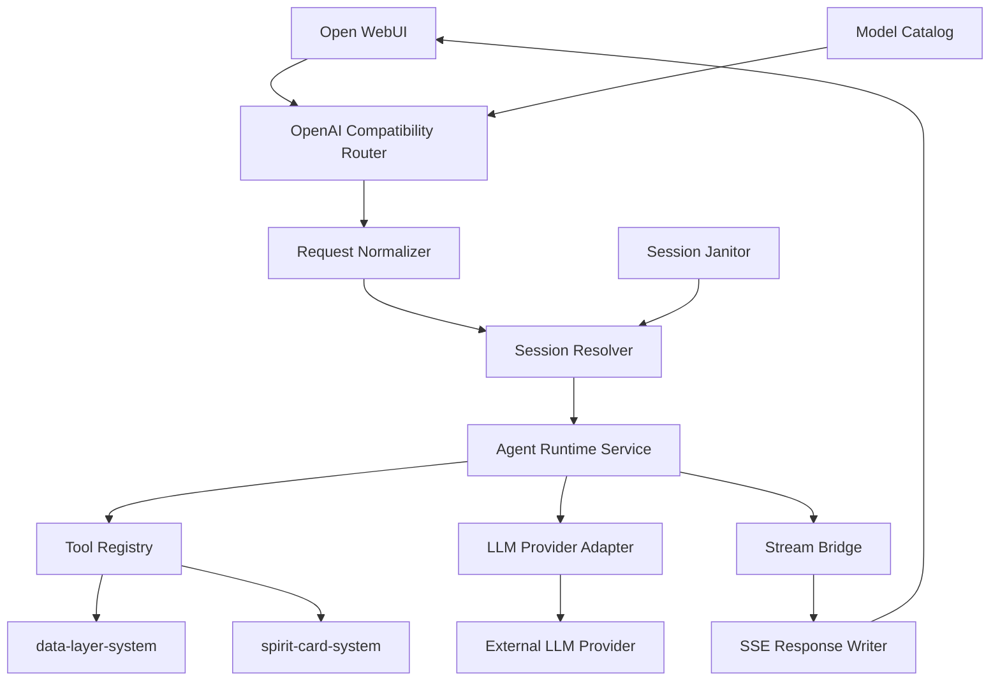

# 系统设计: agent-backend-system

**系统 ID**: `agent-backend-system`
**版本**: v1
**状态**: Draft
**日期**: 2026-04-07
**关联调研**: [`_research/agent-backend-system-research.md`](./_research/agent-backend-system-research.md)

---

## 1. 概览 (Overview)

`agent-backend-system` 是 RoCo Team Builder 的核心执行系统。它以 FastAPI 暴露 OpenAI 兼容接口，被 Open WebUI 作为自定义模型端点接入；在请求进入后，它负责：

- 接收并校验 OpenAI Chat Completions 请求
- 解析用户文本与图片输入，保留多模态内容
- 以 Agents SDK 驱动工具调用与推理循环
- 基于内存 Session 维护多轮对话上下文
- 以 OpenAI 兼容 SSE 形式流式输出结果

该系统是 `web-ui-system` 与 `data-layer-system` / `spirit-card-system` 之间的编排层与协议桥接层，对外提供稳定契约，对内屏蔽具体工具与模型差异。

---

## 2. 目标与非目标 (Goals & Non-Goals)

### 2.1 目标

- 支撑 [REQ-001], [REQ-002], [REQ-003], [REQ-004], [REQ-005]
- 向 Open WebUI 提供兼容的 `GET /v1/models` 与 `POST /v1/chat/completions`
- 支持文字 + 图片输入，不剥离 `messages[].content[]` 中的图片 part
- 支持单进程内多用户会话隔离与多轮追问
- 支持工具调用与结构化错误映射
- 流式首字节尽快返回，满足 PRD 中首 token 体验目标

### 2.2 非目标

- 不提供 BYOK 服务端转发；BYOK 仍由 Open WebUI Direct Connections 直接访问外部 Provider
- 不持久化用户会话到磁盘或数据库
- 不在 v1 支持多 worker / 多副本共享 session
- 不在 v1 实现自动上下文压缩
- 不在本系统内承担 BWIKI schema 解析细节或 Rich UI 视觉细节

---

## 3. 背景与上下文 (Background & Context)

### 3.1 关联需求

- **[REQ-001]** 围绕核心精灵生成个性化配队
- **[REQ-002]** 上传截图识别精灵列表并组队
- **[REQ-003]** 调优当前队伍的技能配置
- **[REQ-004]** 查询单只精灵资料并触发精灵卡片渲染
- **[REQ-005]** 多轮对话内追问修改，保持上下文

### 3.2 核心职责

一句话概括：**将 Open WebUI 发来的 OpenAI 兼容请求，稳定地转换为 Agents SDK 驱动的推理与工具调用，并再转换回 OpenAI 兼容流式响应。**

### 3.3 边界

- **边界内**
  - OpenAI 兼容 API surface
  - 请求解析、参数规范化、错误映射
  - Session key 解析与内存会话管理
  - Agent 调度、模型 provider 配置、工具注册
  - SSE 流式桥接
- **边界外**
  - Open WebUI 自身 UI 与模型注册界面
  - BWIKI 数据抓取、缓存策略实现细节
  - 精灵卡片 HTML 模板实现细节
  - BYOK 直连请求链路

### 3.4 依赖关系

- **上游依赖**: `web-ui-system`
- **下游依赖**: `data-layer-system`, `spirit-card-system`, 外部 LLM Provider
- **继承约束**:
  - PRD: 不持久化用户数据，会话结束即清除
  - ADR-001: Open WebUI + Agents SDK + OpenAI 兼容端点集成
  - ADR-002: 数据层缓存为内存 TTL
  - ADR-003: 会话为内存态，单进程 `--workers 1`

---

## 4. 系统架构 (Architecture)

### 4.1 架构模式

采用**分层模块化单体**：

- **Compatibility API Layer**: 对外暴露 OpenAI 兼容接口
- **Application Layer**: 编排请求生命周期、session、stream bridge
- **Agent Runtime Layer**: Agents SDK Agent/Runner/provider/tools
- **Integration Layer**: `data-layer-system` / `spirit-card-system` / 外部 LLM

### 4.2 Mermaid 架构图



### 4.3 组件说明

| 组件 | 职责 | 关键输入 | 关键输出 |
|------|------|---------|---------|
| `OpenAI Compatibility Router` | 暴露 `/v1/models`、`/v1/chat/completions` | HTTP 请求 | 领域请求对象 / HTTP 响应 |
| `Request Normalizer` | 规范化请求参数，保留多模态内容 | OpenAI 请求 JSON | `ChatRequestContext` |
| `Session Resolver` | 从 header 提取并管理 session key | 请求头 | `SessionHandle` |
| `Agent Runtime Service` | 运行 Agent、注入工具、协调模型与上下文 | `ChatRequestContext` | runtime events |
| `Tool Registry` | 注册配队、资料查询、截图识别等工具 | runtime tool calls | 结构化工具结果 |
| `LLM Provider Adapter` | 初始化 `OpenAIProvider(..., use_responses=False)` | model id / env config | Agents SDK model/provider |
| `Stream Bridge` | 将 runtime events 转换为 OpenAI chunk | runtime events | chunk stream |
| `SSE Response Writer` | 输出标准 `text/event-stream` | chunk bytes | HTTP streaming body |
| `Model Catalog` | 对外公布可用“虚拟模型” | env config | `/v1/models` response |
| `Session Janitor` | 清理闲置内存会话 | session registry | 清理动作 |

### 4.4 建议目录结构

```text
src/agent_backend/
├── api/
│   ├── routes_openai.py
│   ├── schemas_openai.py
│   └── error_mapping.py
├── app/
│   ├── request_context.py
│   ├── session_service.py
│   ├── model_catalog.py
│   └── stream_bridge.py
├── runtime/
│   ├── agent_factory.py
│   ├── provider_factory.py
│   ├── tool_registry.py
│   └── prompting.py
├── integrations/
│   ├── data_layer_client.py
│   └── spirit_card_client.py
└── main.py
```

---

## 5. 接口设计 (Interface Design)

### 5.1 对外接口契约

| 操作 | 方法 | 路径 | 请求体 | 成功响应 | 失败响应 | 备注 |
|------|------|------|--------|---------|---------|------|
| 获取模型列表 | `GET` | `/v1/models` | 无 | OpenAI Models list | OpenAI error JSON | Open WebUI 会调用此接口探测模型 |
| 对话补全 | `POST` | `/v1/chat/completions` | OpenAI Chat Completions JSON | 非流式 JSON 或流式 SSE | OpenAI error JSON / mid-stream SSE error | **核心接口** |
| 健康检查 | `GET` | `/healthz` | 无 | `{status:"ok"}` | 5xx | 运维与容器探针 |
| 就绪检查 | `GET` | `/readyz` | 无 | `{status:"ready"}` | 503 | 校验模型目录与基础依赖初始化 |

### 5.2 `GET /v1/models` 契约

| 字段 | 类型 | 说明 |
|------|------|------|
| `object` | `string` | 固定 `list` |
| `data[]` | `array` | 模型列表 |
| `data[].id` | `string` | 对外暴露的虚拟模型 id，如 `roco-agent-default` |
| `data[].object` | `string` | 固定 `model` |
| `data[].owned_by` | `string` | 固定 `roco-agent` |
| `data[].metadata` | `object?` | 可选，供后续扩展 UI 展示 |

**设计约束**:
- 不直接暴露上游 Provider 的全部模型；只暴露受控的“虚拟模型目录”。
- 每个虚拟模型映射到一组后端配置：`provider_base_url`、`provider_model_name`、`supports_vision`、`temperature_policy`。

### 5.3 `POST /v1/chat/completions` 请求契约

| 字段 | 类型 | 约束 |
|------|------|------|
| `model` | `string` | 必须命中 `Model Catalog` |
| `messages` | `array` | 保留 OpenAI 格式，支持 string content 或 part list |
| `stream` | `boolean` | 缺省为 `false`；Open WebUI 主路径应传 `true` |
| `temperature` | `number?` | 可透传或由模型策略覆盖 |
| `top_p` | `number?` | 可选 |
| `max_tokens` / `max_completion_tokens` | `integer?` | 归一化后传模型层 |
| `tools` | `array?` | v1 对外忽略，由内部 Agent tools 主导 |
| `tool_choice` | `string/object?` | v1 不向外开放调用方自定义工具选择 |
| `metadata` | `object?` | Open WebUI 可能附加 chat metadata |

### 5.4 请求头契约

| Header | 来源 | 用途 | 是否必需 |
|--------|------|------|:--------:|
| `Authorization` | Open WebUI -> 后端 | 后端端点保护，可选 bearer 校验 | 否 |
| `X-OpenWebUI-User-Id` | Open WebUI | 用户隔离主键 | 是（若开启转发） |
| `X-OpenWebUI-Chat-Id` | Open WebUI metadata | 聊天隔离副键 | 推荐 |
| `X-OpenWebUI-User-Role` | Open WebUI | 审计/后续限流扩展 | 否 |
| `Content-Type: application/json` | 客户端 | 请求编码 | 是 |

### 5.5 Session key 解析契约

| 顺位 | 规则 | 结果 |
|------|------|------|
| 1 | 存在 `X-OpenWebUI-User-Id` 与 `X-OpenWebUI-Chat-Id` | `session_key = "{user_id}:{chat_id}"` |
| 2 | 仅存在 `X-OpenWebUI-User-Id` | `session_key = user_id` |
| 3 | 均缺失但请求体有外部会话标识 | 使用请求体外部 id |
| 4 | 全缺失 | 拒绝请求，返回 400 |

### 5.6 流式响应契约

| 项 | 约束 |
|----|------|
| Content-Type | `text/event-stream` |
| 编码格式 | 严格输出 `data: <json>\n\n` |
| 结束帧 | `data: [DONE]\n\n` |
| 首 token 前错误 | 返回非 200 + OpenAI error JSON |
| 流中错误 | 继续 200，发送带 `error` 顶层字段与 `finish_reason:"error"` 的 chunk，然后结束流 |

### 5.7 与内部系统的操作契约

| 调用方 | 被调方 | 操作 | 输入 | 输出 |
|------|------|------|------|------|
| `agent-backend-system` | `data-layer-system` | `get_spirit_info` | 精灵名 | 结构化精灵数据 |
| `agent-backend-system` | `data-layer-system` | `search_wiki` | 搜索词 | 结构化搜索结果 |
| `agent-backend-system` | `data-layer-system` | `get_type_matchup` | 属性组合 | 克制矩阵结果 |
| `agent-backend-system` | `spirit-card-system` | `render_spirit_card` | 精灵结构化数据 | HTML 片段 |

---

## 6. 数据模型 (Data Model)

### 6.1 `ModelCatalogEntry`

| 字段 | 类型 | 说明 |
|------|------|------|
| `public_model_id` | `str` | 对外模型 id |
| `provider_model_name` | `str` | 上游真实模型名 |
| `provider_base_url` | `str` | OpenAI 兼容 base URL |
| `supports_vision` | `bool` | 是否支持图片输入 |
| `enabled` | `bool` | 是否对外可用 |
| `default_temperature` | `float | None` | 默认温度 |

### 6.2 `ChatRequestContext`

| 字段 | 类型 | 说明 |
|------|------|------|
| `request_id` | `str` | 请求标识 |
| `session_key` | `str` | 会话键 |
| `model_entry` | `ModelCatalogEntry` | 选中的模型目录项 |
| `messages` | `list[dict]` | 原始或轻度归一化后的 messages |
| `stream` | `bool` | 是否流式 |
| `user_id` | `str` | Open WebUI user id |
| `chat_id` | `str | None` | Open WebUI chat id |
| `request_headers` | `dict[str, str]` | 保留审计所需头部 |

### 6.3 `SessionRecord`

| 字段 | 类型 | 说明 |
|------|------|------|
| `session_key` | `str` | 会话键 |
| `items` | `list[dict]` | 历史消息项 |
| `last_access_at` | `datetime` | 最近访问时间 |
| `lock` | `asyncio.Lock` | 会话级串行保护 |

### 6.4 `ToolResultEnvelope`

| 字段 | 类型 | 说明 |
|------|------|------|
| `tool_name` | `str` | 工具名 |
| `status` | `Literal["ok", "error"]` | 工具状态 |
| `payload` | `dict` | 结构化结果 |
| `display_payload` | `dict | None` | 供 Rich UI 展示的附加信息 |

### 6.5 `StreamChunkEnvelope`

| 字段 | 类型 | 说明 |
|------|------|------|
| `id` | `str` | completion id |
| `object` | `str` | 固定 `chat.completion.chunk` |
| `created` | `int` | Unix 时间戳 |
| `model` | `str` | 对外模型 id |
| `choices` | `list[dict]` | OpenAI chunk choices |
| `error` | `dict | None` | 仅在 mid-stream error 时出现 |

---

## 7. 技术选型 (Technology Stack)

| 层 | 技术 | 用途 |
|----|------|------|
| API Framework | FastAPI | HTTP 路由与校验 |
| HTTP Server | uvicorn | 单进程异步服务 |
| Agent Runtime | OpenAI Agents SDK | Agent、Runner、tool runtime |
| Provider Client | `AsyncOpenAI` / `OpenAIProvider` | OpenAI 兼容上游访问 |
| Session Storage | 自定义内存 store + `asyncio.Lock` | 非持久化多轮上下文 |
| Streaming | `StreamingResponse` | 手工输出 OpenAI SSE |
| Config | 环境变量 + Pydantic Settings | 安全配置注入 |

### 7.1 关键配置约束

| 配置项 | 值/策略 | 原因 |
|-------|---------|------|
| `use_responses` | `False` | 第三方 Provider 兼容 |
| `uvicorn workers` | `1` | Session 不跨进程共享 |
| `session_idle_ttl_minutes` | `30` | 满足 PRD 会话超时边界 |
| `provider_api_key` | 环境变量 | 禁止硬编码密钥 |
| `ENABLE_FORWARD_USER_INFO_HEADERS` | `true`（在 Open WebUI） | 提供用户/会话隔离头 |

---

## 8. Trade-offs & Alternatives

### 8.1 ADR 引用清单

> **决策来源**: [ADR-001: 技术栈选择](../03_ADR/ADR_001_TECH_STACK.md)
>
> 本系统实现 ADR-001 定义的 Open WebUI + OpenAI Agents SDK + OpenAI 兼容端点集成，不在此重复技术栈选型理由。

> **决策来源**: [ADR-002: 数据层缓存策略](../03_ADR/ADR_002_DATA_LAYER_CACHE.md)
>
> 本系统假定 `data-layer-system` 提供内存 TTL 缓存与有限并发保护，因此后端无需重复实现跨请求 BWIKI 缓存。

> **决策来源**: [ADR-003: 会话上下文管理策略](../03_ADR/ADR_003_SESSION_MANAGEMENT.md)
>
> 本系统遵循“内存 Session + 单进程 `--workers 1`”约束，不在此重复会话持久化决策理由。

### 8.2 本系统特有决策 1：为什么选择 `StreamingResponse`，而不是 `EventSourceResponse`

- **选择 A**: `StreamingResponse` + 手工 SSE framing
- **不选 B**: `EventSourceResponse`

**原因**:
- 我们需要严格输出 OpenAI Chat Completions chunk 格式与 `[DONE]` 结束帧。
- `EventSourceResponse` 更适合通用 SSE 事件流；而本项目的核心不是“有 SSE”，而是“字节级兼容 OpenAI SSE”。
- 手工 framing 更易针对 mid-stream error、finish_reason、空 delta 做兼容测试。

**代价**:
- 代码更底层，易错点更多。

**缓解**:
- 以契约测试锁定 chunk 序列与 headers。

### 8.3 本系统特有决策 2：为什么使用“虚拟模型目录”，而不是直接暴露上游 Provider 模型

- **选择 A**: `/v1/models` 返回受控虚拟模型
- **不选 B**: 直接透传 Provider `/models`

**原因**:
- 避免把上游模型命名、能力差异、实验模型直接泄露给 UI。
- 可以把 `supports_vision`、默认温度、成本策略等绑定到一个稳定模型 id。
- 将来更换 provider 时不影响 Open WebUI 中已保存的模型配置。

**代价**:
- 需要维护一层模型映射。

**缓解**:
- v1 目录保持极简，只暴露 1-3 个模型。

### 8.4 本系统特有决策 3：为什么 session key 采用 `user_id:chat_id` 组合

- **选择 A**: 组合键
- **不选 B**: 只用 `X-OpenWebUI-User-Id`
- **不选 C**: 后端自发 token/session id

**原因**:
- 只用 user id 会导致同一用户多个会话串上下文。
- 自己管理 session token 会复制 Open WebUI 已提供的会话边界，增加偶然复杂度。
- 组合键兼顾“用户隔离”和“聊天隔离”。

**代价**:
- 依赖 Open WebUI header 转发配置正确。

**缓解**:
- 缺失关键 header 时快速失败，并在健康/启动检查中输出告警。

### 8.5 本系统特有决策 4：为什么不使用 `SQLiteSession`

- **选择 A**: 自定义内存 `SessionStore`
- **不选 B**: `SQLiteSession`

**原因**:
- v1 目标是“会话结束即清除”，不是“轻量持久化”。
- `SQLiteSession` 会引入 sqlite 生命周期、schema、线程/连接管理；这不是本质复杂度。
- 自定义内存 store 更符合当前单进程与短生命周期约束。

**代价**:
- 需要自己实现 TTL 清理。

**缓解**:
- 使用统一 registry + janitor 定时器 + 上限保护。

---

## 9. 安全性考虑 (Security Considerations)

- **密钥管理**
  - Provider API Key 仅通过环境变量注入
  - 不回显到日志、不透传到前端
- **用户隔离**
  - 通过 `X-OpenWebUI-User-Id` / `X-OpenWebUI-Chat-Id` 建立 session 边界
  - 会话对象加锁，避免同一会话并发写入竞争
- **输入安全**
  - 只接受 OpenAI 兼容 JSON schema
  - 对 `model` 做白名单校验
  - 限制消息总大小、图片 data URL 总长度与单请求最大 token 预算
- **日志最小化**
  - 不记录完整图片 base64
  - 默认不记录用户原始消息全文，仅记录 request_id、session_key、模型 id、错误码
- **错误暴露控制**
  - 对外返回 OpenAI 风格错误对象
  - 对内保留完整栈与 provider 错误详情

---

## 10. 性能考虑 (Performance Considerations)

- **流式优先**
  - 请求一旦进入模型推理即尽快开始输出首块，避免 UI 长时间空白
- **单会话串行化**
  - 同一 `session_key` 的请求串行执行，避免上下文被并发污染
- **跨会话并发**
  - 不同 session 可并发运行，由 asyncio 调度
- **session 内存上限**
  - 为 registry 设置最大会话数与每会话消息条数上限，防止内存膨胀
- **工具结果瘦身**
  - 仅保留 Agent 真正需要的结构化字段，不把整页 wiki 原文灌入上下文
- **错误快速失败**
  - 非法模型、缺失 header、超大图片、超限请求在进入模型调用前失败

---

## 11. 测试策略 (Testing Strategy)

### 11.1 单元测试

- `Session Resolver`
  - `user_id + chat_id` 组合键解析
  - header 缺失与回退逻辑
- `Model Catalog`
  - 模型白名单与 provider 映射
- `Request Normalizer`
  - 文本消息、多模态消息、base64 data URL 保留
- `Error Mapper`
  - 400 / 401 / 429 / 5xx / mid-stream error 映射
- `Stream Bridge`
  - chunk 序列、空 delta、`[DONE]`

### 11.2 集成测试

- `GET /v1/models` 被 Open WebUI 兼容消费
- `POST /v1/chat/completions` 在 `stream=true` 时输出标准 SSE
- mid-stream provider error 被编码为错误 chunk 而不是断流裸异常
- 同一用户不同 chat_id 不串会话
- 上传图片消息时消息结构未被剥离

### 11.3 契约测试

- 对照 OpenAI Chat Completions chunk schema
- 校验响应头包含 `Content-Type: text/event-stream`
- 校验结束帧为 `data: [DONE]`
- 校验非流式与流式错误格式一致性

### 11.4 验收测试

- 对应 [REQ-001]~[REQ-005] 的端到端会话场景
- 10 并发会话隔离验证
- 30 分钟闲置会话清理验证

---

## 12. 部署与运维 (Deployment & Operations)

### 12.1 部署约束

- Docker 容器单实例运行
- `uvicorn --workers 1`
- 与 Open WebUI 处于同一 Docker Compose 网络
- 通过环境变量注入 provider API key、模型目录、日志级别

### 12.2 启动前检查

- `Model Catalog` 至少存在一个 enabled 模型
- 上游 `provider_base_url` 可达
- 必要环境变量存在
- Open WebUI 已开启用户头转发配置

### 12.3 运行时监控

- `request_count`, `error_count`, `stream_error_count`
- `active_sessions`, `expired_sessions`, `session_evictions`
- `llm_latency_ms`, `time_to_first_chunk_ms`
- `tool_call_count`, `tool_error_count`

---

## 13. 未来考虑 (Future Considerations)

- v2 将 `SessionStore` 抽象切换到 Redis，以支持多 worker / 多副本
- 引入会话摘要或压缩机制，但前提是仍兼容第三方 Chat Completions provider
- 为模型目录增加能力矩阵（视觉、推理、成本等级、上下文长度）
- 在兼容层支持更完整的 OpenAI 字段集，如 `response_format` 的部分受控开放

---

## 14. 附录 (Appendix)

### 14.1 外部来源

- FastAPI SSE 文档: https://fastapi.tiangolo.com/tutorial/server-sent-events/ （访问于 2026-04-07）
- OpenAI Agents SDK Models 文档: https://openai.github.io/openai-agents-python/models/ （访问于 2026-04-07）
- Open WebUI Rich UI 文档: https://docs.openwebui.com/features/extensibility/plugin/development/rich-ui/ （访问于 2026-04-07）
- OpenRouter Streaming 文档: https://openrouter.ai/docs/api/reference/streaming （访问于 2026-04-07）
- OpenAI Streaming 文档入口: https://developers.openai.com/api/docs/guides/streaming-responses （访问于 2026-04-07，正文抓取 403，相关结论已由本地源码交叉验证）

### 14.2 设计拆分检测

| 规则 | 结果 |
|------|------|
| R1 单个函数/算法伪代码 > 30 行 | ❌ |
| R2 所有代码块合计 > 200 行 | ❌ |
| R3 配置常量字典条目 > 5 个 | ❌ |
| R4 版本历史注释 > 5 处 | ❌ |
| R5 预计文档总行数 > 500 行 | ❌ |

**结论**: 本次仅生成 L0 文档，不创建 `.detail.md`。
