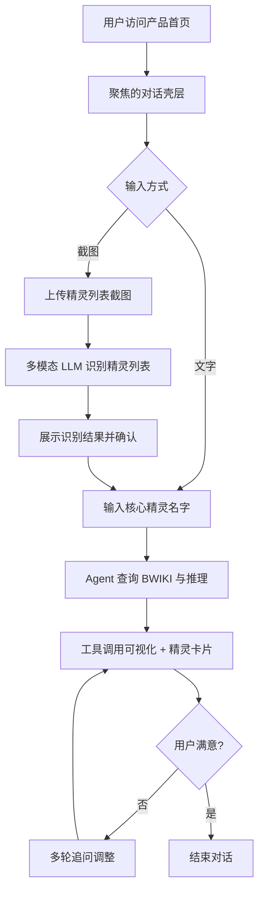

# 产品需求文档 (PRD) v2.0

**项目名称**: 洛克王国世界配队 Agent（RoCo Team Builder）
**功能名称**: AI 驱动的精灵配队与培养助手
**文档状态**: Draft
**版本号**: 2.0
**负责人**: Genesis Agent
**创建日期**: 2026-04-07

---

## 1. 执行摘要 (Executive Summary)

洛克王国世界玩家需要一个围绕自己实际拥有精灵进行个性化配队、技能调优和百科查询的 AI 助手。v2 在 v1 基础上进一步明确：本产品的前端并不是“通用 Open WebUI 实例”，而是**基于 Open WebUI 的受控产品壳层**，仅保留与本产品直接相关的对话、截图上传、BYOK 和 Rich UI 展示能力，并裁剪所有无关的通用平台能力。

---

## 2. 背景与上下文 (Background & Context)

### 2.1 问题陈述 (Problem Statement)
- **当前痛点**: 网上配队攻略均为通用 T0 推荐，不适配玩家心爱的特定精灵；玩家不知道如何围绕 1-3 只核心精灵合理搭配其余队员；技能配置调整缺乏针对性指导。
- **体验痛点**: 如果直接暴露一个“全量 Open WebUI”，用户会看到大量与本产品无关的通用 AI 工作台能力，增加学习成本和认知噪音，削弱产品聚焦度。
- **影响范围**: 所有中轻度洛克王国世界玩家，尤其是不愿照搬强势阵容、想玩自己喜欢的精灵的玩家。

### 2.2 核心机会 (Opportunity)
- 提供真正个性化的配队建议（基于玩家实际拥有的精灵），填补通用攻略与个人需求之间的鸿沟。
- 借助多模态输入降低门槛，让玩家通过截图直接获得可执行建议。
- 在产品层提供**单用途、低噪音、强聚焦**的前端体验，使用户不会被通用 AI 平台心智分散。

### 2.3 竞品与参考 (Reference & Competitors)
- **通用攻略站（游民星空/TapTap）**: 强度排行、T0 推荐，无个性化，无交互。
- **B站攻略视频**: 内容丰富但无法实时查询，无针对性。
- **通用 AI 前端工作台**: 功能很全，但对单一垂类产品而言，容易产生信息架构过载。
- **我们的护城河**: 实时 BWIKI 数据 + 多模态（截图识别精灵列表）+ 基于玩家实际拥有精灵的个性化推理 + 面向该场景收敛后的产品前端壳层。

---

## 3. 目标与范围 (Goals & Non-Goals)

### 3.1 目标 (Goals)
- **[G1]**: 用户输入核心精灵名字（或上传截图），Agent 返回完整配队建议（含定位说明和打法思路），响应速度取决于所选 LLM 模型能力。
- **[G2]**: 精灵数据实时来自 BWIKI，确保与游戏当前版本的精灵技能/种族值一致。
- **[G3]**: 支持多用户并发访问，单用户单聊天会话内上下文隔离，支持多轮追问修改。
- **[G4]**: 截图精灵识别基于多模态 LLM，识别质量与所选模型能力正相关。
- **[G5]**: 公开部署到公网，用户无需安装任何客户端，浏览器直接访问。
- **[G6]**: Agent 具备基础游戏问答能力，不仅限于配队，也能回答属性克制、机制规则、精灵培养等通用问题。
- **[G7]**: 前端界面应呈现为**聚焦配队助手的单用途产品**，而不是开放式通用 AI 工作台。
- **[G8]**: 基于 Open WebUI 构建前端，但必须对无关能力进行裁剪、隐藏或禁用，使终端用户只接触与本产品直接相关的功能入口。
- **[G9]**: 内置模型轨道是完整产品路径（Agent 推理 + 工具调用 + 精灵卡片 + 多轮上下文）；BYOK 轨道是受限直连模式（纯对话能力，无 Agent 工具链），产品界面必须对两条路径的能力差异做出显式标识，避免用户在 BYOK 下期望完整产品能力。

### 3.2 非目标 (Non-Goals)
- **[NG1]**: v1/v2 不做个体值（天分数值）分析，仅基于种族值/系别/技能/血脉推理。
- **[NG2]**: 不做用户账号体系（登录/注册/历史记录持久化），会话结束即清除。
- **[NG3]**: 不做自动化实时游戏数据爬取调度，基础世界观知识（克制表/机制）由开发者手动维护更新。
- **[NG4]**: 不做精灵强度 Tier List 生成或排行榜，专注个性化配队而非客观强度评价。
- **[NG5]**: 不做 PVP 对战预测/对手分析，仅聚焦己方配队优化。
- **[NG6]**: 不做移动端原生 App，仅 Web 端（响应式布局兼顾移动浏览器）。
- **[NG7]**: 不在服务端存储用户 API Key，用户密钥仅保存在用户本地浏览器（localStorage），不上传云端。
- **[NG8]**: 不把 Open WebUI 暴露为“全功能 AI 平台”；终端用户不可见与本产品无关的通用入口、工作台或实验性功能。
- **[NG9]**: 不在 v2 中支持多租户后台、插件市场、知识库运营台、通用文档工作区等产品化外延能力。

---

## 4. 用户故事与需求清单 (User Stories)

### US-001: 围绕核心精灵获得个性化配队 [REQ-001] (优先级: P0)
- **故事描述**: 作为一个洛克王国世界玩家，我想要告诉 Agent 我喜欢哪 1-3 只精灵，让它围绕这些精灵为我推荐完整的 6 只配队，以便于我能用自己心爱的精灵打出有竞争力的阵容。
- **用户价值**: 告别通用攻略，得到真正属于自己的配队方案。
- **独立可测性**: 输入“我想围绕恶魔狼和翼王配一套 PVP 队”，验证返回包含 6 只精灵名称、各自定位说明、整体打法思路、至少一条针对核心精灵弱点的补位说明。
- **涉及系统**: `agent-backend-system`, `data-layer-system`, `web-ui-system`
- **验收标准**:
  - [ ] **Given** 用户输入 1-3 只核心精灵名字，**When** 发送消息，**Then** Agent 返回含 6 只精灵的配队方案，并说明每只精灵的定位和选取理由。
  - [ ] **Given** 推荐精灵中有用户未拥有的，**When** Agent 生成推荐时，**Then** 主动询问用户是否拥有该精灵，并在用户回答“没有”后切换为其他候选。
  - [ ] **异常处理**: 当用户输入的精灵名在 BWIKI 中查询不到时，Agent 反馈“未找到该精灵，请确认名字是否正确”并给出相似名称建议。
- **边界与极限情况**:
  - 用户输入 6 只核心精灵（已满员）时，Agent 仅分析现有队伍合理性，不强行替换。
  - 用户输入的精灵尚未进化时，Agent 将其视为进化后形态纳入推荐，并说明需要进化。

---

### US-002: 上传精灵列表截图，从已有精灵中组队 [REQ-002] (优先级: P0)
- **故事描述**: 作为一个玩家，我想要截图我在小程序里的精灵列表并上传给 Agent，让它从我实际拥有的精灵中为我推荐最优配队，以便于我不需要手动整理精灵名单。
- **用户价值**: 零门槛输入，Agent 自动识别我有什么精灵，推荐切实可用的队伍。
- **独立可测性**: 上传包含至少 10 只精灵名字的截图，验证 Agent 识别精灵名称列表，并基于识别结果给出配队建议。
- **涉及系统**: `agent-backend-system`, `data-layer-system`, `web-ui-system`
- **验收标准**:
  - [ ] **Given** 用户上传小程序精灵列表截图，**When** Agent 收到图片，**Then** `web-ui-system` 必须先检查当前轨道/模型是否支持视觉能力；若支持，才调用多模态 LLM 识别精灵名称列表并展示已识别清单请用户确认。
  - [ ] **Given** 用户处于 BYOK 轨道且当前模型/连接不支持视觉，**When** 用户尝试发送截图，**Then** 前端必须在发送前阻止请求，并明确提示“当前轨道/模型不支持截图识别，请切换支持视觉的模型或切回内置轨道”，而不是等待 Provider 默认报错。
  - [ ] **Given** 用户确认精灵列表，**When** 发送确认，**Then** Agent 基于列表内精灵推荐配队，不推荐列表外的精灵（除非用户要求）。
  - [ ] **异常处理**: 截图中精灵名字模糊或遮挡导致识别失败时，Agent 列出不确定项并请用户手动补充。
- **边界与极限情况**:
  - 截图包含未进化精灵时，推荐中标注“需进化后使用”。
  - 截图精灵数量极少（仅 1-2 只）时，Agent 说明精灵不足以组成完整队伍。

---

### US-003: 调优当前队伍的技能配置 [REQ-003] (优先级: P1)
- **故事描述**: 作为一个玩家，我想要告诉 Agent 我现在 6 只精灵的名字，让它分析当前技能配置是否合理并给出调整建议，以便于我在不换精灵的前提下提升队伍强度。
- **用户价值**: 不换阵容也能提升战斗力，低成本优化现有队伍。
- **独立可测性**: 输入 6 只精灵名字，验证 Agent 返回每只精灵的推荐技能配置（4 技能）、配置理由和精灵之间的协作点。
- **涉及系统**: `agent-backend-system`, `data-layer-system`, `web-ui-system`
- **验收标准**:
  - [ ] **Given** 用户输入当前 6 只精灵名字，**When** 请求技能调优，**Then** Agent 针对每只精灵给出推荐的 4 技能组合及理由。
  - [ ] **Given** Agent 给出技能建议后，**When** 用户说“第三只我不想换技能”，**Then** Agent 保留该精灵技能不变，仅调整其余建议。
  - [ ] **异常处理**: 用户指定的技能该精灵学不了时，Agent 说明原因并推荐替代技能。
- **边界与极限情况**:
  - 用户只提供精灵名字、未说明场景（PVE/PVP）时，Agent 主动询问场景再给建议。
  - 用户队伍有重复系别覆盖或明显短板时，Agent 在技能建议中指出结构问题。

---

### US-004: 查询单只精灵的详细资料 [REQ-004] (优先级: P1)
- **故事描述**: 作为一个玩家，我想要查询任意精灵的种族值、技能、系别、血脉类型和进化链，以便于我在培养或配队前做出有据可依的决策。
- **用户价值**: 随时获取精灵完整数据，无需自己去 BWIKI 翻查。
- **独立可测性**: 输入“告诉我火神的资料”，验证 Agent 返回种族值 6 维数据、系别、可学技能列表、血脉类型、进化链、BWIKI 跳转链接，并在对话中展示精灵卡片 UI。
- **涉及系统**: `agent-backend-system`, `data-layer-system`, `spirit-card-system`, `web-ui-system`
- **验收标准**:
  - [ ] **Given** 用户询问某精灵资料，**When** Agent 调用 `get_spirit_info`，**Then** 在对话中渲染精灵卡片，并附 BWIKI 对应页面链接。
  - [ ] **Given** 精灵有多个进化分支，**When** 展示进化链，**Then** 列出所有分支及进化条件。
  - [ ] **异常处理**: BWIKI 请求超时（>5s）时，Agent 说明数据暂时无法获取并提供 BWIKI 链接。
- **边界与极限情况**:
  - 用户输入精灵简称或别名时，Agent 尝试模糊匹配；若有多个候选则列出确认。

---

### US-005: 多轮对话追问修改配队方案 [REQ-005] (优先级: P1)
- **故事描述**: 作为一个玩家，我想要在 Agent 给出配队建议后，继续追问修改，让它实时调整方案，以便于我能反复打磨出真正满意的配队。
- **用户价值**: 配队是迭代过程，一次对话内多轮修改，无需重新开始。
- **独立可测性**: 先获取一次配队建议，再说“把第 4 位换成幽灵犬”，验证 Agent 仅替换第 4 位并重新分析整队平衡性，其余 5 位保持不变。
- **涉及系统**: `agent-backend-system`, `web-ui-system`
- **验收标准**:
  - [ ] **Given** Agent 已给出配队方案，**When** 用户要求替换某位精灵，**Then** Agent 更新方案并重新分析整队平衡性。
  - [ ] **Given** 会话内已确认用户拥有的精灵列表，**When** 用户追问，**Then** Agent 记住该列表，不重复询问。
  - [ ] **异常处理**: 会话超时（30 分钟无操作）后上下文清除，用户再次发送消息时 Agent 友好提示需重新输入信息。
- **边界与极限情况**:
  - 对话轮数过多触发上下文限制时，提示用户开启新对话。

---

### US-006: 使用聚焦的垂类前端，而不是通用 AI 工作台 [REQ-006] (优先级: P0)
- **故事描述**: 作为一个普通玩家，我希望打开网站后看到的是专注于配队与精灵问答的界面，而不是一个包含大量通用 AI 功能入口的复杂工作台，以便于我能立即理解这个产品是干什么的。
- **用户价值**: 降低认知负担，提高首次使用成功率。
- **独立可测性**: 打开产品首页，验证终端用户只能看到与对话、截图上传、BYOK、工具结果展示直接相关的入口；看不到与产品无关的通用导航与工作台入口。
- **涉及系统**: `web-ui-system`
- **验收标准**:
  - [ ] **Given** 终端用户访问首页，**When** 页面加载完成，**Then** 界面只暴露聊天、图片上传、模型/Key 配置、结果展示等与产品直接相关的能力。
  - [ ] **Given** Open WebUI 原生存在通用工作台模块，**When** 用户进入终端使用路径，**Then** 这些模块应被隐藏、禁用或从导航中移除。
  - [ ] **Given** 用户处于 BYOK 轨道，**When** 发送消息，**Then** 界面应显式提示当前为「直连模式」，不具备配队工具、精灵卡片、BWIKI 查询等 Agent 增强能力。
  - [ ] **异常处理**: 若某些上游能力由于版本升级重新暴露，系统应在发布前通过回归检查识别并拦截。
- **边界与极限情况**:
  - 管理员可保留必要后台配置入口，但终端用户默认不可见。
  - 某些功能无法物理删除时，至少必须在产品壳层中不可达。

---

## 5. 用户体验与设计 (User Experience)

### 5.1 关键用户旅程 (Key User Flows)

### 5.2 交互规范 (Design Guidelines)
- **视觉风格**: Chat-first，对玩家友好，强调低噪音与单任务聚焦。
- **产品壳层原则**: 前端应表现为“RoCo Team Builder”，而不是“Open WebUI 的默认信息架构”。
- **工具调用展示**: 每次工具调用在对话中以折叠卡片展示（工具名/输入/输出可展开）。
- **精灵卡片**: 内嵌在消息中，展示系别色标签、种族值数值/图表、4 技能列表、BWIKI 跳转链接。
- **导航控制**: 不向终端用户暴露与产品目标无关的通用入口、试验入口、内容管理入口或平台化入口。
- **平台兼容**: 主要面向桌面浏览器，响应式布局兼顾移动浏览器。

---

## 6. 约束与限制 (Constraint Analysis)

### 6.1 技术约束 (Technical Constraints)
- **LLM 依赖**: 截图识别需多模态模型（GPT-4o / Gemini 1.5 Pro 级别），文字推理可用成本更低模型。
- **BWIKI 访问**: CC BY-NC-SA 4.0，非商业使用需署名；实时查询需做本地缓存避免频繁请求。
- **数据时效**: BWIKI 精灵数据由社区维护，可能落后游戏版本；预载机制需手动维护。
- **并发规模**: `[ASSUMPTION]` v2 目标支持 50 并发会话，单机 Docker 部署可满足。
- **前端基座约束**: 前端基于 Open WebUI，但需要在配置、路由、界面入口和可见功能层面进行裁剪与定制。

### 6.2 安全与合规 (Security & Compliance)
- **数据安全**: 不持久化任何用户输入（精灵名单、截图），会话结束即清除。
- **LLM API Key — 双轨架构（能力矩阵）**:
  - **内置模型轨道（完整产品路径）**: 部署者在服务端通过环境变量配置 API Key，不暴露给前端，用于提供开箱即用体验。请求经过 `agent-backend-system`，具备 Agent 推理、BWIKI 工具调用、精灵卡片渲染、多轮上下文隔离等完整能力。
  - **用户自带 Key 轨道 / BYOK（受限直连模式）**: 用户在前端自行输入并配置自己的 LLM API Key 和模型，Key 仅存储在用户本地浏览器（`localStorage`），不经过服务端，不上传云端。请求由浏览器直连 Provider，**不经过 Agent 后端**，因此不具备工具调用、BWIKI 数据、精灵卡片、会话隔离等 Agent 增强能力，仅提供纯对话体验。
  - **防薅保护**: 内置模型轨道可配置每 IP/会话的 Token 用量限额；该额度模型只作用于 builtin route，不作用于 BYOK。超限后的产品行为是拒绝继续走内置轨道，并明确提示用户切换自带 Key 或等待额度窗口重置；该语义必须与 Provider 限流区分，不能混同为默认 `RATE_LIMIT_` 报错。

  **双轨能力矩阵**:

  | 能力 | 内置轨道 | BYOK 轨道 |
  |------|:--------:|:---------:|
  | 纯文本对话 | ✅ | ✅ |
  | 截图上传识别 (REQ-002) | ✅ 多模态 LLM 经 Agent 处理 | ⚠️ 取决于所选模型 `supports_vision`；不支持时必须发送前拦截，而不是放任 Provider 默认失败 |
  | BWIKI 精灵数据查询 (REQ-001/003/004) | ✅ | ❌ |
  | 精灵卡片 Rich UI (REQ-004) | ✅ | ❌ |
  | 配队推理工具链 (REQ-001) | ✅ | ❌ |
  | 多轮上下文隔离 (REQ-005) | ✅ Agent Session | ⚠️ 仅依赖 Provider 原生上下文窗口 |
  | 会话超时清理 | ✅ 30 分钟 | N/A |

  > BYOK 轨道的定位是：当用户不想消耗内置额度、或希望使用自己偏好的模型进行通用对话时的补充路径。产品界面必须在 BYOK 轨道下显式降级 Agent 增强能力的相关 UI 暗示；当当前模型不支持视觉时，也必须在发送前给出明确能力拒绝语义。
- **版权合规**: BWIKI 数据遵循 CC BY-NC-SA 4.0，界面注明数据来源；精灵卡片内嵌 BWIKI 链接。

### 6.3 范围收敛约束 (Scope Discipline)
- 任何继承自 Open WebUI 但与本产品目标无关的能力，默认视为应被隐藏、禁用或移除的候选项。
- 前端不得演变为通用 AI 门户、知识工作台或平台型产品。
- 只有能直接支撑配队问答、截图识别、BYOK、Rich UI 展示的能力才允许进入终端用户主路径。

---

## 7. 成功指标 (Success Metrics)

| 核心指标 | 目标值 | 测量方式 |
|---------|--------|---------|
| 配队响应时间 | 取决于所选 LLM，流式输出确保首 token < 3s | 前端计时日志 |
| 截图识别精灵名称准确率 | 取决于所选多模态模型，主流模型预期 > 90% | 人工抽样评估 |
| BWIKI 查询成功率 | ≥ 99%（含缓存兜底） | 工具调用日志 |
| 会话隔离正确率 | 100% | 集成测试 |
| 首次使用理解度 | `[ASSUMPTION]` ≥ 80% 新用户可在 30 秒内理解产品用途 | 可用性测试 |
| 前端噪音控制 | 终端用户主导航中 0 个与产品无关入口 | UI 回归检查 |
| 内置额度提示可解释率 | 100% 内置轨道超限场景返回 `QUOTA_` 语义并带切换引导 | 错误分类抽样 + UI 回归检查 |
| 截图发送前能力拦截正确率 | 100% 非视觉模型上传截图时在发送前被拦截 | 交互测试 + 错误码对账 |
| 白名单验证资产通过率 | 100% 发布前快照/基线比对通过 | 发布前回归检查 |

---

## 8. 完成标准 (Definition of Done)

- [ ] 所有 P0 User Story（REQ-001, REQ-002, REQ-006）验收标准全部通过
- [ ] 所有 P1 User Story（REQ-003, REQ-004, REQ-005）验收标准全部通过
- [ ] 多用户并发会话隔离测试通过（≥ 10 并发）
- [ ] BWIKI 缓存层生效，重复查询不重复请求外部接口
- [ ] 精灵卡片 UI 在 Chrome/Firefox/Safari 均正常渲染
- [ ] LLM API Key 通过环境变量注入，无硬编码
- [ ] BWIKI 数据来源在界面中注明（CC BY-NC-SA 4.0）
- [ ] Open WebUI 无关能力已被隐藏、禁用或从终端用户路径移除
- [ ] 内置轨道额度模型、`QUOTA_` 错误语义与监控口径已在系统设计文档闭合
- [ ] 截图上传在 BYOK 轨道下的发送前视觉能力校验与 `CAPABILITY_` 失败语义已在系统设计文档闭合
- [ ] `VisibleFeaturePolicy` 的导出快照/基线已被指定为白名单唯一验证资产，并纳入发布前检查
- [ ] Docker Compose 部署文档完整，从克隆到运行 < 10 分钟

---

## 9. 附录 (Appendix)

### 9.1 术语表 (Glossary)
参见 `.anws/v2/concept_model.json`。

### 9.2 参考资料 (References)
- BWIKI 精灵图鉴: https://wiki.biligame.com/rocom/精灵图鉴 （访问于 2026-04-07）
- BWIKI 首页: https://wiki.biligame.com/rocom/首页 （访问于 2026-04-07）
- Open WebUI Rich UI 文档: https://docs.openwebui.com/features/extensibility/plugin/development/rich-ui/ （访问于 2026-04-07）
- OpenAI Agents SDK: https://github.com/openai/openai-agents-python （访问于 2026-04-07）
