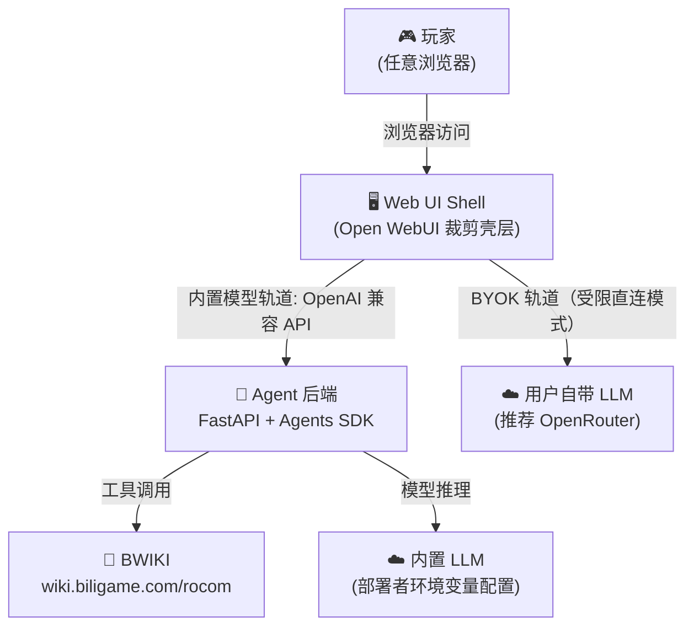
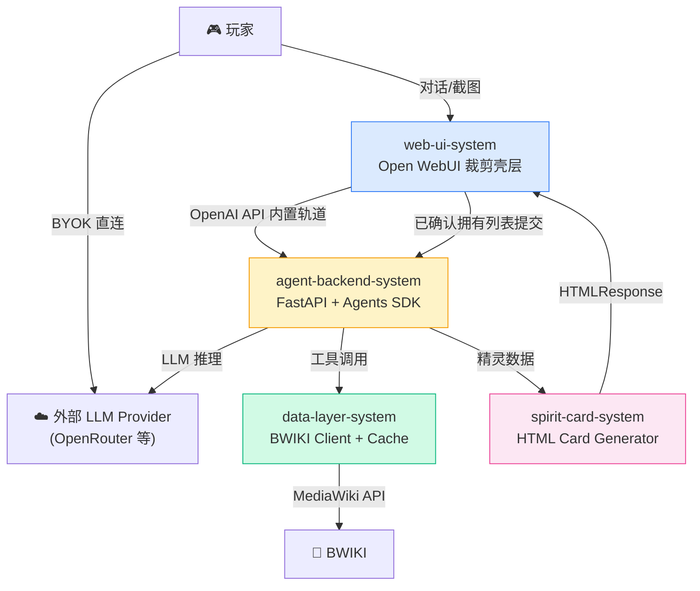

# 系统架构总览 (Architecture Overview)

**项目**: 洛克王国世界配队 Agent（RoCo Team Builder）
**版本**: 2.0
**日期**: 2026-04-07
**ADR 参考**: `03_ADR/ADR_001_TECH_STACK.md`, `03_ADR/ADR_004_WEB_UI_PRUNING_STRATEGY.md`

---

## 1. 系统上下文 (System Context)

### 1.1 C4 Level 1 - 系统上下文图



> **注**: `web-ui-system` 在 v2 被明确定义为“受控产品壳层”，不是原样暴露的 Open WebUI 全功能实例。BYOK 路径中，Key 由前端直接持有并发往 LLM Provider，不经过 Agent 后端，因此 **BYOK 是受限直连模式，不具备 Agent 工具调用、BWIKI 数据、精灵卡片等增强能力**。完整双轨能力矩阵见 `01_PRD.md` §6.2。

### 1.2 关键用户 (Key Users)
- **玩家（终端用户）**: 浏览器访问产品界面，输入精灵名字/上传截图，获取配队建议。
- **部署者（管理员）**: 通过环境变量配置内置 LLM API Key、管理 Open WebUI 的保留能力与上线配置。

### 1.3 外部系统 (External Systems)
- **BWIKI** (`wiki.biligame.com/rocom/api.php`): MediaWiki API，精灵实时数据来源，CC BY-NC-SA 4.0。
- **LLM Provider（内置）**: 部署者配置，用于提供开箱即用体验（推荐 OpenRouter）。其能力由 `agent-backend-system` 的 `Model Catalog` 对外收敛，截图是否可处理以 `supports_vision` 为统一能力字段。
- **LLM Provider（BYOK）**: 用户自带，通过 Direct Connections 从浏览器直连，Key 不经服务端。此路径不经过 Agent 后端，因此不具备工具调用、BWIKI 查询、精灵卡片、会话隔离等 Agent 增强能力；截图是否允许发送由 `web-ui-system` 基于当前模型能力执行发送前判断。

---

## 2. 系统清单 (System Inventory)

### System 1: Web UI 壳层系统
**系统 ID**: `web-ui-system`

**职责**:
- 提供 Chat-first 的产品化对话界面，承接文本输入、截图上传、结果展示。
- 管理 BYOK（Direct Connections，用户 API Key 仅存 `localStorage`），并在 BYOK 轨道下显式标识能力受限（无 Agent 工具链）。
- 渲染 Rich UI 精灵卡片与工具调用折叠卡片。
- 对 Open WebUI 原生能力进行**裁剪、隐藏、禁用、改名或收敛**，确保终端用户只暴露产品相关入口。
- 承担产品壳层的信息架构控制、品牌表达和终端用户路径收敛。
- 在截图发送前执行能力预检；当当前轨道/模型不支持视觉时，返回产品级能力错误而不是放任请求回流为 Provider 默认失败。
- 在内置轨道额度超限时承接显式引导，提示用户切换 BYOK 或等待额度窗口重置。
- 展示截图识别后的候选精灵清单，承接用户确认，并把确认后的 `ConfirmedOwnedSpiritList` 提交给 `agent-backend-system`。
- 在会话界面中显式提示“当前推荐基于已确认拥有列表”，避免把识别候选误呈现为已确认事实。

**边界**:
- **输入**: 用户文字消息、截图上传、识别候选 review/确认、API Key 配置、部署者配置。
- **输出**: OpenAI 兼容 API 请求（发往 `agent-backend-system` 或 BYOK Provider）、`ConfirmedOwnedSpiritList` 提交、Rich UI 消息展示。
- **依赖**: `agent-backend-system`（内置轨道）、外部 LLM Provider（BYOK 轨道）。

**关联需求**: REQ-001, REQ-002, REQ-003, REQ-004, REQ-005, REQ-006

**技术栈**:
- Base Platform: Open WebUI
- Product Shell Strategy: 受控配置 + 定向前端裁剪 + 有限品牌化定制
- Deployment: Docker Container（Port 3000）
- BYOK: `ENABLE_DIRECT_CONNECTIONS=true`
- Rich UI: iframe Embed / HTML Tool Result
- Validation Asset: `VisibleFeaturePolicy` 导出的白名单快照/基线

**设计文档**: `04_SYSTEM_DESIGN/web-ui-system.md`（必须创建，不再视为“仅配置文档”）

---

### System 2: Agent 后端系统
**系统 ID**: `agent-backend-system`

**职责**:
- 暴露 OpenAI 兼容 API（`/v1/models`, `/v1/chat/completions`），供 `web-ui-system` 注册为自定义模型端点。
- 管理多轮对话上下文（会话隔离，支持追问修改）。
- 执行 Agent 推理循环（工具选择、调用、结果整合）。
- 实现配队推理逻辑（弱点分析、速度档位、血脉类型检查）。
- 处理截图多模态输入（图片传递给支持视觉的 LLM）。
- 对内置轨道执行最小额度模型（每 IP/会话窗口、状态、超限错误与监控口径），并把额度超限与 Provider 限流明确区分。

**边界**:
- **输入**: OpenAI Chat Completions 格式请求（含文字/图片消息）。
- **输出**: OpenAI 流式响应（SSE），含工具调用事件。
- **依赖**: `data-layer-system`、外部 LLM Provider。

**关联需求**: REQ-001, REQ-002, REQ-003, REQ-004, REQ-005

**技术栈**:
- Framework: FastAPI（Python 3.11+）
- Agent Runtime: OpenAI Agents SDK
- HTTP Server: uvicorn
- Deployment: Docker Container（Port 8000）
- Shared Capability Source: `Model Catalog.supports_vision`

**设计文档**: `04_SYSTEM_DESIGN/agent-backend-system.md`（已在上一版本形成，需迁移/继承到 v2）

---

### System 3: 数据层系统
**系统 ID**: `data-layer-system`

**职责**:
- 封装 BWIKI MediaWiki API 访问。
- 提供本地 TTL 缓存，减少重复请求。
- 提供本地静态数据（属性克制矩阵、核心机制知识）。
- 处理精灵名称模糊匹配。

**边界**:
- **输入**: 精灵名称、搜索关键词、属性类型对。
- **输出**: 结构化精灵数据（JSON）、属性克制系数、BWIKI 链接。
- **依赖**: 外部 BWIKI API。

**关联需求**: REQ-001, REQ-002, REQ-003, REQ-004

**技术栈**:
- Language: Python 3.11+
- HTTP Client: `httpx`
- Cache: `cachetools` 内存 TTL Cache
- Fuzzy Match: `rapidfuzz`

**设计文档**: `04_SYSTEM_DESIGN/data-layer-system.md`（待创建）

---

### System 4: 精灵卡片系统
**系统 ID**: `spirit-card-system`

**职责**:
- 渲染精灵信息的富媒体卡片。
- 展示系别标签、种族值、技能列表、血脉类型、进化链、BWIKI 跳转链接。
- 适配 Open WebUI Rich UI 的 iframe 沙箱限制。

**边界**:
- **输入**: 精灵结构化数据（JSON）。
- **输出**: HTML 字符串。
- **依赖**: `agent-backend-system`, `data-layer-system`。

**关联需求**: REQ-004

**技术栈**:
- Template: Jinja2 HTML 或等效字符串模板
- Visualization: Chart.js（需遵守 Rich UI 沙箱约束）
- Style: 内联 CSS

**设计文档**: `04_SYSTEM_DESIGN/spirit-card-system.md`（待创建）

---

## 3. 系统边界矩阵 (System Boundary Matrix)

| 系统 | 输入 | 输出 | 依赖系统 | 被依赖系统 | 关联需求 |
|------|------|------|---------|-----------|---------|
| `web-ui-system` | 用户操作/图片上传/识别候选 review/确认/Key配置/平台配置 | OpenAI API 请求 / `ConfirmedOwnedSpiritList` 提交 / 富界面展示 | `agent-backend-system` | — | REQ-001~006 |
| `agent-backend-system` | Chat Completions 请求 / 已确认拥有列表写入 | 流式 SSE 响应 / 受 `ConfirmedOwnedSpiritList` 约束的推荐结果 | `data-layer-system` | `web-ui-system` | REQ-001~005 |
| `data-layer-system` | 精灵名称/搜索词/属性对 | 结构化 JSON/系数 | BWIKI（外部） | `agent-backend-system` | REQ-001~004 |
| `spirit-card-system` | 精灵数据 JSON | HTML 字符串 | — | `agent-backend-system` | REQ-004 |

---

## 3.5 跨系统错误分类矩阵 (Cross-System Error Classification Matrix)

> 本矩阵定义产品级错误的统一分类，各系统在设计错误处理时必须对齐此矩阵，确保终端用户体验一致。

| 错误类别 | 来源系统 | 错误码前缀 | 终端用户展示策略 | 可重试 |
|---------|---------|-----------|----------------|:------:|
| **会话标识缺失** | `agent-backend-system` | `SESSION_` | 提示刷新页面或重新打开聊天 | ❌ |
| **模型不可用** | `agent-backend-system` | `MODEL_` | 提示切换模型或稍后重试 | ✅ |
| **内置轨道额度超限** | `agent-backend-system` | `QUOTA_` | 提示内置额度已达上限，引导切换 BYOK 或等待额度窗口重置 | ❌ |
| **视觉能力不支持** | `web-ui-system`, `agent-backend-system` | `CAPABILITY_` | 提示当前轨道/模型不支持截图识别，建议切换支持视觉的模型或切回内置轨道 | ✅ |
| **Provider 限流** | `agent-backend-system` | `RATE_LIMIT_` | 提示稍后重试，或切换 BYOK | ✅ |
| **BWIKI 超时** | `data-layer-system` | `WIKI_TIMEOUT_` | 展示回退文案 + BWIKI 链接 | ✅ |
| **BWIKI 解析失败** | `data-layer-system` | `WIKI_PARSE_` | 展示回退文案 + BWIKI 链接 | ❌ |
| **精灵未找到** | `data-layer-system` | `SPIRIT_NOT_FOUND_` | 展示相似名称候选 | ❌ |
| **精灵名歧义** | `data-layer-system` | `SPIRIT_AMBIGUOUS_` | 展示候选列表供用户确认 | ❌ |
| **卡片渲染失败** | `spirit-card-system` | `CARD_RENDER_` | 使用 fallback_text 降级展示 | ❌ |
| **BYOK 连接失败** | `web-ui-system` (浏览器) | `BYOK_` | 提示检查 Key/网络/CORS | ✅ |
| **输入校验失败** | `agent-backend-system` | `VALIDATION_` | 提示输入格式要求 | ❌ |

**设计原则**:
- 每种错误必须有对应的终端用户文案策略，不允许裸异常泄漏
- 可重试错误应在 UI 上提供重试按钮或重试引导
- 涉及 BWIKI 失败的场景必须附 `wiki_url` 回退链接
- BYOK 轨道的错误归因必须指向用户侧（Key / Provider / 网络），而非系统内部
- `QUOTA_` 属于产品级内置额度语义，不得与 Provider `RATE_LIMIT_` 混用
- `CAPABILITY_` 属于产品能力边界语义；前端负责发送前拦截，后端负责最终兜底

---

## 3.6 跨系统共享对象与术语 (Shared Objects & Terms)

| 共享对象/术语 | 权威来源 | 统一含义 | 使用约束 |
|--------------|---------|---------|---------|
| `Model Catalog` | `agent-backend-system` | 对外暴露的受控模型目录与能力元数据，至少包含 `supports_vision` | 前后端都只能引用这套能力语义，不再平行引入 `vision_ready` 等别名 |
| `Builtin Quota` | `agent-backend-system` | 仅作用于内置轨道的产品额度模型，定义 owner、window、状态、超限动作与观测口径 | 不等同于单请求 token budget，也不等同于 Provider `RATE_LIMIT_` |
| `VisibleFeaturePolicy` | `web-ui-system` | 终端用户白名单真理源，定义哪些入口可见、哪些入口必须隐藏 | 其导出的快照/基线是白名单回归的唯一验证资产，人工清单只能作为辅助手段 |
| `Recognition Review` | `web-ui-system` | 截图识别后的候选精灵 review 交互态，等待用户确认，不代表已确认拥有事实 | 只能作为展示与确认输入，不得直接作为推荐约束真理源 |
| `ConfirmedOwnedSpiritList` | `agent-backend-system` | 当前 `user_id:chat_id` 会话内已确认拥有的精灵列表，是后续推荐默认约束输入 | 不持久化、不跨 chat 共享；只有用户显式要求时才允许突破该约束 |

---

## 4. 系统依赖图 (System Dependency Graph)



**关键跨系统闭环**:
1. 截图请求在 `web-ui-system` 完成视觉能力预检后，才允许走内置轨道进入 `agent-backend-system`。
2. `agent-backend-system` 返回识别候选后，`web-ui-system` 必须先展示 `Recognition Review`，由用户确认后再提交 `ConfirmedOwnedSpiritList`。
3. `ConfirmedOwnedSpiritList` 写入当前 `user_id:chat_id` 会话后，后续推荐默认只能在该列表内收敛；仅当用户显式要求时才允许突破约束。
4. BYOK 轨道不经过 `agent-backend-system`，因此不进入识别确认、工具调用、精灵卡片与会话约束闭环。

---

## 5. 技术栈总览 (Technology Stack Overview)

| Layer | Technology | System |
|-------|-----------|--------|
| **Web UI Shell** | Open WebUI（受控壳层） | `web-ui-system` |
| **Agent Runtime** | OpenAI Agents SDK（Python） | `agent-backend-system` |
| **API 框架** | FastAPI + uvicorn | `agent-backend-system` |
| **BWIKI 客户端** | httpx + cachetools | `data-layer-system` |
| **静态知识** | JSON / Markdown 文件 | `data-layer-system` |
| **精灵卡片** | Jinja2 HTML + Rich UI Embed | `spirit-card-system` |
| **基础设施** | Docker Compose | 全部 |
| **LLM Provider** | OpenRouter（推荐）/ 任意 OpenAI 兼容端点 | 外部 |

### 5.1 标准部署基线 (Standard Deployment Baseline)

- v2 的**唯一标准部署基线**是 Docker Compose；架构、设计、验收与交付文档都以此为准。
- 最小部署拓扑仅包含两个长期运行服务：`web-ui-system`（Port 3000）与 `agent-backend-system`（Port 8000）。
- v2 默认前提是**单机、单进程、单 worker**，不引入 Redis、数据库、消息队列或 Kubernetes 作为默认依赖。
- `agent-backend-system` 必须暴露 `healthz/readyz` 语义；`web-ui-system` 必须能在 Compose 基线上完成内置轨道注册与终端用户主路径验证。
- “**从 clone 到运行 < 10 分钟**”不是文档润色目标，而是产品交付型架构契约。

### 5.2 跨系统观测归属 (Cross-System Observability Ownership)

- `agent-backend-system` 持有核心运行指标：会话、额度、能力兜底、推荐约束命中与 override。
- `web-ui-system` 持有 UX 与发布回归指标：视觉发送前拦截、白名单回归、识别 review/确认链路可达性。
- 两侧指标必须共享统一错误语义（如 `QUOTA_`、`CAPABILITY_`），但不得重复定义彼此的真理源。

---

## 6. 物理代码结构规划 (Planned Physical Code Structure)

```text
src/
├── web-ui-shell/              ← Open WebUI 裁剪与产品壳层定制
├── agent-backend/             ← FastAPI + Agents SDK
├── data-layer/                ← BWIKI client + cache + static knowledge
└── spirit-card/               ← HTML card generator

.anws/
├── v1/                        ← 已归档的上一版架构文档
└── v2/                        ← 当前真理源
    ├── 00_MANIFEST.md
    ├── 01_PRD.md
    ├── 02_ARCHITECTURE_OVERVIEW.md
    ├── 03_ADR/
    ├── 04_SYSTEM_DESIGN/
    ├── 05_TASKS.md            (待 /blueprint)
    └── 06_CHANGELOG.md
```

---

## 7. 拆分原则与理由

### 为什么仍然是 4 个系统？

| 维度 | 拆分理由 |
|------|---------|
| **部署单元** | `web-ui-system` 与 `agent-backend-system` 仍是两个独立 Docker 服务 |
| **技术栈** | 前端壳层是 Open WebUI 定制面，后端是纯 Python，自然分离 |
| **职责分离** | 前端壳层负责信息架构与能力暴露控制；后端负责推理与编排 |
| **变化频率** | 前端壳层的产品收敛策略会持续演化，不应混入后端运行时 |

### 为什么 `web-ui-system` 不能被视为“只是配置文档”？

- 因为它承担**终端用户看到什么、看不到什么、如何理解产品边界**的核心职责。
- 因为 Open WebUI 是一个通用平台，而本产品需要的是垂类壳层；两者之间存在真实的产品化剪裁工作。
- 因为“隐藏/禁用/移除哪些能力”本身就是跨版本持续存在的架构问题，而不只是部署参数。

### 为什么不进一步拆分 `web-ui-system`？

- v2 阶段前端规模尚不足以拆为“壳层系统 + 主题系统 + 插件系统”。
- 当前最重要的是先定义清楚**保留能力与裁剪边界**，而不是引入更多抽象层。

---

## 8. 关键架构决策索引

| 决策 | ADR 文档 |
|------|---------|
| Agent 框架选型（OpenAI Agents SDK） | `03_ADR/ADR_001_TECH_STACK.md` |
| Web UI 基座选型（Open WebUI 作为壳层基座） | `03_ADR/ADR_001_TECH_STACK.md` |
| Open WebUI 裁剪与收敛策略 | `03_ADR/ADR_004_WEB_UI_PRUNING_STRATEGY.md` |
| 数据层缓存策略（cachetools 内存 TTL Cache） | `03_ADR/ADR_002_DATA_LAYER_CACHE.md` |
| 会话上下文管理（内存 Session + 单进程） | `03_ADR/ADR_003_SESSION_MANAGEMENT.md` |

---

## 9. 下一步行动

待 `/design-system` 分别为各系统创建或迁移详细设计文档，之后运行 `/blueprint` 生成任务清单：

```text
/design-system web-ui-system          ← v2 优先级上升，必须正式设计
/design-system data-layer-system
/design-system spirit-card-system
/blueprint
```

> `agent-backend-system` 已有设计基础，但应在迁移到 v2 后重新校对与最新 ADR 是否一致。
