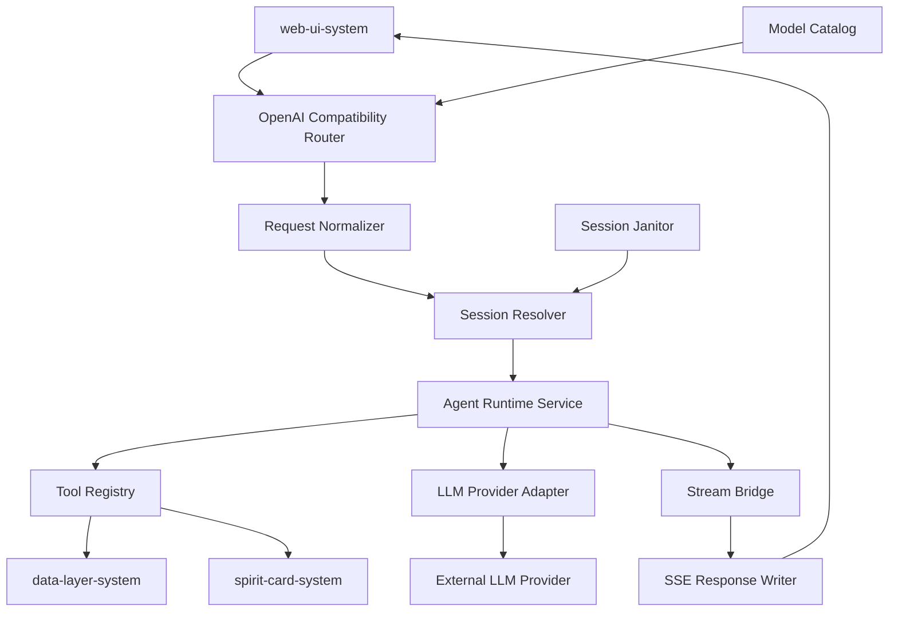
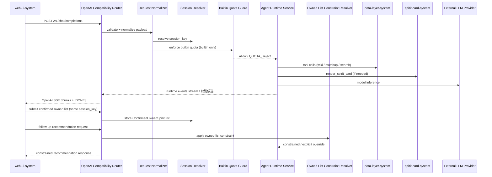
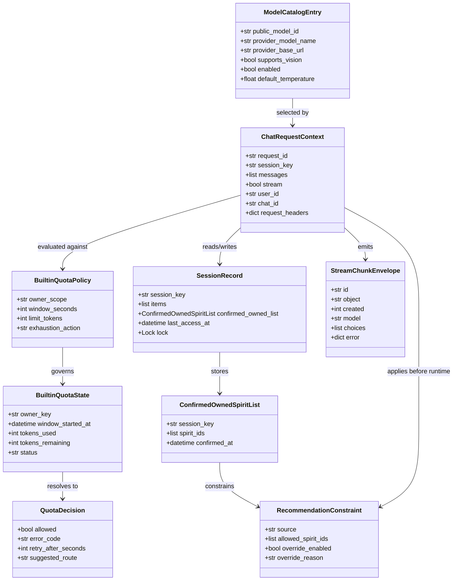

# 系统设计: agent-backend-system
 
 | 字段 | 值 |
 | ---- | --- |
 | **System ID** | `agent-backend-system` |
 | **Project** | RoCo Team Builder |
 | **Version** | v2 |
 | **Status** | `Draft` |
 | **Author** | Cascade |
 | **Date** | 2026-04-07 |
 | **L1 Detail** | [agent-backend-system.detail.md](./agent-backend-system.detail.md) |
 | **Research** | [`_research/agent-backend-system-research.md`](./_research/agent-backend-system-research.md) |
 
 > [!IMPORTANT]
 > **文档分层说明**
 > - **本文件 (L0 导航层)**: 架构图、操作契约、设计决策。面向快速理解与任务规划。禁止放配置字典、算法伪代码和方法体。
 > - **[agent-backend-system.detail.md](./agent-backend-system.detail.md) (L1 实现层)**: 完整伪代码、配置常量、边缘情况。仅 `/forge` 任务明确引用时加载。
 > - **L1 锚点原则 ⚠️**: L1 中的每一节都必须在本文件有对应超链接入口。严禁 L1 出现 L0 完全未提及的孤岛内容。
 
 ---
 
 ## 📋 目录 (Table of Contents)
 
 | § | 章节 | 关键内容 |
 | :---: | ---- | ---- |
 | 1 | [概览](#1-概览-overview) | 系统目的、边界、职责 |
 | 2 | [目标与非目标](#2-目标与非目标-goals--non-goals) | Goals / Non-Goals |
 | 3 | [背景与上下文](#3-背景与上下文-background--context) | 为什么需要这个系统、约束 |
 | 4 | [系统架构](#4-系统架构-architecture) | Mermaid 架构图、组件职责、数据流 |
 | 5 | [接口设计](#5-接口设计-interface-design) | 操作契约表、跨系统协议、HTTP API |
 | 6 | [数据模型](#6-数据模型-data-model) | 实体字段声明、ER 图 → [L1 §1-2](./agent-backend-system.detail.md) |
 | 7 | [技术选型](#7-技术选型-technology-stack) | 核心技术、关键依赖 |
 | 8 | [Trade-offs](#8-trade-offs--alternatives) | 决策理由、备选方案对比 |
 | 9 | [安全性考虑](#9-安全性考虑-security-considerations) | 认证授权、风险与缓解 |
 | 10 | [性能考虑](#10-性能考虑-performance-considerations) | 性能目标、优化策略 |
 | 11 | [测试策略](#11-测试策略-testing-strategy) | 单测、集成、性能测试 |
 | 12 | [部署与运维](#12-部署与运维-deployment--operations) | 流程、监控、可观测性 |
 | 13 | [未来考虑](#13-未来考虑-future-considerations) | 扩展性、技术债 |
 | 14 | [附录](#14-附录-appendix) | 参考资料、拆分检测 |
 
 **L1 实现层** → [agent-backend-system.detail.md](./agent-backend-system.detail.md)
 > [§1 配置常量](./agent-backend-system.detail.md#1-配置常量-config-constants) · [§2 数据结构](./agent-backend-system.detail.md#2-核心数据结构完整定义-full-data-structures) · [§3 算法](./agent-backend-system.detail.md#3-核心算法伪代码-non-trivial-algorithm-pseudocode) · [§4 决策树](./agent-backend-system.detail.md#4-决策树详细逻辑-decision-tree-details) · [§5 边缘情况](./agent-backend-system.detail.md#5-边缘情况与注意事项-edge-cases--gotchas)
 
 ---
 
 ## 1. 概览 (Overview)
 
 ### 1.1 System Purpose (系统目的)
 
 `agent-backend-system` 是 RoCo Team Builder 的核心执行系统。它以 FastAPI 暴露 OpenAI 兼容接口，被 `web-ui-system` 作为自定义模型端点接入；在请求进入后，负责把 OpenAI 兼容请求稳定转换为 Agents SDK 驱动的推理、工具调用和流式响应。
 
 ### 1.2 System Boundary (系统边界)
 
 - **输入 (Input)**: OpenAI Chat Completions 格式请求、用户文本、图片消息、Open WebUI 转发头部
 - **输出 (Output)**: OpenAI 兼容模型目录、流式 SSE 响应、结构化错误对象
 - **依赖系统 (Dependencies)**: `data-layer-system`、`spirit-card-system`、外部 LLM Provider
 - **被依赖系统 (Dependents)**: `web-ui-system`
 
 ### 1.3 System Responsibilities (系统职责)
 
 **负责**:
 - 接收并校验 OpenAI Chat Completions 请求
 - 解析用户文本与图片输入，保留多模态内容
 - 以 Agents SDK 驱动工具调用与推理循环
 - 基于内存 Session 维护多轮对话上下文
 - 以 OpenAI 兼容 SSE 形式流式输出结果
- 区分“识别候选”和“已确认拥有列表”，并把 `ConfirmedOwnedSpiritList` 写入当前 `user_id:chat_id` 会话
- 在后续推荐阶段默认施加已确认拥有列表约束；仅当用户显式要求时才允许突破约束
 
 **不负责**:
 - `web-ui-system` 的 UI、导航与产品壳层裁剪
 - BWIKI 数据抓取与缓存策略实现细节
 - 精灵卡片 HTML 模板视觉实现细节
 - BYOK 浏览器直连请求链路（BYOK 是受限直连模式，不经过本系统，详见 `01_PRD.md` §6.2 双轨能力矩阵）
 
 ---
 
 ## 2. 目标与非目标 (Goals & Non-Goals)

### 2.1 目标

- 支撑 [REQ-001], [REQ-002], [REQ-003], [REQ-004], [REQ-005]
- 向 `web-ui-system` 提供兼容的 `GET /v1/models` 与 `POST /v1/chat/completions`
- 支持文字 + 图片输入，不剥离 `messages[].content[]` 中的图片 part
- 支持单进程内多用户、多聊天会话隔离与多轮追问
- 支持工具调用与结构化错误映射
- 流式首字节尽快返回，满足 PRD 中首 token 体验目标

### 2.2 非目标

- 不提供 BYOK 服务端转发；BYOK 是受限直连模式，由 Open WebUI Direct Connections 直接访问外部 Provider，不经过本系统，因此不具备 Agent 工具链能力
- 不持久化用户会话到磁盘或数据库
- 不在 v2 支持多 worker / 多副本共享 session
- 不在 v2 实现自动上下文压缩
- 不在本系统内承担 BWIKI schema 解析细节或 Rich UI 视觉细节

---

## 3. 背景与上下文 (Background & Context)

### 3.1 Why This System? (为什么需要这个系统？)

 `web-ui-system` 需要一个稳定、可控、对 Open WebUI 友好的后端端点来承接对话请求，但产品真正需要的不是“再造一个通用模型代理”，而是一个**围绕 REQ-001 ~ REQ-005 的 OpenAI 兼容编排层**：

 - 对上，它向 `web-ui-system` 暴露固定的 `/v1/models` 与 `/v1/chat/completions` 契约
 - 对内，它把请求转换为 Agents SDK 的运行时上下文、工具调用和流式事件
 - 对外部，它屏蔽 Provider 差异、BWIKI 查询细节和精灵卡片渲染实现

 **关联 PRD 需求**: [REQ-001], [REQ-002], [REQ-003], [REQ-004], [REQ-005]

### 3.2 Current State (现状分析)

 当前文档已经明确了后端的核心职责、接口集合和技术选型，但在模板层面仍存在几个问题：

 - `§5` 以 endpoint 细表为主，尚未收敛为模板要求的操作契约表
 - `§6` 仍是字段表，不符合 L0 层“属性声明 + 方法签名”的写法要求
 - 尚未显式拆分出 `L1 detail` 承载算法伪代码、配置常量和边缘情况
 - `§4` 缺少独立的数据流视图，不利于把请求生命周期讲清楚

### 3.3 Constraints (约束条件)

 - **技术约束**: 必须以 FastAPI 暴露 OpenAI 兼容接口；Agent Runtime 固定为 OpenAI Agents SDK；Provider 适配需兼容 `use_responses=False`
 - **性能约束**: 需要尽快返回首个流式 chunk；同一会话必须串行，跨会话允许并发
 - **资源约束**: v2 维持单机、单进程优先，不引入 Redis、数据库或多 worker session 共享
 - **安全约束**: 不持久化用户会话；不暴露 provider key；错误输出需保持 OpenAI 兼容格式

---

## 4. 系统架构 (Architecture)

### 4.1 Architecture Diagram (架构图)



### 4.2 Core Components (核心组件)

| Component Name | Responsibility | Tech Stack | Notes |
| ------ | ------ | ------ | ------ |
| `OpenAI Compatibility Router` | 暴露 `/v1/models` 与 `/v1/chat/completions` | FastAPI Router | 对外协议入口 |
| `Request Normalizer` | 归一化请求参数，保留多模态结构，并在进入 runtime 前执行图片能力兜底校验 | Pydantic / Python | 不能压平图片 part；能力错误统一映射到 `CAPABILITY_` |
| `Session Resolver` | 解析 `user_id:chat_id` 会话键，并维护 chat 作用域下的 `ConfirmedOwnedSpiritList` | Header parsing + in-memory store | 受 ADR-003 约束 |
| `Agent Runtime Service` | 运行 Agent、注入工具、协调上下文，并按会话内已确认拥有列表施加推荐约束 | OpenAI Agents SDK | 编排核心 |
| `Tool Registry` | 注册配队、资料查询、截图识别等工具 | `function_tool` / service adapters | 对接内部系统 |
| `Owned List Constraint Resolver` | 根据 session 中的 `ConfirmedOwnedSpiritList` 与用户意图决定是否收紧或放宽推荐范围 | runtime policy logic | override 只能由显式用户意图触发 |
| `Stream Bridge` | 把 runtime events 转成 OpenAI chunk | StreamingResponse | 负责 mid-stream error 映射 |
| `Model Catalog` | 管理对外虚拟模型目录与能力元数据 | env config + in-memory mapping | 不直接透传 provider 模型；`supports_vision` 是统一能力字段 |
| `Builtin Quota Guard` | 在 builtin route 上执行额度检查、超限决策与指标记录 | in-memory state + request accounting | v2 只做单机最小模型 |

### 4.3 Data Flow (数据流)



**关键数据流说明**:
1. 请求必须先经过 `Request Normalizer`，确保 `messages[].content[]` 中的图片 part 被完整保留。
2. 会话边界必须在进入 runtime 前解析完成，否则多轮上下文会失真。
3. 若请求命中 builtin route，必须在进入 runtime 前完成额度检查；额度超限返回 `QUOTA_` 产品错误，而不是混同为 Provider `RATE_LIMIT_`。
4. 图片请求即便已在前端做发送前预检，后端仍必须以 `Model Catalog.supports_vision` 做最终兜底，避免能力语义漂移。
5. `ConfirmedOwnedSpiritList` 只属于当前 `user_id:chat_id` 会话；识别候选在用户确认前不得进入推荐约束。
6. 后续推荐默认必须经过 `Owned List Constraint Resolver`；只有当用户显式要求突破拥有列表时才允许 override。
7. 一旦开始流式输出，错误只能编码为 SSE chunk，不能再回退为普通 JSON 响应。
8. 完整决策逻辑见 [L1 §4](./agent-backend-system.detail.md#4-决策树详细逻辑-decision-tree-details)。

### 4.4 建议目录结构

```text
src/agent-backend/
├── api/
│   ├── routes_openai.py
│   ├── schemas_openai.py
│   └── error_mapping.py
├── app/
│   ├── request_context.py
│   ├── session_service.py
│   ├── model_catalog.py
│   └── stream_bridge.py
├── runtime/
│   ├── agent_factory.py
│   ├── provider_factory.py
│   ├── tool_registry.py
│   └── prompting.py
├── integrations/
│   ├── data_layer_client.py
│   └── spirit_card_client.py
└── main.py
```

---

## 5. 接口设计 (Interface Design)

### 5.1 操作契约表 (Operation Contracts)

| 操作 | [REQ-XXX] | 前置条件 | 消耗/输入 | 产出/副作用 | 实现细节 |
| ---- | :---: | ---- | ---- | ---- | :---: |
| `list_models(catalog)` | [REQ-001], [REQ-005] | 模型目录已初始化 | catalog | 返回受控虚拟模型列表，并附统一能力元数据 | [L1 §3.4](./agent-backend-system.detail.md#34-list_modelscatalog) |
| `normalize_chat_request(payload, headers, catalog)` | [REQ-001], [REQ-002], [REQ-003], [REQ-004], [REQ-005] | payload 非空; model 存在 | OpenAI payload、headers | 生成 `ChatRequestContext`；非法请求提前失败；图片能力兜底失败时返回 `CAPABILITY_` 错误 | [L1 §3.2](./agent-backend-system.detail.md#32-normalize_chat_requestpayload-headers-catalog) |
| `resolve_session_key(headers, body)` | [REQ-005] | 请求必须携带 `X-OpenWebUI-User-Id` 和 `X-OpenWebUI-Chat-Id` | headers、body | 生成稳定 `session_key = "{user_id}:{chat_id}"`；**任一缺失时拒绝请求（400），不做回退** | [L1 §3.1](./agent-backend-system.detail.md#31-resolve_session_keyheaders-body) |
| `enforce_builtin_quota(context, quota_state)` | [REQ-001], [REQ-002], [REQ-005] | 请求已归一化; 当前请求命中 builtin route | `ChatRequestContext`、额度策略、额度状态 | 返回允许继续或 `QUOTA_` 拒绝；记录额度监控指标 | [L1 §3.7](./agent-backend-system.detail.md#37-enforce_builtin_quotacontext-policy-state_store) |
| `store_confirmed_owned_list(session_key, confirmed_spirit_ids)` | [REQ-002], [REQ-005] | `session_key` 已解析; 用户已在前端确认候选 | `session_key`、已确认精灵 ID 列表 | 更新当前 chat 的 `ConfirmedOwnedSpiritList`；覆盖旧确认结果并记录写入指标 | [L1 §3.8](./agent-backend-system.detail.md#38-store_confirmed_owned_listsession_key-confirmed_spirit_ids) |
| `apply_owned_list_constraint(context, session_record, user_intent)` | [REQ-002], [REQ-005] | 当前请求属于 builtin 轨道; session 已存在 | `ChatRequestContext`、`SessionRecord`、用户意图摘要 | 返回受约束或 override 后的推荐上下文；记录约束命中/override 指标 | [L1 §3.9](./agent-backend-system.detail.md#39-apply_owned_list_constraintcontext-session_record-user_intent) |
| `run_agent_turn(context, session_items)` | [REQ-001], [REQ-002], [REQ-003], [REQ-004], [REQ-005] | 请求已归一化; session 已就绪; builtin quota 已通过 | `ChatRequestContext`、session history | 产生 runtime events；可能触发工具调用 | [L1 §3.5](./agent-backend-system.detail.md#35-run_agent_turncontext-session_items) |
| `stream_runtime_events(events, model_id)` | [REQ-001], [REQ-002], [REQ-003], [REQ-004], [REQ-005] | runtime 已开始执行 | runtime events、model id | 输出 OpenAI SSE chunk；必要时编码 mid-stream error | [L1 §3.3](./agent-backend-system.detail.md#33-stream_runtime_eventsevents-model_id) |
| `evict_idle_sessions(registry, now)` | [REQ-005] | janitor 定时触发 | session registry、当前时间 | 清理超时会话，释放内存 | [L1 §3.6](./agent-backend-system.detail.md#36-evict_idle_sessionsregistry-now) |

### 5.2 跨系统接口协议 (Cross-System Interface)

```python
class IDataLayerClient(Protocol):
    def get_spirit_info(self, spirit_name: str) -> dict: ...
    def search_wiki(self, query: str) -> list[dict]: ...
    def get_type_matchup(self, type_combo: list[str]) -> dict: ...

class ISpiritCardClient(Protocol):
    def render_spirit_card(self, spirit_payload: dict, policy: dict | None = None) -> RenderedSpiritCard: ...

class RenderedSpiritCard(Protocol):
    html: str
    fallback_text: str
    render_mode: str  # "rich_html" | "html_with_text_fallback" | "text_only"
    metadata: dict

class IAgentBackendService(Protocol):
    def list_models(self) -> list[dict]: ...
    def chat_completions(self, payload: dict, headers: dict[str, str]) -> object: ...
```

### 5.3 HTTP API 端点摘要

| Method | Path | Auth | 用途 | [REQ-XXX] |
| ---- | ---- | :---: | ---- | :---: |
| `GET` | `/v1/models` | 可选 Bearer | 向 `web-ui-system` 暴露受控虚拟模型目录 | [REQ-001], [REQ-005] |
| `POST` | `/v1/chat/completions` | 可选 Bearer | 承接 OpenAI Chat Completions 请求并返回流式/非流式响应 | [REQ-001], [REQ-002], [REQ-003], [REQ-004], [REQ-005] |
| `GET` | `/healthz` | 否 | 容器健康检查 | [REQ-005] |
| `GET` | `/readyz` | 否 | 就绪检查，验证模型目录与依赖初始化 | [REQ-005] |

---

## 6. 数据模型 (Data Model)

### 6.1 核心实体 (Core Entities)

```python
@dataclass
class ModelCatalogEntry:
    public_model_id: str
    provider_model_name: str
    provider_base_url: str
    supports_vision: bool
    enabled: bool
    default_temperature: float | None = None

    def can_accept_image(self) -> bool: ...


@dataclass
class BuiltinQuotaPolicy:
    owner_scope: Literal["ip", "session"]
    window_seconds: int
    limit_tokens: int
    exhaustion_action: Literal["suggest_byok"]

    def owner_key_for(self, context: "ChatRequestContext") -> str: ...


@dataclass
class BuiltinQuotaState:
    owner_key: str
    window_started_at: datetime
    tokens_used: int
    tokens_remaining: int
    status: Literal["available", "exhausted"]

    def is_exhausted(self) -> bool: ...


@dataclass
class QuotaDecision:
    allowed: bool
    error_code: str | None
    retry_after_seconds: int | None
    suggested_route: Literal["builtin", "byok"] | None


@dataclass
class ChatRequestContext:
    request_id: str
    session_key: str
    model_entry: ModelCatalogEntry
    messages: list[dict]
    stream: bool
    user_id: str
    chat_id: str | None
    request_headers: dict[str, str]

    def normalized_token_budget(self) -> int | None: ...


@dataclass
class ConfirmedOwnedSpiritList:
    session_key: str
    spirit_ids: list[str]
    confirmed_at: datetime

    def is_empty(self) -> bool: ...


@dataclass
class RecommendationConstraint:
    source: Literal["confirmed_owned_list", "none"]
    allowed_spirit_ids: list[str]
    override_enabled: bool
    override_reason: str | None


@dataclass
class SessionRecord:
    session_key: str
    items: list[dict]
    confirmed_owned_list: ConfirmedOwnedSpiritList | None
    last_access_at: datetime
    lock: asyncio.Lock

    def touch(self) -> None: ...


@dataclass
class StreamChunkEnvelope:
    id: str
    object: str
    created: int
    model: str
    choices: list[dict]
    error: dict | None
```

> *(配置常量详见 [L1 §1](./agent-backend-system.detail.md#1-配置常量-config-constants) · 完整方法实现详见 [L1 §2](./agent-backend-system.detail.md#2-核心数据结构完整定义-full-data-structures))*

### 6.2 实体关系图 (Entity Relationship)



### 6.3 数据模型说明 (Model Notes)

- `ModelCatalogEntry` 定义对外可见的虚拟模型，而不是 Provider 原生模型集合；`supports_vision` 是跨前后端统一能力字段
- `BuiltinQuotaPolicy` 定义内置轨道额度的 owner、窗口和超限动作；这是产品额度，不等同于单请求 token budget
- `BuiltinQuotaState` 承载额度窗口内的消耗状态；v2 仅要求单机内存态最小模型
- `QuotaDecision` 负责把额度检查结果显式映射为继续执行或 `QUOTA_` 产品错误
- `ChatRequestContext` 是请求进入 runtime 前的标准化上下文载体
- `ConfirmedOwnedSpiritList` 是当前 `user_id:chat_id` 会话内已确认拥有的精灵列表；识别候选在确认前不得写入该实体
- `RecommendationConstraint` 把“默认只推荐已确认拥有列表内精灵”落成运行时约束，而不是 prompt 层建议
- `SessionRecord` 承载内存态历史消息、已确认拥有列表与并发保护锁；该状态不持久化，不跨 chat 共享
- `StreamChunkEnvelope` 约束流式输出的 OpenAI 兼容 chunk 结构

---

## 7. 技术选型 (Technology Stack)

| 层 | 技术 | 用途 |
|----|------|------|
| API Framework | FastAPI | HTTP 路由与校验 |
| HTTP Server | uvicorn | 单进程异步服务 |
| Agent Runtime | OpenAI Agents SDK | Agent、Runner、tool runtime |
| Provider Client | `AsyncOpenAI` / `OpenAIProvider` | OpenAI 兼容上游访问 |
| Session Storage | 自定义内存 store + `asyncio.Lock` | 非持久化多轮上下文 |
| Streaming | `StreamingResponse` | 手工输出 OpenAI SSE |
| Config | 环境变量 + Pydantic Settings | 安全配置注入 |

### 7.1 关键配置约束

| 配置项 | 值/策略 | 原因 |
|-------|---------|------|
| `use_responses` | `False` | 第三方 Provider 兼容 |
| `uvicorn workers` | `1` | Session 不跨进程共享 |
| `session_idle_ttl_minutes` | `30` | 满足 PRD 会话超时边界 |
| `provider_api_key` | 环境变量 | 禁止硬编码密钥 |
| `ENABLE_FORWARD_USER_INFO_HEADERS` | `true`（在 Open WebUI） | 提供用户/会话隔离头 |

---

## 8. Trade-offs & Alternatives

### 8.1 ADR 引用清单

> **决策来源**: [ADR-001: 技术栈选择（v2）](../03_ADR/ADR_001_TECH_STACK.md)
>
> 本系统实现 ADR-001 定义的 `web-ui-system` 受控壳层 + OpenAI Agents SDK + OpenAI 兼容端点集成，不在此重复技术栈选型理由。

> **决策来源**: [ADR-002: 数据层缓存策略（v2）](../03_ADR/ADR_002_DATA_LAYER_CACHE.md)
>
> 本系统假定 `data-layer-system` 提供内存 TTL 缓存与有限并发保护，因此后端无需重复实现跨请求 BWIKI 缓存。

> **决策来源**: [ADR-003: 会话上下文管理策略（v2）](../03_ADR/ADR_003_SESSION_MANAGEMENT.md)
>
> 本系统遵循“内存 Session + 单进程 `--workers 1` + `user_id:chat_id` 组合键”约束，不在此重复会话持久化决策理由。

### 8.2 本系统特有决策 1：为什么选择 `StreamingResponse`，而不是 `EventSourceResponse`

- **选择 A**: `StreamingResponse` + 手工 SSE framing
- **不选 B**: `EventSourceResponse`

**原因**:
- 我们需要严格输出 OpenAI Chat Completions chunk 格式与 `[DONE]` 结束帧。
- `EventSourceResponse` 更适合通用 SSE 事件流；而本项目的核心不是“有 SSE”，而是“字节级兼容 OpenAI SSE”。
- 手工 framing 更易针对 mid-stream error、finish_reason、空 delta 做兼容测试。

### 8.3 本系统特有决策 2：为什么使用“虚拟模型目录”，而不是直接暴露上游 Provider 模型

- **选择 A**: `/v1/models` 返回受控虚拟模型
- **不选 B**: 直接透传 Provider `/models`

**原因**:
- 避免把上游模型命名、能力差异、实验模型直接泄露给前端壳层。
- 可以把 `supports_vision`、默认温度、成本策略等绑定到一个稳定模型 id。
- 将来更换 provider 时不影响 `web-ui-system` 中已保存的模型配置。

### 8.4 本系统特有决策 3：为什么 session key 采用 `user_id:chat_id` 组合

- **选择 A**: 组合键
- **不选 B**: 只用 `X-OpenWebUI-User-Id`
- **不选 C**: 后端自发 token/session id

**原因**:
- 只用 user id 会导致同一用户多个会话串上下文。
- 自己管理 session token 会复制 Open WebUI 已提供的会话边界，增加偶然复杂度。
- 组合键兼顾“用户隔离”和“聊天隔离”。

### 8.5 本系统特有决策 4：为什么不使用 `SQLiteSession`

- **选择 A**: 自定义内存 `SessionStore`
- **不选 B**: `SQLiteSession`

**原因**:
- v2 目标仍是“会话结束即清除”，不是“轻量持久化”。
- `SQLiteSession` 会引入 sqlite 生命周期、schema、线程/连接管理；这不是本质复杂度。
- 自定义内存 store 更符合当前单进程与短生命周期约束。

---

## 9. 安全性考虑 (Security Considerations)

- **密钥管理**
  - Provider API Key 仅通过环境变量注入
  - 不回显到日志、不透传到前端
- **用户隔离**
  - 通过 `X-OpenWebUI-User-Id` / `X-OpenWebUI-Chat-Id` 建立 session 边界
  - 会话对象加锁，避免同一会话并发写入竞争
- **输入安全**
  - 只接受 OpenAI 兼容 JSON schema
  - 对 `model` 做白名单校验
  - 限制消息总大小、图片 data URL 总长度与单请求最大 token 预算
- **额度与能力边界**
  - 内置轨道额度超限必须映射为 `QUOTA_`，不得与 Provider `RATE_LIMIT_` 混用
  - 后端发现图片请求命中非视觉模型时，必须返回 `CAPABILITY_` 产品错误，而不是泄露 Provider 原始异常
- **日志最小化**
  - 不记录完整图片 base64
  - 默认不记录用户原始消息全文，仅记录 request_id、session_key、模型 id、错误码
- **错误暴露控制**
  - 对外返回 OpenAI 风格错误对象
  - 对内保留完整栈与 provider 错误详情
- **工具错误降级**
  - 当 `data-layer-system` 返回 BWIKI 超时/解析失败时，必须从 `DataLayerErrorEnvelope.wiki_url` 中提取回退链接，并在 Agent 回复中附上该链接引导用户自行访问
  - 当 `spirit-card-system` 渲染失败时，必须使用 `RenderedSpiritCard.fallback_text` 作为文本降级输出
- **跨系统错误分类对齐**
  - 所有对外错误必须使用 `02_ARCHITECTURE_OVERVIEW.md` §3.5 跨系统错误分类矩阵中定义的错误码前缀
  - 错误响应结构遵循 OpenAI 风格 `{"error": {"code": "...", "message": "..."}}`，`code` 字段使用矩阵中的前缀
  - 可重试错误应在 `error.metadata` 中附 `retryable: true` 提示前端展示重试引导

---

## 10. 性能考虑 (Performance Considerations)

- **流式优先**: 请求一旦进入模型推理即尽快开始输出首块，避免 UI 长时间空白
- **单会话串行化**: 同一 `session_key` 的请求串行执行，避免上下文被并发污染
- **跨会话并发**: 不同 session 可并发运行，由 asyncio 调度
- **session 内存上限**: 为 registry 设置最大会话数与每会话消息条数上限，防止内存膨胀
- **工具结果瘦身**: 仅保留 Agent 真正需要的结构化字段，不把整页 wiki 原文灌入上下文
- **错误快速失败**: 非法模型、缺失 header、超大图片、超限请求在进入模型调用前失败

---

### 10.1 运行时约束
- v2 的额度模型只覆盖单机、单进程、内存态最小实现，不引入 Redis、数据库或分布式共享额度
- quota owner 与会话边界必须兼容 `ADR_003_SESSION_MANAGEMENT.md`；若按 session 计量，则必须绑定 `user_id:chat_id`
- 单请求 token budget 继续存在，但它只是请求级保护，不替代 `Builtin Quota`
- `ConfirmedOwnedSpiritList` 仅在当前 chat 会话内生效，不持久化，不跨 chat 共享
- 推荐阶段默认受 `ConfirmedOwnedSpiritList` 约束；只有用户显式要求时才允许 override

---

## 11. 测试策略 (Testing Strategy)

### 11.1 单元测试
- `Session Resolver`: `user_id + chat_id` 组合键解析、header 缺失时严格拒绝（400）逻辑
- `Model Catalog`: 模型白名单与 provider 映射、`supports_vision` 能力字段
- `Builtin Quota Guard`: owner 计算、窗口判断、`QUOTA_` 决策
- `Request Normalizer`: 文本消息、多模态消息、base64 data URL 保留
- `store_confirmed_owned_list(...)`: 覆盖写入、空列表、同 chat 重复确认行为
- `apply_owned_list_constraint(...)`: 命中已确认拥有列表、无确认列表、显式 override 三种分支
- `Error Mapper`: 400 / 401 / 429 / 5xx / mid-stream error 映射
- `Stream Bridge`: chunk 序列、空 delta、`[DONE]`

### 11.2 集成测试
- `GET /v1/models` 被 `web-ui-system` 兼容消费
- `POST /v1/chat/completions` 在 `stream=true` 时输出标准 SSE
- mid-stream provider error 被编码为错误 chunk 而不是断流裸异常
- 同一用户不同 `chat_id` 不串会话
- 缺失 `X-OpenWebUI-User-Id` 或 `X-OpenWebUI-Chat-Id` 时返回 400 而非回退到 user_id
- 上传图片消息时消息结构未被剥离
- 内置轨道额度超限时返回 `QUOTA_`，而不是 `RATE_LIMIT_`
- 图片命中非视觉模型时返回 `CAPABILITY_`，而不是 provider 默认报错
- 前端提交 `ConfirmedOwnedSpiritList` 后，同 chat 的后续推荐默认只使用列表内精灵
- 用户显式要求突破拥有列表时，override 行为被接受且可观测

### 11.3 契约测试
- 对照 OpenAI Chat Completions chunk schema
- 校验响应头包含 `Content-Type: text/event-stream`
- 校验结束帧为 `data: [DONE]`
- 校验非流式与流式错误格式一致性
- 校验 `QUOTA_` / `CAPABILITY_` 错误结构与 `02_ARCHITECTURE_OVERVIEW.md` §3.5 一致
- 校验确认拥有列表只作用于当前 `user_id:chat_id`，不会泄漏到其他 chat

### 11.4 验收测试
- 对应 [REQ-001]~[REQ-005] 的端到端会话场景
- 10 并发会话隔离验证
- 30 分钟闲置会话清理验证
- “截图识别候选 → 用户确认 → 默认受约束推荐 → 显式 override”完整路径验证

---

## 12. 部署与运维 (Deployment & Operations)

### 12.1 部署约束
- Docker 容器单实例运行
- `uvicorn --workers 1`
- 与 `web-ui-system` 处于同一 Docker Compose 网络
- 通过环境变量注入 provider API key、模型目录、日志级别
- `ConfirmedOwnedSpiritList` 会话态成立的前提是 v2 单机 Compose + 单 worker；v2 不引入外部 session store

### 12.2 启动前检查
- `Model Catalog` 至少存在一个 enabled 模型
- 上游 `provider_base_url` 可达
- 必要环境变量存在
- `web-ui-system` 已开启用户头转发配置
- builtin quota 策略已初始化，且 owner_scope 与当前文档口径一致
- 同 chat 的确认拥有列表写入与读取链路在 Compose 基线上可验

### 12.3 运行时监控
- `request_count`, `error_count`, `stream_error_count`
- `active_sessions`, `expired_sessions`, `session_evictions`
- `llm_latency_ms`, `time_to_first_chunk_ms`
- `tool_call_count`, `tool_error_count`
- `builtin_quota_check_count`, `builtin_quota_exhausted_count`, `builtin_quota_tokens_used`
- `capability_vision_reject_count`
- `confirmed_owned_list_write_count`, `owned_list_constrained_recommendation_count`, `owned_list_override_count`


## 13. 未来考虑 (Future Considerations)

- v3+ 可将 `SessionStore` 抽象切换到 Redis，以支持多 worker / 多副本
- 引入会话摘要或压缩机制，但前提是仍兼容第三方 Chat Completions provider
- 为模型目录增加能力矩阵（视觉、推理、成本等级、上下文长度）
- 在兼容层支持更完整的 OpenAI 字段集，如 `response_format` 的部分受控开放

---

## 14. 附录 (Appendix)

### 14.1 外部来源
- FastAPI SSE 文档: https://fastapi.tiangolo.com/tutorial/server-sent-events/ （访问于 2026-04-07）
- OpenAI Agents SDK Models 文档: https://openai.github.io/openai-agents-python/models/ （访问于 2026-04-07）
- Open WebUI Rich UI 文档: https://docs.openwebui.com/features/extensibility/plugin/development/rich-ui/ （访问于 2026-04-07）
- OpenRouter Streaming 文档: https://openrouter.ai/docs/api/reference/streaming （访问于 2026-04-07）
- OpenAI Streaming 文档入口: https://developers.openai.com/api/docs/guides/streaming-responses （访问于 2026-04-07，正文抓取 403，相关结论已由本地源码交叉验证）

### 14.2 设计拆分检测

| 规则 | 结果 |
|------|------|
| R1 单个函数/算法伪代码 > 30 行 | ❌ |
| R2 所有代码块合计 > 200 行 | ❌ |
| R3 配置常量字典条目 > 5 个 | ✅ |
| R4 版本历史注释 > 5 处 | ❌ |
| R5 文档总行数 > 500 行 | ✅ |

**结论**: 触发 R3 / R5，已创建 [agent-backend-system.detail.md](./agent-backend-system.detail.md) 作为实现层补充文档。
