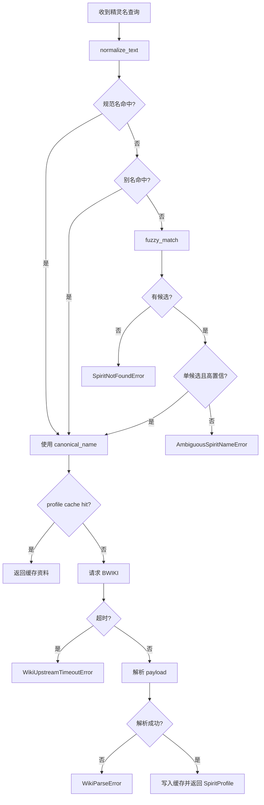

# 系统设计实现层: data-layer-system.detail

| 字段 | 值 |
| ---- | --- |
| **System ID** | `data-layer-system` |
| **Project** | RoCo Team Builder |
| **Version** | v2 |
| **Status** | `Draft` |
| **Author** | Cascade |
| **Date** | 2026-04-07 |
| **L0 Document** | [data-layer-system.md](./data-layer-system.md) |

> [!IMPORTANT]
> **本文件 (L1 实现层)** 承载 L0 不应展开的实现细节：配置常量、完整数据结构、核心算法伪代码、决策树和边缘情况。

---

## 📋 目录 (Table of Contents)

| § | 章节 | 内容 |
| :---: | ---- | ---- |
| 1 | [配置常量](#1-配置常量-config-constants) | TTL、超时、候选上限、缓存 key 前缀 |
| 2 | [核心数据结构完整定义](#2-核心数据结构完整定义-full-data-structures) | 完整 `@dataclass` 与异常结构 |
| 3 | [核心算法伪代码](#3-核心算法伪代码-non-trivial-algorithm-pseudocode) | 名称解析、精灵查询、缓存写入流程 |
| 4 | [决策树详细逻辑](#4-决策树详细逻辑-decision-tree-details) | 名称命中、缓存命中、上游失败分支 |
| 5 | [边缘情况与注意事项](#5-边缘情况与注意事项-edge-cases--gotchas) | 模板漂移、别名缺失、空字段、并发抖动 |
| 6 | [版本历史](#6-版本历史-version-history) | 当前版本记录 |

---

## 1. 配置常量 (Config Constants)

```python
WIKI_REQUEST_TIMEOUT_SECONDS = 5
SPIRIT_PROFILE_TTL_SECONDS = 3600
SEARCH_RESULT_TTL_SECONDS = 600
TYPE_MATCHUP_TTL_SECONDS = 3600
STATIC_KNOWLEDGE_TTL_SECONDS = 3600
CACHE_MAX_ENTRIES = 500
FUZZY_MATCH_LIMIT = 5
FUZZY_MATCH_MIN_SCORE = 70.0
ALIAS_EXACT_PRIORITY = 100.0
CANONICAL_EXACT_PRIORITY = 120.0

CACHE_KEY_PREFIX = {
    "spirit_profile": "spirit_profile",
    "search_candidates": "search_candidates",
    "type_matchup": "type_matchup",
    "static_knowledge": "static_knowledge",
    "wiki_page_extract": "wiki_page_extract",
}

ALLOWED_STATIC_TOPICS = {
    "type_chart",
    "bloodline_rules",
    "battle_mechanics",
}
```

**说明**:
- `WIKI_REQUEST_TIMEOUT_SECONDS=5` 直接承接 PRD 对 BWIKI 超时边界的约束。
- `CACHE_KEY_PREFIX` 统一 key namespace，避免不同查询类型互相污染。
- `FUZZY_MATCH_MIN_SCORE` 是候选下限，不应让极弱相关候选进入上游追问链路。

---

## 2. 核心数据结构完整定义 (Full Data Structures)

```python
from dataclasses import dataclass, field
from typing import Literal


@dataclass
class SearchCandidate:
    canonical_name: str
    display_name: str
    score: float
    match_reason: Literal["canonical", "alias", "fuzzy"]

    def is_high_confidence(self) -> bool:
        return self.score >= 90.0


@dataclass
class SpiritSkill:
    name: str
    type: str | None
    power: int | None
    pp: int | None
    description: str | None


@dataclass
class BaseStats:
    hp: int | None
    attack: int | None
    defense: int | None
    magic_attack: int | None
    magic_defense: int | None
    speed: int | None


@dataclass
class EvolutionNode:
    stage_name: str
    condition: str | None
    branch_label: str | None


@dataclass
class SpiritProfile:
    canonical_name: str
    display_name: str
    types: list[str]
    base_stats: BaseStats
    skills: list[SpiritSkill] = field(default_factory=list)
    bloodline_type: str | None = None
    evolution_chain: list[EvolutionNode] = field(default_factory=list)
    wiki_url: str = ""

    def is_minimal_profile(self) -> bool:
        return bool(self.display_name and self.wiki_url)


@dataclass
class TypeMatchupItem:
    target_type: str
    multiplier: float
    note: str | None = None


@dataclass
class TypeMatchupResult:
    input_types: list[str]
    attack_advantages: list[TypeMatchupItem]
    defense_weaknesses: list[TypeMatchupItem]
    defense_resistances: list[TypeMatchupItem]


@dataclass
class StaticKnowledgeEntry:
    topic_key: str
    title: str
    content: str
    source: str


@dataclass
class DataLayerErrorEnvelope:
    error_code: str
    message: str
    retryable: bool
    wiki_url: str | None = None
    candidates: list[SearchCandidate] | None = None


class SpiritNotFoundError(Exception):
    pass


class AmbiguousSpiritNameError(Exception):
    def __init__(self, candidates: list[SearchCandidate]):
        self.candidates = candidates
        super().__init__("spirit name is ambiguous")


class WikiUpstreamTimeoutError(Exception):
    pass


class WikiParseError(Exception):
    pass
```

---

## 3. 核心算法伪代码 (Non-trivial Algorithm Pseudocode)

### 3.1 `resolve_spirit_name(query)`

```python
def resolve_spirit_name(query: str) -> dict:
    cleaned = normalize_text(query)
    if not cleaned:
        raise SpiritNotFoundError()

    canonical_hit = canonical_index.get(cleaned)
    if canonical_hit is not None:
        return {
            "status": "resolved",
            "canonical_name": canonical_hit,
            "candidates": [],
        }

    alias_hit = alias_index.get(cleaned)
    if alias_hit is not None:
        return {
            "status": "resolved",
            "canonical_name": alias_hit,
            "candidates": [
                SearchCandidate(
                    canonical_name=alias_hit,
                    display_name=alias_hit,
                    score=ALIAS_EXACT_PRIORITY,
                    match_reason="alias",
                )
            ],
        }

    fuzzy_candidates = fuzzy_match(
        cleaned,
        canonical_names,
        limit=FUZZY_MATCH_LIMIT,
        min_score=FUZZY_MATCH_MIN_SCORE,
    )

    if not fuzzy_candidates:
        raise SpiritNotFoundError()

    if len(fuzzy_candidates) == 1 and fuzzy_candidates[0].is_high_confidence():
        return {
            "status": "resolved",
            "canonical_name": fuzzy_candidates[0].canonical_name,
            "candidates": fuzzy_candidates,
        }

    raise AmbiguousSpiritNameError(fuzzy_candidates)
```

### 3.2 `get_spirit_profile(spirit_name)`

```python
def get_spirit_profile(spirit_name: str) -> SpiritProfile:
    resolved = resolve_spirit_name(spirit_name)
    canonical_name = resolved["canonical_name"]
    cache_key = build_cache_key("spirit_profile", canonical_name)

    cached = cache_registry.get(cache_key)
    if cached is not None:
        return cached

    wiki_url = build_wiki_link(canonical_name)

    try:
        raw_payload = wiki_gateway.fetch_spirit_page(canonical_name)
    except TimeoutError as exc:
        raise WikiUpstreamTimeoutError(str(exc))

    try:
        profile = wiki_parser.parse_spirit_profile(raw_payload, wiki_url)
    except Exception as exc:
        raise WikiParseError(str(exc))

    if not profile.is_minimal_profile():
        raise WikiParseError("profile missing required fields")

    cache_registry.set(
        cache_key,
        profile,
        ttl=SPIRIT_PROFILE_TTL_SECONDS,
    )
    return profile
```

### 3.3 `search_spirits(query, limit)`

```python
def search_spirits(query: str, limit: int = 5) -> list[SearchCandidate]:
    cache_key = build_cache_key("search_candidates", normalize_text(query), limit)
    cached = cache_registry.get(cache_key)
    if cached is not None:
        return cached

    candidates = fuzzy_match(
        normalize_text(query),
        canonical_names,
        limit=min(limit, FUZZY_MATCH_LIMIT),
        min_score=FUZZY_MATCH_MIN_SCORE,
    )

    cache_registry.set(
        cache_key,
        candidates,
        ttl=SEARCH_RESULT_TTL_SECONDS,
    )
    return candidates
```

### 3.4 `get_type_matchup(type_combo)`

```python
def get_type_matchup(type_combo: list[str]) -> TypeMatchupResult:
    normalized_combo = normalize_type_combo(type_combo)
    cache_key = build_cache_key("type_matchup", *normalized_combo)
    cached = cache_registry.get(cache_key)
    if cached is not None:
        return cached

    matrix = static_knowledge_store.read_type_chart()
    result = compute_type_matchup(matrix, normalized_combo)

    cache_registry.set(
        cache_key,
        result,
        ttl=TYPE_MATCHUP_TTL_SECONDS,
    )
    return result
```

### 3.5 `build_error_envelope(error, spirit_name)`

```python
def build_error_envelope(error: Exception, spirit_name: str | None) -> DataLayerErrorEnvelope:
    wiki_url = build_wiki_link(spirit_name) if spirit_name else None

    if isinstance(error, SpiritNotFoundError):
        return DataLayerErrorEnvelope(
            error_code="spirit_not_found",
            message="spirit not found",
            retryable=False,
            wiki_url=None,
            candidates=None,
        )

    if isinstance(error, AmbiguousSpiritNameError):
        return DataLayerErrorEnvelope(
            error_code="spirit_name_ambiguous",
            message="multiple spirit candidates found",
            retryable=False,
            wiki_url=wiki_url,
            candidates=error.candidates,
        )

    if isinstance(error, WikiUpstreamTimeoutError):
        return DataLayerErrorEnvelope(
            error_code="wiki_timeout",
            message="wiki upstream timeout",
            retryable=True,
            wiki_url=wiki_url,
            candidates=None,
        )

    return DataLayerErrorEnvelope(
        error_code="wiki_parse_error",
        message="failed to parse wiki payload",
        retryable=False,
        wiki_url=wiki_url,
        candidates=None,
    )
```

---

## 4. 决策树详细逻辑 (Decision Tree Details)



---

## 5. 边缘情况与注意事项 (Edge Cases & Gotchas)

### 5.1 页面模板漂移
- BWIKI 页面模板若改名或字段层级变动，`WikiParser` 很容易静默产出空字段。
- 解析器必须有“最小有效资料”校验，不能只要不抛异常就视为成功。

### 5.2 别名表不完整
- v2 初期别名表不可能完整，模糊匹配必须作为兜底，但不能替代人工别名维护。
- 若候选分数接近，应优先返回歧义而不是强行猜中。

### 5.3 上游超时不能长缓存
- 短时 BWIKI 故障不应被缓存为长期失败结果。
- 最多允许极短暂的 in-flight 折叠，不应把 `wiki_timeout` 当作正常缓存值写入 TTL cache。

### 5.4 同名或近名精灵
- 若后续出现同名不同形态、不同分支或简称冲突，`SearchCandidate.match_reason` 必须保留足够解释信息。
- 上游 Agent 应基于候选理由向用户追问，而不是自行猜测。

### 5.5 静态知识版本漂移
- 属性克制表与机制知识虽然本地维护，但仍可能和游戏版本产生漂移。
- 静态知识条目应保留来源与更新时间，避免被误当成绝对实时事实。

---

## 6. 版本历史 (Version History)

| 版本 | 日期 | 变更 |
|------|------|------|
| v2 | 2026-04-07 | 首次创建 `data-layer-system` 的 L1 实现层文档 |
