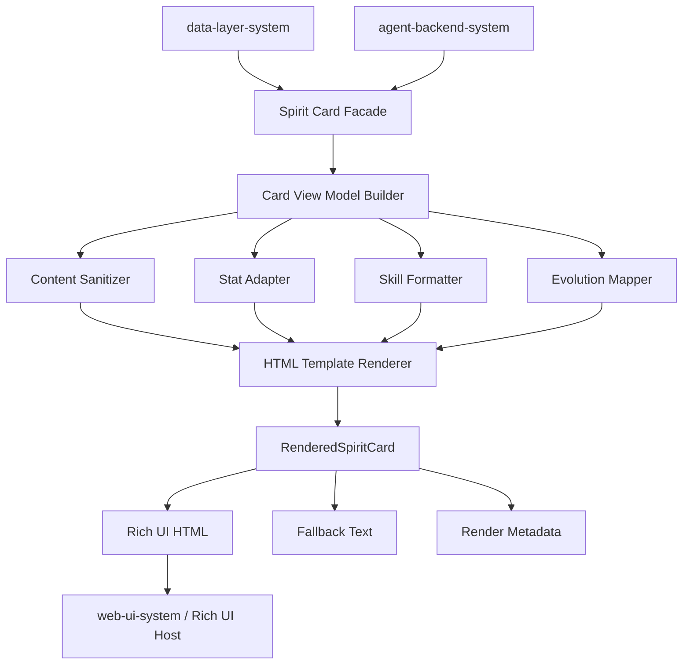
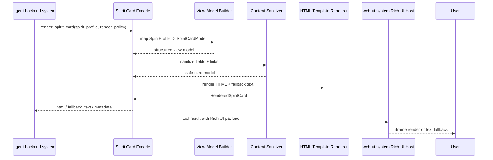
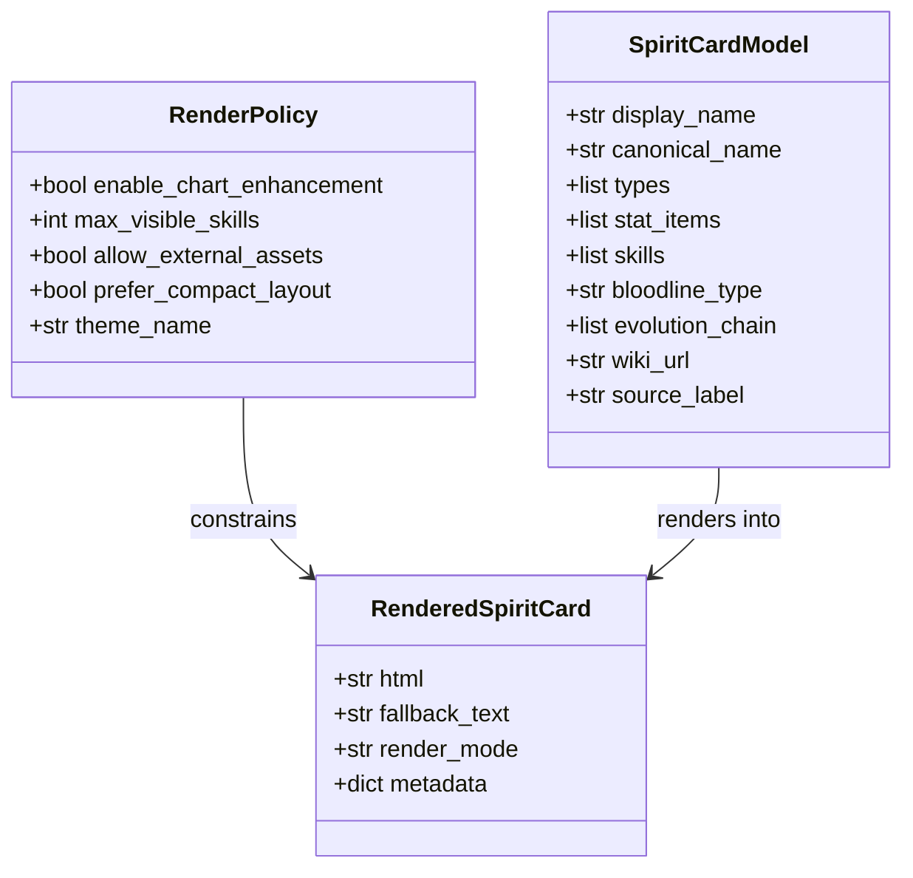

# 系统设计: spirit-card-system
 
| 字段 | 值 |
| ---- | --- |
| **System ID** | `spirit-card-system` |
| **Project** | RoCo Team Builder |
| **Version** | v2 |
| **Status** | `Draft` |
| **Author** | Cascade |
| **Date** | 2026-04-07 |
| **L1 Detail** | [spirit-card-system.detail.md](./spirit-card-system.detail.md) |
| **Research** | [`_research/spirit-card-system-research.md`](./_research/spirit-card-system-research.md) |
 
> [!IMPORTANT]
> **文档分层说明**
> - **本文件 (L0 导航层)**: 架构图、操作契约、设计决策。面向快速理解与任务规划。
> - **[spirit-card-system.detail.md](./spirit-card-system.detail.md) (L1 实现层)**: 配置常量、完整数据结构、伪代码、边缘情况。仅 `/forge` 明确引用时加载。
 
---
 
## 📋 目录 (Table of Contents)
 
| § | 章节 | 关键内容 |
| :---: | ---- | ---- |
| 1 | [概览](#1-概览-overview) | 系统目的、边界、职责 |
| 2 | [目标与非目标](#2-目标与非目标-goals--non-goals) | Goals / Non-Goals |
| 3 | [背景与上下文](#3-背景与上下文-background--context) | 为什么需要这个系统、约束 |
| 4 | [系统架构](#4-系统架构-architecture) | Mermaid 架构图、组件职责、数据流 |
| 5 | [接口设计](#5-接口设计-interface-design) | 操作契约表、跨系统协议 |
| 6 | [数据模型](#6-数据模型-data-model) | 属性字段声明、关系图 |
| 7 | [技术选型](#7-技术选型-technology-stack) | 核心技术、关键依赖 |
| 8 | [Trade-offs](#8-trade-offs--alternatives) | 决策理由、备选方案对比 |
| 9 | [安全性考虑](#9-安全性考虑-security-considerations) | 风险与缓解 |
| 10 | [性能考虑](#10-性能考虑-performance-considerations) | 性能目标、优化策略 |
| 11 | [测试策略](#11-测试策略-testing-strategy) | 单测、集成、契约测试 |
| 12 | [部署与运维](#12-部署与运维-deployment--operations) | 部署、监控、运维边界 |
| 13 | [未来考虑](#13-未来考虑-future-considerations) | 扩展性、演进路径 |
| 14 | [附录](#14-附录-appendix) | 参考资料、拆分检测 |
 
**L1 实现层** → [spirit-card-system.detail.md](./spirit-card-system.detail.md)
> [§1 配置常量](./spirit-card-system.detail.md#1-配置常量-config-constants) · [§2 数据结构](./spirit-card-system.detail.md#2-核心数据结构完整定义-full-data-structures) · [§3 算法](./spirit-card-system.detail.md#3-核心算法伪代码-non-trivial-algorithm-pseudocode) · [§4 决策树](./spirit-card-system.detail.md#4-决策树详细逻辑-decision-tree-details) · [§5 边缘情况](./spirit-card-system.detail.md#5-边缘情况与注意事项-edge-cases--gotchas)

---
 
## 1. 概览 (Overview)
 
### 1.1 System Purpose (系统目的)
 
`spirit-card-system` 是 RoCo Team Builder 的受控富展示生成层。它的职责不是成为一个通用前端组件库，也不是替代 `web-ui-system` 的宿主渲染能力，而是把 `data-layer-system` 提供的结构化精灵资料收敛成一份**可嵌入 Open WebUI Rich UI、同时具备文本降级路径**的 HTML 卡片产物，供 `agent-backend-system` 在回答精灵资料查询时稳定返回。
 
### 1.2 System Boundary (系统边界)
 
- **输入 (Input)**: 结构化精灵资料、渲染选项、Rich UI 宿主能力信息
- **输出 (Output)**: HTML 字符串、降级文本摘要、可选图表配置元数据
- **依赖系统 (Dependencies)**: `data-layer-system`（数据来源）、Open WebUI Rich UI 宿主约束
- **被依赖系统 (Dependents)**: `agent-backend-system`
 
### 1.3 System Responsibilities (系统职责)
 
**负责**:
- 将精灵结构化资料转换为稳定的卡片视图模型
- 生成适配 Rich UI iframe 的 HTML 字符串
- 为种族值、系别、技能、血脉、进化链、BWIKI 链接提供一致展示结构
- 在图表不可用、脚本受限或富展示失败时提供可读的文本降级内容
- 控制卡片内容的安全边界，避免把不可信原始 HTML 直接嵌入消息
 
**不负责**:
- 直接访问 BWIKI 或实现缓存
- Agent 对话编排、多轮上下文和工具选择
- Open WebUI 的 iframe 宿主、导航与可见性控制
- 通用页面路由、主题系统或可复用设计系统建设
 
---
 
## 2. 目标与非目标 (Goals & Non-Goals)

### 2.1 目标
- 支撑 [REQ-004]
- 为 `agent-backend-system` 提供稳定、可测试、可降级的精灵卡片渲染契约
- 在 Rich UI iframe sandbox 约束下，优先保证信息可读性，其次才是图表增强
- 让卡片展示的数据字段与 `data-layer-system` 输出的领域对象一一对应，避免展示层自行猜测或补数
- 保持 v2 的简单实现路径：服务端模板生成 + 少量可选前端增强，不引入独立前端应用
- 让精灵卡片在视觉语言上与 `web-ui-system` 的“复古冒险者手账风”保持同源，呈现图鉴页 / 手账页气质，而不是 SaaS 仪表盘风格

### 2.2 非目标
- 不在 v2 中建设通用卡片平台、可视化组件市场或多主题皮肤系统
- 不在本系统中维护精灵业务规则、推荐逻辑或数据抓取逻辑
- 不假设 Rich UI 一定拥有 `allowSameOrigin`、外部 CDN 或完整浏览器能力
- 不让卡片渲染依赖远程静态资源拉取
- 不把任意 wiki 原始 HTML 或脚本原样透传到前端宿主
- 不把精灵资料卡片做成偏 BI、后台管理台或泛数据看板式视觉组件
 
---
 
## 3. 背景与上下文 (Background & Context)

### 3.1 Why This System? (为什么需要这个系统？)
 
PRD 在 [REQ-004] 中明确要求：当用户查询某只精灵资料时，系统不仅要返回结构化内容，还要**在对话中展示精灵卡片 UI**。这意味着系统不能停留在“后端返回一段文本”的层面，而必须有一个专门负责把结构化数据转换为富展示产物的系统边界。
 
如果把这件事散落到 `agent-backend-system` 的工具函数中，会产生三个问题：
 
- 展示模板与推理编排耦合，后端职责被污染
- 富展示失败时缺乏统一的降级路径
- 难以针对 HTML 结构、安全清洗和宿主兼容性做独立测试
 
**关联 PRD 需求**: [REQ-004]
 
### 3.2 Current State (现状分析)
 
当前 v2 已经完成 `web-ui-system`、`agent-backend-system`、`data-layer-system` 的系统设计，并在 Architecture Overview 中明确 `spirit-card-system` 的输入输出边界。但该系统仍缺少一份正式设计来写死以下关键问题：
 
- HTML 卡片生成契约由谁定义，输入模型是什么
- Rich UI sandbox 条件不足时如何降级
- 图表增强与纯文本可读性如何取舍
- `agent-backend-system` 应接收怎样的渲染结果对象，而不是只拿一段裸 HTML
### 3.3 Constraints (约束条件)
 
- **技术约束**: 需适配 Open WebUI Rich UI iframe；模板生成优先采用 Python 服务端模板；可视化增强需兼容 `Chart.js` 可选注入模式
- **产品约束**: 必须服务于 [REQ-004] 的精灵资料展示，不演化为通用可视化平台
- **安全约束**: 不允许原样注入不可信 HTML；禁止依赖远程脚本和样式资源
- **宿主约束**: Rich UI 可能不具备 `allowSameOrigin`；脚本执行、父子通信和图表增强都需存在失败路径
- **视觉约束**: 卡片必须采用羊皮纸 / 奶白纸贴片、暖金强调、轻纹理底、资料页分区标题与标签式技能项；沉浸感应服务于资料可读性，不得因为装饰效果牺牲信息扫描效率
 
---
 
## 4. 系统架构 (Architecture)

### 4.1 Architecture Diagram (架构图)
 

 
### 4.2 Core Components (核心组件)
 
| Component Name | Responsibility | Tech Stack | Notes |
| ------ | ------ | ------ | ------ |
| `Spirit Card Facade` | 对 `agent-backend-system` 暴露统一渲染入口 | Python service layer | 上游唯一依赖点 |
| `Card View Model Builder` | 将 `SpiritProfile` 转换为展示友好的视图模型 | Python mapper | 展示层与数据层解耦 |
| `Content Sanitizer` | 处理文本转义、链接协议和富文本限制 | Python escaping / allowlist | 安全边界核心 |
| `Stat Adapter` | 生成 6 维种族值展示与可选图表数据 | Python adapter | 图表必须可降级 |
| `Skill Formatter` | 技能列表排序、截断、分组和标签化 | Python formatter | 不改写业务语义 |
| `Evolution Mapper` | 进化链与分支条件映射 | Python mapper | 服务 [REQ-004] |
| `Card Theme Token Pack` | 管理卡片色票、圆角、纹理与分区样式 token | inline CSS / token map | 与 `web-ui-system` 视觉同源 |
| `HTML Template Renderer` | 生成最终 HTML 字符串 | `Jinja2` | 不依赖远程资源 |
| `RenderedSpiritCard` | 聚合 HTML、降级文本和元数据 | dataclass / dict | 供上游统一消费 |
 
### 4.3 Data Flow (数据流)
 

 
**关键数据流说明**:
1. `spirit-card-system` 只消费结构化领域对象，不直接理解 BWIKI 页面原始结构。
2. 富展示与文本降级必须在同一次渲染中同时产出，不能等 iframe 失败后再临时拼接。
3. 图表增强是次级能力；即便脚本无法运行，卡片也必须完整展示关键字段。
4. 完整决策逻辑见 [L1 §4](./spirit-card-system.detail.md#4-决策树详细逻辑-decision-tree-details)。
 
### 4.4 建议目录结构
 
```text
src/spirit-card/
├── app/
│   ├── facade.py
│   ├── contracts.py
│   └── render_policy.py
├── mapping/
│   ├── view_model_builder.py
│   ├── stat_adapter.py
│   ├── skill_formatter.py
│   └── evolution_mapper.py
├── rendering/
│   ├── template_renderer.py
│   ├── fallback_builder.py
│   ├── sanitization.py
│   └── templates/
├── assets/
│   └── inline_tokens.py
└── tests/
    ├── contract/
    ├── unit/
    └── integration/
```
 
---
 
## 5. 接口设计 (Interface Design)
 
### 5.1 操作契约表 (Operation Contracts)
 
| 操作 | [REQ-XXX] | 前置条件 | 消耗/输入 | 产出/副作用 | 实现细节 |
| ---- | :---: | ---- | ---- | ---- | :---: |
| `build_spirit_card_model(profile, options)` | [REQ-004] | `profile` 已结构化且字段最小集完整 | `SpiritProfile`、渲染选项 | 返回 `SpiritCardModel`；不直接生成 HTML | [L1 §3.1](./spirit-card-system.detail.md#31-build_spirit_card_modelprofile-options) |
| `sanitize_spirit_content(card_model)` | [REQ-004] | 已完成视图模型映射 | `SpiritCardModel` | 返回安全可渲染模型；移除危险协议或未转义文本 | [L1 §3.2](./spirit-card-system.detail.md#32-sanitize_spirit_contentcard_model) |
| `render_spirit_card(card_model, policy)` | [REQ-004] | 内容已清洗；模板可用 | 安全视图模型、渲染策略 | 返回 `RenderedSpiritCard`（HTML + fallback + metadata） | [L1 §3.3](./spirit-card-system.detail.md#33-render_spirit_cardcard_model-policy) |
| `render_stats_visual(card_model, sandbox_caps)` | [REQ-004] | 存在种族值数据 | 视图模型、宿主能力 | 返回图表片段或数值列表降级结果 | [L1 §3.4](./spirit-card-system.detail.md#34-render_stats_visualcard_model-sandbox_caps) |
| `build_fallback_text(card_model)` | [REQ-004] | 至少有名称和关键字段 | 视图模型 | 返回用于文本降级的摘要字符串 | [L1 §3.5](./spirit-card-system.detail.md#35-build_fallback_textcard_model) |
 
### 5.2 跨系统接口协议 (Cross-System Interface)
 
```python
class ISpiritCardService(Protocol):
    def build_spirit_card_model(self, profile: dict, options: dict | None = None) -> dict: ...
    def render_spirit_card(self, profile: dict, policy: dict | None = None) -> dict: ...


class IRenderedSpiritCard(Protocol):
    html: str
    fallback_text: str
    render_mode: str
    metadata: dict
```
 
### 5.3 对 `agent-backend-system` 的契约要求
 
| 契约点 | 要求 |
| ---- | ---- |
| 输入数据 | 只接受已结构化的精灵资料对象，不接受裸 wiki HTML |
| 输出结构 | 至少包含 `html`, `fallback_text`, `render_mode`, `metadata` |
| 错误边界 | 渲染失败时优先返回可读 fallback，而不是让整个工具调用失败 |
| 链接语义 | 必须保留 BWIKI 跳转链接与数据来源指示 |
| 宿主兼容 | 不能假设 `web-ui-system` 必然支持脚本增强或 same-origin |
 
---
 
## 6. 数据模型 (Data Model)
 
### 6.1 核心实体 (Core Entities)
 
```python
@dataclass
class SpiritCardModel:
    display_name: str
    canonical_name: str
    types: list[str]
    stat_items: list[dict]
    skills: list[dict]
    bloodline_type: str | None
    evolution_chain: list[dict]
    wiki_url: str
    source_label: str

    def has_chartable_stats(self) -> bool: ...


@dataclass
class RenderPolicy:
    enable_chart_enhancement: bool
    max_visible_skills: int
    allow_external_assets: bool
    prefer_compact_layout: bool
    theme_name: Literal["roco_adventure_journal"]


@dataclass
class RenderedSpiritCard:
    html: str
    fallback_text: str
    render_mode: Literal["rich_html", "html_with_text_fallback", "text_only"]
    metadata: dict
```
 
> *(配置常量详见 [L1 §1](./spirit-card-system.detail.md#1-配置常量-config-constants) · 完整方法实现详见 [L1 §2](./spirit-card-system.detail.md#2-核心数据结构完整定义-full-data-structures))*
 
### 6.2 实体关系图 (Entity Relationship)
 

 
### 6.3 数据模型说明 (Model Notes)
 
- `SpiritCardModel` 是展示层领域对象，不应直接等同于 `data-layer-system` 原始返回结构。
- `RenderPolicy` 让 `agent-backend-system` 能基于宿主条件控制“增强 vs 降级”。
- `RenderedSpiritCard` 不是单一 HTML 字符串，而是**可渲染产物包**，便于上游在失败时仍保住可读性。
- `theme_name` 在 v2 固定为 `roco_adventure_journal`，用来锁定卡片与产品壳层共享的视觉 token 体系。
 
---
 
## 7. 技术选型 (Technology Stack)

| 层 | 技术 | 用途 |
|----|------|------|
| Template Engine | `Jinja2` | 服务端 HTML 模板渲染 |
| Markup Safety | Python escaping / allowlist sanitization | 文本与链接安全控制 |
| Visualization | `Chart.js`（可选增强） | 种族值图表展示 |
| Styling | Inline CSS / design tokens | 避免外部静态资源依赖 |
| Packaging | Python module | 作为 `agent-backend-system` 内部依赖 |
 
### 7.1 关键配置约束
 
| 配置项 | 值/策略 | 原因 |
|-------|---------|------|
| `allow_external_assets` | `false` | 避免 iframe 中依赖远程资源 |
| `chart_enhancement` | 默认可开，但必须有数值降级 | 图表不是主路径 |
| `max_visible_skills` | 有上限，超出滚动或折叠 | 控制卡片高度与可读性 |
| `source_label` | 固定注明 BWIKI 来源 | 满足 PRD 合规要求 |
| `render_failure_policy` | 优先回退 `fallback_text` | 避免展示失败即功能失败 |

### 7.2 Card Visual Language

- **整体气质**: 卡片应像“洛克王国图鉴页 / 冒险者手账页”，而不是平台后台卡片
- **色彩结构**: 奶白或浅羊皮纸作为主底，暖金用于标题、分隔符、关键属性与高亮标签，正文保持深灰可读色
- **材质语言**: 允许极轻的地图线稿、印章、纸张纹理或磨边效果，但透明度需足够低，不能干扰 stats、技能和进化链信息识别
- **布局语言**: 采用资料面板式分区，标题条、属性块、技能标签、进化链节点都应有明确层级；避免出现现代 dashboard 式大面积图表主导布局
- **聊天兼容**: 卡片宽度、高度、阴影和圆角必须适合聊天时间线嵌入，不得让单条消息呈现失控的门户页面感
- **实现参考**: 具体 token、内联样式策略与 Tailwind 拆解见 [L1 §5.2](./spirit-card-system.detail.md#52-card-visual-reference)
 
---
 
## 8. Trade-offs & Alternatives
 
### 8.1 ADR 引用清单
 
> **决策来源**: [ADR-001: 技术栈选择（v2）](../03_ADR/ADR_001_TECH_STACK.md)
>
> 本系统实现 ADR-001 中“Jinja2 HTML + Rich UI Embed”的卡片展示路线，不在此重复为何不自建独立前端卡片应用。
 
> **决策来源**: [ADR-004: Web UI 裁剪与收敛策略](../03_ADR/ADR_004_WEB_UI_PRUNING_STRATEGY.md)
>
> 本系统遵循 `web-ui-system` 保留 Rich UI 精灵卡片嵌入能力的前提，因此输出必须适配白名单内的受控 Rich UI 路径，而不是额外扩张前端能力面。
 
### 8.2 本系统特有决策 1：为什么输出“渲染产物包”，而不是只返回一段裸 HTML
 
- **选择 A**: 返回 `html + fallback_text + metadata`
- **不选 B**: 仅返回 HTML 字符串
 
**原因**:
- Rich UI 运行在 iframe sandbox 中，失败并不罕见。
- 只有同时产出文本降级，`agent-backend-system` 才能稳定兜底。
- 元数据还能帮助上游记录 render mode、图表启用状态和诊断信息。
 
### 8.3 本系统特有决策 2：为什么采用服务端模板，而不是让前端宿主自行拼 DOM
 
- **选择 A**: 服务端统一模板渲染
- **不选 B**: 后端只返回 JSON，由宿主前端临场拼接
 
**原因**:
- `web-ui-system` 的职责是宿主与壳层，不应承担业务卡片细节拼装。
- 服务端模板更容易和 `agent-backend-system` 保持单仓版本一致。
- 富展示降级逻辑可在同一系统内封装，而不是分散到多个运行时。
 
### 8.4 本系统特有决策 3：为什么图表必须是“可选增强”，不能成为必需条件
 
- **选择 A**: 数值优先，图表增强可关闭
- **不选 B**: 完全依赖脚本图表来表达种族值
 
**原因**:
- Rich UI 可能没有 same-origin 或脚本增强条件。
- 图表失败不应影响用户读取 6 维种族值。
- [REQ-004] 的核心是“获取资料”，不是“获得图表动画”。
 
### 8.5 本系统特有决策 4：为什么卡片系统不直接消费 wiki 原始 HTML
 
- **选择 A**: 只消费 `data-layer-system` 的结构化对象
- **不选 B**: 直接拼接或嵌入 wiki 页面 HTML 片段
 
**原因**:
- wiki 原始结构不稳定，也不可信。
- 直接透传会把上游模板漂移与安全风险引入消息渲染链路。
- 结构化对象更利于测试、国际化和未来样式演化。
 
### 8.6 本系统特有决策 5：为什么 v2 不做通用卡片框架
 
- **选择 A**: 单一精灵资料卡片系统
- **不选 B**: 可配置化卡片引擎 / 多实体平台
 
**原因**:
- 当前唯一确定需求是 [REQ-004] 的精灵资料展示。
- 抽象过早只会引入偶然复杂度。
- 等未来出现“队伍卡片 / 对比卡片 / 战术面板”真实需求后再抽象更稳妥。
 
---
 
## 9. 安全性考虑 (Security Considerations)
 
- **HTML 注入边界**
  - 所有来自 `data-layer-system` 的文本字段必须先转义再进入模板
  - 不允许把外部 HTML 片段直接拼入卡片主体
- **链接安全**
  - 仅允许 `https://` 指向受控 BWIKI 链接
  - 禁止 `javascript:`、`data:` 等危险协议进入跳转按钮
- **脚本与资源控制**
  - 默认不依赖外部 CDN 或远程样式资源
  - 即便启用图表增强，也必须在宿主脚本能力不足时自动降级
- **错误暴露控制**
  - 渲染异常不应把模板堆栈直接暴露给终端用户
  - 上游只接收可诊断元数据与安全的 fallback 文本
 
---
 
## 10. 性能考虑 (Performance Considerations)
 
- **单次渲染完成双产物**: 一次生成 HTML 和 fallback，减少故障路径重复计算
- **轻量模板**: 避免大体积脚本和复杂 DOM 层级，控制 iframe 渲染成本
- **无远程资源阻塞**: 不等待外部 CSS/JS 下载，降低空白卡片概率
- **视图模型前置**: 先把 stats、skills、进化链映射成模板友好结构，减少模板层复杂逻辑
- **内容有界**: 技能列表和描述长度需受策略约束，防止卡片无限拉长
- **轻装饰策略**: 纹理、印章和暖金装饰必须轻量内联，避免为视觉效果引入大体积资源或过多重绘成本
 
---
 
## 11. 测试策略 (Testing Strategy)
 
### 11.1 单元测试
- `Card View Model Builder`: 字段映射、空值处理、种族值排序
- `Content Sanitizer`: 文本转义、链接协议过滤
- `Skill Formatter`: 技能排序、截断、标签展示
- `Fallback Builder`: 无图表、无血脉、无进化链时仍可读
- `Template Renderer`: 关键 DOM 结构与来源标签稳定存在
- `Card Theme Token Pack`: 标题条、纸张底色、技能标签和 stats 分区样式 token 输出正确
 
### 11.2 集成测试
- `agent-backend-system` 可直接消费 `RenderedSpiritCard`
- `data-layer-system` 返回完整 `SpiritProfile` 时，卡片渲染成功
- Rich UI payload 注入 `web-ui-system` 后可正常显示 HTML
- 图表能力关闭时卡片仍保留 6 维数值展示
- 卡片嵌入聊天区后仍与主壳层保持同源手账风，不出现明显平台默认组件感
 
### 11.3 契约测试
- `RenderedSpiritCard` 必须至少包含 `html`, `fallback_text`, `render_mode`, `metadata`
- 卡片必须包含精灵名、系别、种族值、技能、BWIKI 链接
- 当 `wiki_url` 存在时，来源标签与跳转入口不可缺失
- 渲染失败不得返回空字符串和空 fallback 的双空结果
- 卡片 HTML 必须包含可识别的标题区、资料分区和来源区，避免退化成无层次的纯文本拼版
 
### 11.4 验收测试
- 对照 [REQ-004]：查询单只精灵资料时，对话中出现精灵卡片 UI
- 若精灵有多个进化分支，卡片内正确列出所有分支及条件
- BWIKI 请求超时后，Agent 可展示 fallback 文本并附 wiki 链接
- 在 Chrome/Firefox/Safari 中卡片可正常渲染或优雅降级
- 卡片整体视觉与产品主 UI 统一为“复古冒险者手账风”，且不因装饰层削弱关键信息扫描效率
 
---
 
## 12. 部署与运维 (Deployment & Operations)
 
### 12.1 部署约束
- 作为 `agent-backend-system` 进程内模块或同容器代码包存在
- 不单独暴露网络端口，不作为独立 HTTP 服务部署
- 模板文件、内联样式和渲染策略随应用版本一同发布
 
### 12.2 启动前检查
- 模板文件存在且可加载
- 基础 design tokens 与系别颜色映射齐全
- 渲染策略配置可解析
- `data-layer-system` 输出结构与卡片输入契约一致
- 卡片标题区、纸张底色、标签样式和来源区在 Rich UI 宿主中人工检查通过
 
### 12.3 运行时监控
- `card_render_count`, `card_render_error_count`
- `card_fallback_count`, `chart_disabled_count`
- `template_load_error_count`
- `avg_card_render_ms`
 
---
 
## 13. 未来考虑 (Future Considerations)
 
- v3+ 可扩展为“队伍卡片 / 双精灵对比卡片”，但应保持输入契约清晰
- 若 Rich UI 宿主能力更稳定，可增加更丰富的交互视图，但仍需保留文本降级
- 可逐步引入更细的视觉 token 与响应式布局策略，但不应倒逼系统演化为独立前端应用
- 当卡片种类超过 3 种以上时，再评估抽象为可复用 card renderer framework
 
---
 
## 14. 附录 (Appendix)
 
### 14.1 外部来源
- Open WebUI Rich UI: https://docs.openwebui.com/features/extensibility/plugin/development/rich-ui/ （访问于 2026-04-07）
- Jinja2 Documentation: https://jinja.palletsprojects.com/en/stable/ （访问于 2026-04-07）
- Chart.js Documentation: https://www.chartjs.org/docs/latest/ （访问于 2026-04-07）
 
### 14.2 本地文档参考
- `d:\PROJECTALL\ROCO\.anws\v2\01_PRD.md`
- `d:\PROJECTALL\ROCO\.anws\v2\02_ARCHITECTURE_OVERVIEW.md`
- `d:\PROJECTALL\ROCO\.anws\v2\03_ADR\ADR_001_TECH_STACK.md`
- `d:\PROJECTALL\ROCO\.anws\v2\03_ADR\ADR_004_WEB_UI_PRUNING_STRATEGY.md`
- `d:\PROJECTALL\ROCO\.anws\v2\04_SYSTEM_DESIGN\agent-backend-system.md`
- `d:\PROJECTALL\ROCO\.anws\v2\04_SYSTEM_DESIGN\web-ui-system.md`
- `d:\PROJECTALL\ROCO\.anws\v2\04_SYSTEM_DESIGN\data-layer-system.md`
 
### 14.3 设计拆分检测
 
| 规则 | 结果 |
|------|------|
| R1 单个函数/算法伪代码 > 30 行 | ❌ |
| R2 所有代码块合计 > 200 行 | ❌ |
| R3 配置常量字典条目 > 5 个 | ❌ |
| R4 版本历史注释 > 5 处 | ❌ |
| R5 文档总行数 > 500 行 | ✅ |
 
**结论**: 触发 R5，已创建 [spirit-card-system.detail.md](./spirit-card-system.detail.md) 作为实现层补充文档，避免把配置、伪代码和边缘情况污染导航层。
