# 任务清单 (Task List)

## 依赖图总览

```mermaid
graph TD
    T1_1_1[T1.1.1 建立数据层骨架] --> T1_1_2[T1.1.2 实现名称解析与错误信封]
    T1_1_1 --> T1_2_1[T1.2.1 实现 BWIKI 网关与缓存仓储]
    T1_1_2 --> T1_2_1
    T1_2_1 --> T1_2_2[T1.2.2 实现属性克制与静态知识]
    T1_2_1 --> T2_1_1[T2.1.1 建立精灵卡片渲染骨架]
    T1_2_1 --> T3_2_2[T3.2.2 接入资料查询与精灵卡片工具]
    T2_1_1 --> T2_2_1[T2.2.1 完成卡片模板与降级文本]
    T2_2_1 --> T3_2_2

    T3_1_1[T3.1.1 建立后端兼容层与模型目录] --> T3_1_2[T3.1.2 实现会话解析与内存会话仓库]
    T3_1_1 --> T3_2_1[T3.2.1 实现请求归一化与错误映射]
    T3_1_2 --> T3_2_3[T3.2.3 实现多轮配队与技能调优工具链]
    T1_2_1 --> T3_2_3
    T1_2_2 --> T3_2_3
    T3_2_1 --> T3_2_4[T3.2.4 实现截图识别确认流与 owned_spirits 约束]
    T3_2_3 --> T3_2_4
    T3_1_2 --> T3_2_4
    T3_2_4 --> T3_3_2
    T3_2_1 --> T3_3_1[T3.3.1 实现 builtin 配额守卫与视觉能力兜底]
    T3_2_3 --> T3_3_2[T3.3.2 打通 SSE 流式输出与集成测试]
    T3_2_2 --> T3_3_2
    T3_3_1 --> T3_3_2

    T4_1_1[T4.1.1 建立产品壳层与 VisibleFeaturePolicy] --> T4_1_2[T4.1.2 接入内置轨道与 BYOK 双轨设置]
    T4_1_1 --> T4_2_2[T4.2.2 实现白名单导航裁剪与主题覆写]
    T3_1_1 --> T4_1_2
    T3_3_2 --> T4_2_1[T4.2.1 打通聊天时间线/工具卡片/富卡片宿主]
    T2_2_1 --> T4_2_1
    T4_1_2 --> T4_2_3[T4.2.3 实现截图发送前能力预检与配额提示]
    T3_3_1 --> T4_2_3
    T4_2_1 --> T4_3_1[T4.3.1 完成关键用户故事 E2E 与白名单回归]
    T4_2_2 --> T4_3_1
    T4_2_3 --> T4_3_1

    T1_2_2 --> INTS1[INT-S1]
    T2_2_1 --> INTS2[INT-S2]
    T3_3_2 --> INTS3[INT-S3]
    T4_3_1 --> INTS4[INT-S4]
    T3_3_2 --> T5_1_1[T5.1.1 产出部署文档与冷启动演练]
    T4_3_1 --> T5_1_1
```

## 📊 Sprint 路线图

| Sprint | 代号 | 核心任务 | 退出标准 | 预估 |
|--------|------|---------|---------|------|
| S1 | Data Spine | 数据层骨架 + 名称解析 + BWIKI 缓存 + 静态知识 | `data-layer-system` 可返回规范化精灵资料、候选名称、属性克制结果，且重复查询命中缓存 | 1.5-2d |
| S2 | Card Surface | 精灵卡片渲染骨架 + 资料卡模板 + 降级文本 | 查询单只精灵时可生成 Rich UI HTML 与 fallback 文本，Chrome/Firefox/Safari 手动验证通过 | 1.5-2d |
| S3 | Agent Core | OpenAI 兼容后端 + 会话隔离 + 工具链 + quota/capability 守卫 + SSE + 截图识别确认流 | 内置轨道可完成多轮配队/资料查询/技能调优，`QUOTA_` 与 `CAPABILITY_` 语义正确，10 并发会话不串线，owned_spirits 约束推荐可验证 | 2.5-3d |
| S4 | Product Shell | 双轨前端壳层 + 白名单裁剪 + 视觉预检 + 关键路径回归 | 终端用户只看到产品相关入口；文字/截图/BYOK/卡片路径可演示；白名单快照比对通过 | 2-2.5d |

---

## System 1: data-layer-system

### Phase 1: Foundation (基础设施)

- [x] **T1.1.1** [基础]: 建立数据层目录骨架与基础契约
  - **描述**: 搭建 `data-layer-system` 的 facade、contracts、errors、cache 目录和最小可导入模块，固定上游只依赖统一 facade
  - **输入**: `02_ARCHITECTURE_OVERVIEW.md` §2 System 3、§6 物理代码结构规划；`04_SYSTEM_DESIGN/data-layer-system.md` §4.4 建议目录结构、§5.2 跨系统接口协议
  - **输出**: `src/data-layer/app/facade.py`、`src/data-layer/app/contracts.py`、`src/data-layer/app/errors.py`、`src/data-layer/cache/registry.py`
  - **📎 参考**: `03_ADR/ADR_002_DATA_LAYER_CACHE.md`；`04_SYSTEM_DESIGN/data-layer-system.md` §5.2
  - **验收标准**:
    - Given 数据层目录尚未建立
    - When 创建 facade/contracts/errors/cache 骨架并暴露统一入口
    - Then `agent-backend-system` 侧可以按协议导入 `IDataLayerFacade`
    - Given 运行类型检查/导入检查
    - When 导入 `src.data-layer.app.facade`
    - Then 不出现循环依赖或缺失模块错误
  - **验证类型**: 编译检查
  - **验证说明**: 运行 Python 导入检查或最小测试，确认模块树与协议定义可被导入
  - **估时**: 3h
  - **依赖**: 无
  - **优先级**: P0

- [x] **T1.1.2** [REQ-001]: 实现名称解析、候选排序与结构化错误信封
  - **描述**: 实现精灵名称规范化、别名/模糊匹配、`SPIRIT_NOT_FOUND_` 与 `SPIRIT_AMBIGUOUS_` 错误信封，支撑查无结果与歧义澄清
  - **输入**: `01_PRD.md` US-001、US-004；`02_ARCHITECTURE_OVERVIEW.md` §3.5 跨系统错误分类矩阵；`04_SYSTEM_DESIGN/data-layer-system.md` §5.1 `resolve_spirit_name(query)`、§6.1 `SearchCandidate` / `DataLayerErrorEnvelope`；T1.1.1 产出的 `contracts.py`、`errors.py`
  - **输出**: `src/data-layer/spirits/name_resolver.py`、`src/data-layer/spirits/fuzzy_matcher.py`、`src/data-layer/spirits/alias_index.py`
  - **📎 参考**: `04_SYSTEM_DESIGN/data-layer-system.md` §3.3、§5.1、§6.1
  - **验收标准**:
    - Given 用户输入别名、简称或轻微拼写偏差
    - When 调用 `resolve_spirit_name(query)`
    - Then 返回规范名或按分数排序的候选列表
    - Given 完全未命中名称
    - When 解析失败
    - Then 返回带 `SPIRIT_NOT_FOUND_` 前缀的结构化错误，且包含候选列表或空候选
    - Given 多个候选分数接近
    - When 解析存在歧义
    - Then 返回 `SPIRIT_AMBIGUOUS_` 错误并附候选名称列表
  - **验证类型**: 单元测试
  - **验证说明**: 为名称规范化、模糊匹配、歧义/未找到分支编写单元测试，检查错误码和候选顺序
  - **估时**: 4h
  - **依赖**: T1.1.1
  - **优先级**: P0

### Phase 2: Core (核心功能)

- [x] **T1.2.1** [REQ-004]: 实现 BWIKI 网关、解析器与 TTL 缓存仓储
  - **描述**: 打通 BWIKI MediaWiki API 请求、结构化解析、wiki 链接构造和 TTL 缓存，输出稳定 `SpiritProfile`
  - **输入**: `01_PRD.md` US-004、§8 DoD（BWIKI 缓存层生效）；`03_ADR/ADR_002_DATA_LAYER_CACHE.md`；`02_ARCHITECTURE_OVERVIEW.md` §1.3 外部系统、§3.5 错误矩阵；`04_SYSTEM_DESIGN/data-layer-system.md` §4.2 Core Components、§5.1 `get_spirit_profile(spirit_name)` / `build_wiki_link(spirit_name)`、§7.1 关键配置约束；T1.1.1、T1.1.2 产出的 facade/errors/name_resolver
  - **输出**: `src/data-layer/wiki/gateway.py`、`src/data-layer/wiki/parser.py`、`src/data-layer/spirits/repository.py`、`src/data-layer/cache/key_builder.py`
  - **📎 参考**: `03_ADR/ADR_002_DATA_LAYER_CACHE.md`；`04_SYSTEM_DESIGN/data-layer-system.md` §4.3、§6.1
  - **验收标准**:
    - Given 规范化精灵名可被解析
    - When 调用 `get_spirit_profile(spirit_name)`
    - Then 返回包含种族值、系别、技能、血脉、进化链和 `wiki_url` 的 `SpiritProfile`
    - Given 同一精灵在 TTL 窗口内被重复查询
    - When 第二次调用资料查询
    - Then 命中缓存而不是再次访问 BWIKI
    - Given BWIKI 超时或解析失败
    - When 请求失败
    - Then 返回 `WIKI_TIMEOUT_` 或 `WIKI_PARSE_` 错误并携带可用 `wiki_url`
  - **验证类型**: 集成测试
  - **验证说明**: 用 mock BWIKI 响应或录制样本做数据层集成测试，校验缓存命中、字段映射与错误信封
  - **估时**: 6h
  - **依赖**: T1.1.1, T1.1.2
  - **优先级**: P0

- [x] **T1.2.2** [REQ-003]: 实现属性克制矩阵与静态知识 facade
  - **描述**: 提供属性克制结果与核心机制静态知识读取，供配队推理和技能调优使用
  - **输入**: `01_PRD.md` US-003；`02_ARCHITECTURE_OVERVIEW.md` §2 System 3 职责、§3.6 共享术语；`04_SYSTEM_DESIGN/data-layer-system.md` §5.1 `get_type_matchup(type_combo)` / `get_static_knowledge(topic_key)`、§6.1 `TypeMatchupResult` / `StaticKnowledgeEntry`；T1.2.1 产出的 facade/cache 结构
  - **输出**: `src/data-layer/static/type_chart.py`、`src/data-layer/static/mechanism_knowledge.py`、`src/data-layer/static/data/*`
  - **📎 参考**: `04_SYSTEM_DESIGN/data-layer-system.md` §4.2 `Type Matchup Store` / `Static Knowledge Store`
  - **验收标准**:
    - Given 输入 1-2 个合法属性类型
    - When 调用 `get_type_matchup(type_combo)`
    - Then 返回克制、被克制和抗性结果，且不依赖网络
    - Given 输入受支持的机制主题 key
    - When 调用 `get_static_knowledge(topic_key)`
    - Then 返回结构化静态知识条目与来源字段
    - Given 非法属性组合或未知 topic key
    - When 调用 facade
    - Then 返回结构化领域错误而不是裸异常
  - **验证类型**: 单元测试
  - **验证说明**: 为属性矩阵和静态知识读取编写单元测试，覆盖合法/非法输入路径
  - **估时**: 4h
  - **依赖**: T1.2.1
  - **优先级**: P1

---

## System 2: spirit-card-system

### Phase 1: Foundation (基础设施)

- [x] **T2.1.1** [REQ-004]: 建立精灵卡片渲染骨架与视图模型
  - **描述**: 建立卡片 facade、视图模型、render policy 和模板目录，固定卡片系统输入输出契约
  - **输入**: `01_PRD.md` US-004；`02_ARCHITECTURE_OVERVIEW.md` §2 System 4、§6 物理代码结构规划；`04_SYSTEM_DESIGN/spirit-card-system.md` §4.4 建议目录结构、§5.2 跨系统接口协议、§6.1 `SpiritCardModel` / `RenderPolicy` / `RenderedSpiritCard`；T1.2.1 产出的 `SpiritProfile` 契约
  - **输出**: `src/spirit-card/app/facade.py`、`src/spirit-card/app/render_policy.py`、`src/spirit-card/mapping/view_model_builder.py`、`src/spirit-card/rendering/templates/spirit_card.html`
  - **📎 参考**: `04_SYSTEM_DESIGN/spirit-card-system.md` §5.1、§6.1
  - **验收标准**:
    - Given 已有 `SpiritProfile` 结构定义
    - When 创建 `SpiritCardModel` 与 `RenderedSpiritCard` 契约
    - Then `agent-backend-system` 可按协议消费 `html/fallback_text/render_mode/metadata`
    - Given 模板与 facade 已建立
    - When 导入卡片系统入口
    - Then 不出现缺失模板或循环依赖错误
  - **验证类型**: 编译检查
  - **验证说明**: 运行模板加载和模块导入检查，确认卡片骨架可实例化
  - **估时**: 3h
  - **依赖**: T1.2.1
  - **优先级**: P1

### Phase 2: Core (核心功能)

- [x] **T2.2.1** [REQ-004]: 完成卡片模板、内容清洗与文本降级
  - **描述**: 将 `SpiritProfile` 渲染为手账风 Rich UI 卡片，并保证图表不可用或渲染失败时存在可读 fallback 文本
  - **输入**: `01_PRD.md` US-004、§8 DoD（Chrome/Firefox/Safari 正常渲染）；`02_ARCHITECTURE_OVERVIEW.md` §3.5 错误矩阵中的 `CARD_RENDER_`；`04_SYSTEM_DESIGN/spirit-card-system.md` §5.1 `sanitize_spirit_content` / `render_spirit_card` / `build_fallback_text`、§7.2 Card Visual Language、§11 测试策略；T2.1.1 产出的 facade/model/template 骨架
  - **输出**: `src/spirit-card/rendering/template_renderer.py`、`src/spirit-card/rendering/sanitization.py`、`src/spirit-card/rendering/fallback_builder.py`、`src/spirit-card/assets/inline_tokens.py`
  - **📎 参考**: `04_SYSTEM_DESIGN/spirit-card-system.md` §8.2、§8.4、§9
  - **验收标准**:
    - Given 有完整 `SpiritProfile`
    - When 调用 `render_spirit_card(profile, policy)`
    - Then 返回包含名称、系别、种族值、技能、进化链、BWIKI 来源区的 HTML 卡片
    - Given Rich UI 宿主不支持脚本增强或渲染失败
    - When 卡片降级
    - Then 返回非空 `fallback_text`，且关键信息仍可读
    - Given 输入字段包含潜在危险文本或链接
    - When 执行内容清洗
    - Then 不透传不可信 HTML 与危险协议，错误时映射为 `CARD_RENDER_` 或文本降级
  - **验证类型**: 集成测试
  - **验证说明**: 用样本 `SpiritProfile` 执行模板渲染集成测试，并手动在主流浏览器检查 HTML/fallback 展示
  - **估时**: 6h
  - **依赖**: T2.1.1
  - **优先级**: P1

---

## System 3: agent-backend-system

### Phase 1: Foundation (基础设施)

- [x] **T3.1.1** [REQ-001]: 建立 OpenAI 兼容路由、模型目录与健康检查
  - **描述**: 搭建 FastAPI 服务入口、`/v1/models`、`/healthz`、`/readyz` 和受控 `Model Catalog`，作为 web-ui 的内置轨道端点
  - **输入**: `01_PRD.md` §3 Goals G1/G5/G9；`02_ARCHITECTURE_OVERVIEW.md` §2 System 2、§3.6 `Model Catalog`；`03_ADR/ADR_001_TECH_STACK.md`；`04_SYSTEM_DESIGN/agent-backend-system.md` §4.2 Core Components、§5.1 `list_models(catalog)`、§5.3 HTTP API 端点摘要
  - **输出**: `src/agent-backend/main.py`、`src/agent-backend/api/routes_openai.py`、`src/agent-backend/app/model_catalog.py`
  - **📎 参考**: `04_SYSTEM_DESIGN/agent-backend-system.md` §7.1 关键配置约束
  - **验收标准**:
    - Given 服务启动完成
    - When 请求 `GET /v1/models`
    - Then 返回受控虚拟模型目录且包含统一能力元数据 `supports_vision`
    - Given 调用健康检查与就绪检查
    - When 访问 `/healthz` 与 `/readyz`
    - Then 返回可用于容器探针的成功响应
  - **验证类型**: 集成测试
  - **验证说明**: 启动 FastAPI 后通过 HTTP 集成测试校验端点形状与模型目录字段
  - **估时**: 4h
  - **依赖**: 无
  - **优先级**: P0

- [x] **T3.1.2** [REQ-005]: 实现会话键解析、内存会话仓库与闲置清理
  - **描述**: 根据 `user_id:chat_id` 组合键实现内存 Session、锁和 30 分钟闲置清理，严格拒绝缺失头部的请求
  - **输入**: `01_PRD.md` US-005；`03_ADR/ADR_003_SESSION_MANAGEMENT.md`；`02_ARCHITECTURE_OVERVIEW.md` §3.5 `SESSION_`、§3.6 `Builtin Quota` / 会话术语；`04_SYSTEM_DESIGN/agent-backend-system.md` §5.1 `resolve_session_key(headers, body)` / `evict_idle_sessions(registry, now)`、§11 测试策略；T3.1.1 产出的 FastAPI/app 骨架
  - **输出**: `src/agent-backend/app/session_service.py`、`src/agent-backend/app/request_context.py`
  - **📎 参考**: `03_ADR/ADR_003_SESSION_MANAGEMENT.md`
  - **验收标准**:
    - Given 请求同时携带 `X-OpenWebUI-User-Id` 与 `X-OpenWebUI-Chat-Id`
    - When 解析 session key
    - Then 生成稳定 `user_id:chat_id` 组合键并为该会话加锁
    - Given 任一头部缺失
    - When 请求进入兼容层
    - Then 返回 400 与 `SESSION_` 语义，不允许回退到仅 user_id
    - Given 会话 30 分钟无操作
    - When janitor 触发清理
    - Then 会话被移出 registry 且后续请求提示重新输入上下文
  - **验证类型**: 集成测试
  - **验证说明**: 编写会话服务集成测试，覆盖双头部存在、缺失拒绝、闲置清理与同用户不同 chat_id 隔离
  - **估时**: 5h
  - **依赖**: T3.1.1
  - **优先级**: P1

### Phase 2: Core (核心功能)

- [x] **T3.2.1** [REQ-002]: 实现请求归一化、多模态保留与错误映射
  - **描述**: 将 OpenAI Chat Completions 请求归一化为标准上下文，保留图片 part，并统一输出 OpenAI 风格错误对象
  - **输入**: `01_PRD.md` US-002；`02_ARCHITECTURE_OVERVIEW.md` §3.5 错误矩阵、§3.6 `Model Catalog`；`04_SYSTEM_DESIGN/agent-backend-system.md` §5.1 `normalize_chat_request(payload, headers, catalog)`、§9 安全性考虑；T3.1.1 产出的 model catalog、API 路由
  - **输出**: `src/agent-backend/api/schemas_openai.py`、`src/agent-backend/api/error_mapping.py`、`src/agent-backend/app/request_normalizer.py`
  - **📎 参考**: `04_SYSTEM_DESIGN/agent-backend-system.md` §4.3、§11.1
  - **验收标准**:
    - Given 文本或图文混合请求
    - When 执行 `normalize_chat_request`
    - Then 保留 `messages[].content[]` 中的图片 part，不压平为纯文本
    - Given 非法模型、超大输入或格式错误
    - When 归一化失败
    - Then 返回 OpenAI 风格错误对象，且错误码前缀符合总览矩阵
  - **验证类型**: 单元测试
  - **验证说明**: 为 schema/normalizer/error mapper 编写单元测试，检查图片保留与错误对象结构
  - **估时**: 4h
  - **依赖**: T3.1.1
  - **优先级**: P0

- [x] **T3.2.2** [REQ-004]: 接入资料查询工具与精灵卡片工具结果
  - **描述**: 在 Agent runtime 中接入 `get_spirit_profile` / `search_spirits` / `render_spirit_card` 工具，使单精灵资料查询能返回卡片或文本降级
  - **输入**: `01_PRD.md` US-004；`02_ARCHITECTURE_OVERVIEW.md` §2 System 2/3/4、§3.5 `WIKI_TIMEOUT_` / `CARD_RENDER_`；`04_SYSTEM_DESIGN/agent-backend-system.md` §5.2 `IDataLayerClient` / `ISpiritCardClient`、§8.2；T1.2.1 产出的 `SpiritProfile` facade、T2.2.1 产出的 `RenderedSpiritCard` 渲染器
  - **输出**: `src/agent-backend/runtime/tool_registry.py`、`src/agent-backend/integrations/data_layer_client.py`、`src/agent-backend/integrations/spirit_card_client.py`
  - **📎 参考**: `04_SYSTEM_DESIGN/data-layer-system.md` §5.2；`04_SYSTEM_DESIGN/spirit-card-system.md` §5.2
  - **验收标准**:
    - Given 用户询问单只精灵资料
    - When Agent 调用资料查询工具
    - Then 返回结构化资料并附 BWIKI 链接
    - Given 精灵卡片渲染成功
    - When 工具结果回传
    - Then 输出 `html/fallback_text/render_mode/metadata` 供前端宿主使用
    - Given BWIKI 超时或卡片渲染失败
    - When 工具调用异常
    - Then 仍返回带 `wiki_url` 的降级文本，不泄漏内部异常堆栈
  - **验证类型**: 集成测试
  - **验证说明**: 以运行时集成测试打通 data-layer 与 spirit-card，验证成功与降级分支
  - **估时**: 5h
  - **依赖**: T1.2.1, T2.2.1
  - **优先级**: P1

- [x] **T3.2.3** [REQ-001]: 实现配队推理与技能调优工具链
  - **描述**: 实现围绕核心精灵配队、已有 6 只技能调优、缺失精灵追问与补位分析的 Agent 工具链
  - **输入**: `01_PRD.md` US-001、US-003、US-005；`02_ARCHITECTURE_OVERVIEW.md` §2 System 2 职责；`04_SYSTEM_DESIGN/agent-backend-system.md` §4.2 `Tool Registry`、§5.1 `run_agent_turn(context, session_items)`；`04_SYSTEM_DESIGN/data-layer-system.md` §5.1 `resolve_spirit_name` / `get_spirit_profile` / `get_type_matchup` / `get_static_knowledge`；T1.2.1、T1.2.2、T3.1.2 产出的数据 facade 与会话仓库
  - **输出**: `src/agent-backend/runtime/agent_factory.py`、`src/agent-backend/runtime/prompting.py`、`src/agent-backend/runtime/team_builder_tools.py`
  - **📎 参考**: `01_PRD.md` US-001 / US-003 / US-005；`04_SYSTEM_DESIGN/agent-backend-system.md` §4.3
  - **验收标准**:
    - Given 用户输入 1-3 只核心精灵
    - When Agent 执行配队推理
    - Then 返回 6 只精灵、各自定位、整体打法与至少一条补位说明
    - Given 推荐中出现用户未拥有的精灵
    - When Agent 发现该情况
    - Then 主动追问是否拥有，并在用户回答没有后切换候选
    - Given 用户输入完整 6 只队伍请求技能调优
    - When Agent 分析队伍
    - Then 返回每只精灵 4 技能组合与理由，并允许用户锁定部分技能不变
  - **验证类型**: 集成测试
  - **验证说明**: 编写端到端风格的 Agent 集成测试，用固定样本数据验证配队、追问、技能调优三条路径
  - **估时**: 7h
  - **依赖**: T1.2.1, T1.2.2, T3.1.2
  - **优先级**: P0

- [x] **T3.2.4** [REQ-002]: 实现截图识别确认流与 owned_spirits 会话约束
  - **描述**: 在 Agent 收到图片后，先将多模态 LLM 识别出的精灵名称列表结构化为 `RecognitionResult`，以工具调用结果形式回传给前端展示并等待用户确认；用户确认后，将 `owned_spirits` 列表持久化到当前会话上下文；后续推理工具链在 `owned_spirits` 非空时，仅从该列表内推荐精灵，若确需列表外精灵，须先向用户询问
  - **输入**: `01_PRD.md` US-002 AC-1（识别清单确认）、AC-3（推荐不超出列表）；`02_ARCHITECTURE_OVERVIEW.md` §3.5 错误矩阵；`04_SYSTEM_DESIGN/agent-backend-system.md` §4.2 `Tool Registry`、§5.1 `run_agent_turn`、§6 数据模型；`03_ADR/ADR_003_SESSION_MANAGEMENT.md`（会话边界不新增并行状态源）；T3.1.2 产出的会话仓库、T3.2.1 产出的请求归一化器、T3.2.3 产出的配队工具链
  - **输出**: `src/agent-backend/runtime/recognition_tool.py`（`recognize_spirit_list` 工具，输出 `RecognitionResult`）、`src/agent-backend/app/session_extensions.py`（为 `SessionItem` 扩展 `owned_spirits: list[str]` 字段）、`src/agent-backend/runtime/team_builder_tools.py`（在配队工具链入口处读取 `owned_spirits` 并约束候选池）
  - **📎 参考**: `01_PRD.md` US-002、US-005 §AC-2（"记住该列表，不重复询问"）；`03_ADR/ADR_003_SESSION_MANAGEMENT.md`；`04_SYSTEM_DESIGN/agent-backend-system.md` §4.2、§5.1
  - **验收标准**:
    - Given 用户上传精灵列表截图
    - When Agent 调用 `recognize_spirit_list` 工具
    - Then 返回结构化 `RecognitionResult`（精灵名称列表 + 不确定项），并在对话中展示确认卡片等待用户确认
    - Given 用户确认精灵列表
    - When 确认信号被接收
    - Then `owned_spirits` 写入当前会话上下文，后续工具调用可读取
    - Given `owned_spirits` 非空时 Agent 执行配队推理
    - When `recommend_team` 调用候选池
    - Then 候选只从 `owned_spirits` 内选取；若无法凑齐完整队伍，先向用户说明并询问是否放宽限制，而不是静默引入列表外精灵
    - Given 截图中存在模糊或遮挡的精灵名称
    - When 识别置信度低于阈值
    - Then `RecognitionResult.uncertain_items` 非空，Agent 在确认卡片中列出不确定项并提示用户手动补充
  - **验证类型**: 集成测试
  - **验证说明**: 编写 Agent 集成测试，覆盖识别→确认→约束推荐完整状态机；用固定截图样本验证 `owned_spirits` 写入会话、候选池约束与不确定项提示三条路径
  - **估时**: 6h
  - **依赖**: T3.1.2, T3.2.1, T3.2.3
  - **优先级**: P0

### Phase 3: Integration (集成)

- [x] **T3.3.1** [REQ-002]: 实现 builtin 配额守卫与视觉能力后端兜底
  - **描述**: 实现 builtin route 的最小额度模型，以及基于 `supports_vision` 的后端最终能力兜底，明确区分 `QUOTA_`、`CAPABILITY_` 与 `RATE_LIMIT_`
  - **输入**: `01_PRD.md` §6.2 双轨能力矩阵、§8 DoD（`QUOTA_` / `CAPABILITY_` 闭合）；`02_ARCHITECTURE_OVERVIEW.md` §3.5 错误矩阵、§3.6 `Builtin Quota` / `Model Catalog`；`04_SYSTEM_DESIGN/agent-backend-system.md` §5.1 `enforce_builtin_quota(context, quota_state)`、§6.1 `BuiltinQuotaPolicy` / `BuiltinQuotaState` / `QuotaDecision`、§9 安全性考虑；T3.1.1、T3.2.1 产出的 model catalog 与 normalizer
  - **输出**: `src/agent-backend/app/quota_guard.py`、`src/agent-backend/app/capability_guard.py`
  - **📎 参考**: `01_PRD.md` §6.2；`02_ARCHITECTURE_OVERVIEW.md` §3.5
  - **验收标准**:
    - Given builtin 轨道额度已耗尽
    - When 请求进入后端
    - Then 返回 `QUOTA_` 错误并建议切换 BYOK 或等待窗口重置
    - Given 图片请求命中不支持视觉的模型
    - When 后端执行最终能力校验
    - Then 返回 `CAPABILITY_` 错误而不是透传 Provider 默认报错
    - Given Provider 真实限流
    - When 上游返回限流错误
    - Then 仍映射为 `RATE_LIMIT_`，不与 `QUOTA_` 混用
  - **验证类型**: 集成测试
  - **验证说明**: 用 quota state 与模型目录样本做后端集成测试，检查三类错误码语义与 metadata
  - **估时**: 5h
  - **依赖**: T3.2.1
  - **优先级**: P0

- [x] **T3.3.2** [REQ-005]: 打通 SSE 流式输出、兼容层契约与 10 并发隔离验证
  - **描述**: 完成 runtime events 到 OpenAI SSE chunk 的桥接，并验证流式输出、跨会话并发和 mid-stream error 行为
  - **输入**: `01_PRD.md` §7 成功指标（会话隔离正确率 100%）、§8 DoD（≥10 并发会话隔离）；`04_SYSTEM_DESIGN/agent-backend-system.md` §5.1 `stream_runtime_events(events, model_id)`、§11.2/11.3/11.4；T3.1.2、T3.2.2、T3.2.3、T3.3.1 产出的 session/runtime/quota 能力
  - **输出**: `src/agent-backend/app/stream_bridge.py`、`tests/integration/agent_backend_streaming_test.py`
  - **📎 参考**: `04_SYSTEM_DESIGN/agent-backend-system.md` §8.2、§11.2、§11.3
  - **验收标准**:
    - Given `stream=true` 的聊天请求
    - When 后端开始返回响应
    - Then 输出符合 OpenAI Chat Completions 的 SSE chunk，且以 `data: [DONE]` 结束
    - Given mid-stream provider/tool error
    - When 错误在流式过程中发生
    - Then 以错误 chunk 编码，不出现裸断流
    - Given 10 个并发会话且同一用户使用不同 chat_id
    - When 同时发起请求
    - Then 上下文不串线，且同一 session 内请求保持串行
  - **验证类型**: 集成测试
  - **验证说明**: 运行后端集成测试，覆盖 SSE schema、错误 chunk 和 10 并发会话隔离
  - **估时**: 6h
  - **依赖**: T3.2.2, T3.2.3, T3.3.1
  - **优先级**: P0

---

## System 4: web-ui-system

### Phase 1: Foundation (基础设施)

- [x] **T4.1.1** [REQ-006]: 建立产品壳层骨架与 VisibleFeaturePolicy 真理源
  - **描述**: 建立前端产品壳层、白名单策略定义与快照导出能力，固定终端用户可见入口范围
  - **输入**: `01_PRD.md` US-006、§8 DoD（`VisibleFeaturePolicy` 快照/基线）；`02_ARCHITECTURE_OVERVIEW.md` §2 System 1、§3.6 `VisibleFeaturePolicy`；`03_ADR/ADR_004_WEB_UI_PRUNING_STRATEGY.md`；`04_SYSTEM_DESIGN/web-ui-system.md` §4.2 Core Components、§6.1 `VisibleFeaturePolicy`、§11.3 UI 回归测试
  - **输出**: `src/web-ui-shell/guards/feature-whitelist/policy.ts`、`src/web-ui-shell/regression/visible-feature-snapshot.ts`、`src/web-ui-shell/shell/layout/*`
  - **📎 参考**: `03_ADR/ADR_004_WEB_UI_PRUNING_STRATEGY.md`；`04_SYSTEM_DESIGN/web-ui-system.md` §8.2
  - **验收标准**:
    - Given 产品壳层启动
    - When 加载白名单策略
    - Then 终端用户可见能力只包含聊天、图片上传、模型/Key 配置、工具结果和富卡片宿主
    - Given 生成白名单快照
    - When 导出结构化基线对象
    - Then 可用于后续发布前比对，且字段覆盖 expected visible/hidden entries
  - **验证类型**: 单元测试
  - **验证说明**: 为策略对象与快照导出编写单元测试，检查可见/隐藏入口集合
  - **估时**: 4h
  - **依赖**: 无
  - **优先级**: P0

- [x] **T4.1.2** [REQ-006]: 接入内置轨道与 BYOK 双轨设置
  - **描述**: 实现内置连接注册、BYOK 本地保存、轨道状态显示与不可静默切轨规则
  - **输入**: `01_PRD.md` §6.2 双轨能力矩阵；`02_ARCHITECTURE_OVERVIEW.md` §1 系统上下文、§2 System 1 职责；`04_SYSTEM_DESIGN/web-ui-system.md` §5.1 `select_route` / `persist_direct_connection` / `register_builtin_connection`、§6.1 `BuiltinRouteConfig` / `DirectConnectionEntry` / `UiRouteState`；T4.1.1 产出的 policy/shell 骨架、T3.1.1 产出的 `/v1/models`
  - **输出**: `src/web-ui-shell/settings/builtin-route/*`、`src/web-ui-shell/settings/byok/*`、`src/web-ui-shell/integrations/agent-backend-connection/*`
  - **📎 参考**: `04_SYSTEM_DESIGN/web-ui-system.md` §8.4、§9
  - **验收标准**:
    - Given 管理员已注册 builtin connection
    - When 用户打开模型设置
    - Then 能看到内置轨道与 BYOK 轨道的清晰差异提示
    - Given 用户输入 BYOK 配置
    - When 保存连接
    - Then API Key 仅保存在 `localStorage`，不发送到服务端
    - Given 当前轨道不可用
    - When 用户发送消息
    - Then 不发生静默切轨，而是显示明确的下一步提示
  - **验证类型**: 集成测试
  - **验证说明**: 通过前端集成测试检查 localStorage 存储、builtin 模型加载和轨道状态切换文案
  - **估时**: 5h
  - **依赖**: T4.1.1, T3.1.1
  - **优先级**: P0

### Phase 2: Core (核心功能)

- [x] **T4.2.1** [REQ-004]: 打通聊天时间线、工具折叠卡片与 Rich UI 宿主
  - **描述**: 在聊天时间线中接入工具调用折叠展示和精灵卡片宿主，支持 Rich UI 与 fallback 文本双路径
  - **输入**: `01_PRD.md` §5.2 交互规范；`04_SYSTEM_DESIGN/web-ui-system.md` §5.1 `render_message_artifacts(message, policy)`、§10 性能考虑、§11 测试策略；T2.2.1 产出的 `RenderedSpiritCard`、T3.3.2 产出的 SSE/tool result 流
  - **输出**: `src/web-ui-shell/chat/timeline/*`、`src/web-ui-shell/chat/tool-result/*`、`src/web-ui-shell/integrations/rich-ui/*`
  - **📎 参考**: `04_SYSTEM_DESIGN/spirit-card-system.md` §5.2；`04_SYSTEM_DESIGN/web-ui-system.md` §11.2
  - **验收标准**:
    - Given 后端返回工具调用事件
    - When 消息进入时间线
    - Then 显示可折叠的工具卡片，并可查看输入/输出摘要
    - Given 后端返回 `RenderedSpiritCard`
    - When 富卡片宿主尝试渲染
    - Then 成功显示 HTML 卡片；若失败则显示 `fallback_text`
    - Given 时间线包含普通消息、工具卡和富卡片
    - When 在桌面与移动端查看
    - Then 布局保持可读，不破坏聊天主路径
  - **验证类型**: 集成测试
  - **验证说明**: 用前端集成测试和手动 UI 检查验证时间线渲染、折叠行为与 fallback 分支
  - **估时**: 6h
  - **依赖**: T2.2.1, T3.3.2
  - **优先级**: P1

- [ ] **T4.2.2** [REQ-006]: 实现白名单导航裁剪与复古手账主题覆写
  - **描述**: 移除或隐藏终端用户无关入口，并完成炭黑侧栏、羊皮纸主区、暖金高亮与撕纸边缘的主题覆写
  - **输入**: `01_PRD.md` US-006、§5.2 交互规范；`03_ADR/ADR_004_WEB_UI_PRUNING_STRATEGY.md`；`04_SYSTEM_DESIGN/web-ui-system.md` §5.1 `filter_navigation` / `build_theme_override_css`、§7.2 Visual Language、§11.3 UI 回归测试；T4.1.1 产出的 policy/snapshot 工具
  - **输出**: `src/web-ui-shell/navigation/*`、`src/web-ui-shell/branding/*`、`src/web-ui-shell/shell/theme-override.css`
  - **📎 参考**: `04_SYSTEM_DESIGN/web-ui-system.md` §8.2、§8.5
  - **验收标准**:
    - Given 终端用户访问首页
    - When 导航树经过白名单过滤
    - Then Notes、Channels、Knowledge、Admin、Open Terminal 等无关入口不可见且不可达
    - Given 主题覆写已注入
    - When 查看侧栏、主区、输入区和历史项
    - Then 呈现统一的复古手账风，而非 Open WebUI 默认平台风格
    - Given Open WebUI 上游升级导致入口回流
    - When 运行白名单快照比对
    - Then 能检测出新增暴露入口并判定回归失败
  - **验证类型**: 回归测试
  - **验证说明**: 运行基于 `VisibleFeaturePolicy` 的快照/基线比对，并辅以人工 UI 巡检
  - **估时**: 6h
  - **依赖**: T4.1.1
  - **优先级**: P0

- [ ] **T4.2.3** [REQ-002]: 实现截图发送前能力预检与 builtin 配额提示
  - **描述**: 在前端发送前依据当前轨道与 `supports_vision` 做图片能力预检，并在 builtin 超额时显示 `QUOTA_` 语义引导
  - **输入**: `01_PRD.md` US-002、§6.2 双轨能力矩阵；`02_ARCHITECTURE_OVERVIEW.md` §3.5 `CAPABILITY_` / `QUOTA_`；`04_SYSTEM_DESIGN/web-ui-system.md` §5.1 `preflight_image_capability` / `submit_image_message`、§6.1 `UiRouteState`；T4.1.2 产出的 route state、T3.3.1 产出的 quota/capability 守卫
  - **输出**: `src/web-ui-shell/chat/attachments/*`、`src/web-ui-shell/guards/route-isolation/*`、`src/web-ui-shell/chat/composer/*`
  - **📎 参考**: `04_SYSTEM_DESIGN/web-ui-system.md` §4.3、§11.1、§11.2
  - **验收标准**:
    - Given 当前为 BYOK 轨道且模型不支持视觉
    - When 用户尝试发送截图
    - Then 前端在发送前阻止请求并提示切换支持视觉的模型或切回内置轨道
    - Given builtin 轨道额度已用尽
    - When 用户继续发送消息
    - Then 显示 `QUOTA_` 语义提示，并引导切换 BYOK 或等待重置，不发生静默切轨
    - Given 当前模型支持视觉且额度可用
    - When 用户发送截图
    - Then 请求进入正常的图文消息链路
  - **验证类型**: 集成测试
  - **验证说明**: 通过前端交互测试验证发送前拦截、配额提示和正常放行三条路径
  - **估时**: 5h
  - **依赖**: T4.1.2, T3.3.1
  - **优先级**: P0

### Phase 3: Polish (优化)

- [ ] **T4.3.1** [REQ-006]: 完成关键用户故事 E2E、白名单回归与发布前检查
  - **描述**: 以产品视角验证文字配队、截图识别、资料卡片、BYOK 降级与白名单基线，形成发布前回归门槛
  - **输入**: `01_PRD.md` US-001~US-006、§8 DoD；`03_ADR/ADR_004_WEB_UI_PRUNING_STRATEGY.md` 中唯一验证资产约束；`04_SYSTEM_DESIGN/web-ui-system.md` §11.3/11.4、§12.2；T4.2.1、T4.2.2、T4.2.3 的前端产物
  - **输出**: `tests/e2e/product_shell.spec.ts`、`tests/e2e/visible_feature_policy.spec.ts`、发布前检查记录
  - **📎 参考**: `04_SYSTEM_DESIGN/web-ui-system.md` §11.3、§11.4；`01_PRD.md` §8
  - **验收标准**:
    - Given 系统已完成前后端接入
    - When 执行关键用户故事 E2E
    - Then US-001 配队、US-002 截图、US-004 资料卡、US-006 白名单路径均可演示
    - Given 当前为 BYOK 且不支持视觉
    - When 运行 E2E
    - Then 发送前拦截与降级提示正确出现
    - Given 发布前运行白名单快照比对
    - When 比对当前入口与基线
    - Then 未出现新增暴露入口，若出现则阻断发布
  - **验证类型**: E2E测试
  - **验证说明**: 运行 Playwright E2E 与白名单基线比对，输出截图/日志作为发布前证据
  - **估时**: 6h
  - **依赖**: T4.2.1, T4.2.2, T4.2.3
  - **优先级**: P0

---

## 集成验证任务 (INT Tasks)

- [x] **INT-S1** [MILESTONE]: S1 集成验证 — Data Spine
  - **描述**: 验证数据层退出标准，确认名称解析、资料查询、缓存和静态知识已形成稳定数据脊柱
  - **输入**: T1.1.1 产出的 facade/contracts；T1.1.2 产出的名称解析器；T1.2.1 产出的 BWIKI 仓储/缓存；T1.2.2 产出的属性矩阵与静态知识
  - **输出**: 数据层集成验证记录（通过/失败 + Bug 清单）
  - **📎 参考**: `01_PRD.md` US-001/003/004；`04_SYSTEM_DESIGN/data-layer-system.md` §11
  - **验收标准**:
    - Given S1 所有任务已完成
    - When 执行名称解析、精灵资料、缓存命中和属性克制检查
    - Then 全部通过且重复查询不再命中外部请求
    - Given 任一检查失败
    - When 记录结果
    - Then 形成明确 bug 清单并阻止 Sprint 关闭
  - **验证类型**: 集成测试, 冒烟测试
  - **验证说明**: 运行数据层集成测试并做 1 次真实样本冒烟查询，保存日志/断言结果
  - **估时**: 3h
  - **依赖**: T1.2.2
  - **优先级**: P0

- [x] **INT-S2** [MILESTONE]: S2 集成验证 — Card Surface
  - **描述**: 验证资料卡片退出标准，确认精灵资料可被渲染为 Rich UI 与文本降级双产物
  - **输入**: T2.1.1 产出的卡片骨架；T2.2.1 产出的模板/清洗/fallback；T1.2.1 产出的 `SpiritProfile`
  - **输出**: 卡片集成验证记录（通过/失败 + Bug 清单）
  - **📎 参考**: `01_PRD.md` US-004；`04_SYSTEM_DESIGN/spirit-card-system.md` §11
  - **验收标准**:
    - Given S2 所有任务已完成
    - When 渲染完整精灵资料与降级场景
    - Then HTML 卡片与 fallback 文本都存在且关键信息完整
    - Given 在 Chrome/Firefox/Safari 手动检查
    - When 查看卡片
    - Then 布局可读且来源区存在
  - **验证类型**: 集成测试, 冒烟测试
  - **验证说明**: 运行卡片渲染集成测试，并在三浏览器完成少量真实渲染冒烟
  - **估时**: 3h
  - **依赖**: T2.2.1
  - **优先级**: P1

- [x] **INT-S3** [MILESTONE]: S3 集成验证 — Agent Core
  - **描述**: 验证后端退出标准，确认多轮配队、资料查询、技能调优、SSE、配额与视觉能力守卫在内置轨道上闭合；同时验证关键监控指标可被观测
  - **输入**: T3.1.1~T3.3.2 所有后端产物，以及 T1/T2 的数据与卡片产物
  - **输出**: 后端集成验证记录（通过/失败 + Bug 清单）
  - **📎 参考**: `01_PRD.md` US-001~US-005；`04_SYSTEM_DESIGN/agent-backend-system.md` §11、§12.3
  - **验收标准**:
    - Given S3 所有任务已完成
    - When 执行配队、资料、技能调优、SSE、`QUOTA_`、`CAPABILITY_`、10 并发检查
    - Then 全部通过且错误语义与总览矩阵一致
    - Given `agent-backend-system.md` §12.3 定义的关键监控口径（`builtin_quota_exhausted_count`、`image_capability_block_count` 等）
    - When 触发对应场景（额度耗尽、视觉拦截）
    - Then 日志/指标中可观测到对应事件记录，不因功能先行而被省略
    - Given 任一检查失败
    - When 记录结果
    - Then 阻止 Sprint 完成并输出 bug 清单
  - **验证类型**: 集成测试, 冒烟测试
  - **验证说明**: 运行后端集成套件，并用最少关键路径做真实请求冒烟验证；保存监控指标触发截图/日志作为可观测性证据
  - **估时**: 4h
  - **依赖**: T3.3.2
  - **优先级**: P0

- [ ] **INT-S4** [MILESTONE]: S4 集成验证 — Product Shell
  - **描述**: 验证产品壳层退出标准，确认终端用户主路径、截图能力预检、BYOK 降级、白名单快照和关键故事可演示；同时验证白名单回归指标可被观测
  - **输入**: T4.1.1~T4.3.1 的前端产物，以及 T3.3.2 的后端流式能力
  - **输出**: 端到端验证记录（通过/失败 + Bug 清单）
  - **📎 参考**: `01_PRD.md` US-001~US-006；`04_SYSTEM_DESIGN/web-ui-system.md` §11、§12.2、§12.3
  - **验收标准**:
    - Given S4 所有任务已完成
    - When 执行文字配队、截图识别、资料卡片、BYOK 降级、白名单基线和主题巡检
    - Then 全部通过，终端用户主导航保持 0 个无关入口
    - Given `web-ui-system.md` §12.3 定义的 `visible_feature_policy_regression_fail_count` 指标
    - When 白名单比对发现新增暴露入口
    - Then 日志/报告中可观测到该指标被触发，且构建被阻断
    - Given 任一关键路径失败
    - When 记录结果
    - Then 形成发布阻断项并要求修复后重跑
  - **验证类型**: E2E测试, 冒烟测试, 回归测试
  - **验证说明**: 运行 Playwright E2E、白名单基线比对，并保存截图/日志/录屏证据（含白名单回归指标触发证据）
  - **估时**: 4h
  - **依赖**: T4.3.1
  - **优先级**: P0

---

## System 5: deployment

### Phase 1: Foundation (部署交付)

- [ ] **T5.1.1** [DoD]: 产出 Docker Compose 部署文档并完成冷启动演练验收
  - **描述**: 编写面向首次部署者的完整运行说明，涵盖环境变量配置、服务启动顺序、健康检查与常见排错；以一次真实冷启动演练（从干净克隆到所有服务就绪）验证"< 10 分钟"承诺；不得引入 `02_ARCHITECTURE_OVERVIEW.md` 之外的额外基础设施
  - **输入**: `01_PRD.md` §8 DoD（"Docker Compose 部署文档完整，从克隆到运行 < 10 分钟"）；`02_ARCHITECTURE_OVERVIEW.md` §6 物理代码结构与部署拓扑；`03_ADR/ADR_001_TECH_STACK.md`（简单优先、Docker Compose 即可）；所有 S1-S4 产物（代码、镜像、env 示例）
  - **输出**: `README.md`（含快速启动章节，≤ 10 步）、`docker-compose.yml`（生产就绪配置）、`.env.example`（所有必填变量含注释）、冷启动演练记录（截图/日志，证明 < 10 分钟）
  - **📎 参考**: `01_PRD.md` §8；`03_ADR/ADR_001_TECH_STACK.md`
  - **验收标准**:
    - Given 部署者拿到干净克隆的仓库
    - When 仅参照 README.md 操作（无需额外口头指导）
    - Then 所有服务在 10 分钟内健康运行，Open WebUI 可访问，Agent 后端返回 `/v1/models`
    - Given 运行 `docker compose up` 后任一服务启动失败
    - When 查阅 README.md 的排错章节
    - Then 能定位到具体原因及修复步骤，不需要翻阅源码
    - Given `.env.example` 中所有变量
    - When 对照实际启动需要的变量
    - Then 无遗漏变量，无硬编码密钥
  - **验证类型**: 冒烟测试
  - **验证说明**: 在干净环境执行一次冷启动演练，记录起止时间与每步截图/日志；演练通过方可关闭此任务
  - **估时**: 4h
  - **依赖**: T3.3.2, T4.3.1
  - **优先级**: P0

---

## 🎯 User Story Overlay

### US-001: 围绕核心精灵获得个性化配队 (P0)
**涉及任务**: T1.1.2 → T1.2.1 → T1.2.2 → T3.1.1 → T3.1.2 → T3.2.3 → T3.3.2 → T4.1.2 → T4.2.1 → T4.3.1  
**关键路径**: T1.2.1 → T1.2.2 → T3.2.3 → T3.3.2 → T4.2.1  
**独立可测**: ✅ S4 结束可演示  
**覆盖状态**: ✅ 完整

### US-002: 上传截图从已有精灵中组队 (P0)
**涉及任务**: T3.1.1 → T3.2.1 → T3.2.4 → T3.3.1 → T4.1.2 → T4.2.3 → T4.3.1  
**关键路径**: T3.2.1 → T3.2.4 → T3.3.1 → T4.2.3  
**独立可测**: ✅ S4 结束即可演示，且 BYOK 非视觉模型有发送前拦截，确认态与 owned_spirits 约束已闭合  
**覆盖状态**: ✅ 完整（含识别确认流 + owned_spirits 约束推荐，已由 T3.2.4 承接）

### US-003: 调优当前队伍的技能配置 (P1)
**涉及任务**: T1.2.1 → T1.2.2 → T3.2.3 → T3.3.2 → T4.2.1  
**关键路径**: T1.2.2 → T3.2.3 → T3.3.2  
**独立可测**: ✅ S3 结束可在后端完成验证，S4 前端可演示  
**覆盖状态**: ✅ 完整

### US-004: 查询单只精灵的详细资料 (P1)
**涉及任务**: T1.2.1 → T2.1.1 → T2.2.1 → T3.2.2 → T4.2.1 → T4.3.1  
**关键路径**: T1.2.1 → T2.2.1 → T3.2.2 → T4.2.1  
**独立可测**: ✅ S2 结束可完成卡片渲染验证，S4 结束可在产品壳层演示  
**覆盖状态**: ✅ 完整

### US-005: 多轮对话追问修改配队方案 (P1)
**涉及任务**: T3.1.2 → T3.2.3 → T3.3.2 → T4.2.1  
**关键路径**: T3.1.2 → T3.2.3 → T3.3.2  
**独立可测**: ✅ S3 结束可验证会话隔离与追问调整  
**覆盖状态**: ✅ 完整

### US-006: 使用聚焦的垂类前端，而不是通用 AI 工作台 (P0)
**涉及任务**: T4.1.1 → T4.1.2 → T4.2.2 → T4.2.3 → T4.3.1  
**关键路径**: T4.1.1 → T4.2.2 → T4.3.1  
**独立可测**: ✅ S4 结束可通过白名单快照与 E2E 独立验收  
**覆盖状态**: ✅ 完整

---

## 统计

- **总任务数**: 20 个 Level 3 任务 + 4 个 INT 任务 = 24（新增 T3.2.4、T5.1.1）
- **P0 任务**: 14
- **P1 任务**: 10
- **P2 任务**: 0
- **总预估工时**: 120h
- **Sprint 数**: 4（S3 含识别确认流；S4 后新增部署交付）

## 执行建议

1. 先完成 **S1 → S2 → S3 → S4**，每个 Sprint 结束必须通过对应 `INT-S{N}`。
2. P0 主链优先顺序：`T1.1.1 → T1.1.2 → T1.2.1 → T3.1.1 → T3.2.1 → T3.2.3 → T3.3.1 → T3.3.2 → T4.1.1 → T4.1.2 → T4.2.2 → T4.2.3 → T4.3.1`。
3. `/forge` Wave 1 建议从数据层脊柱开始：`T1.1.1`, `T1.1.2`, `T1.2.1`。
