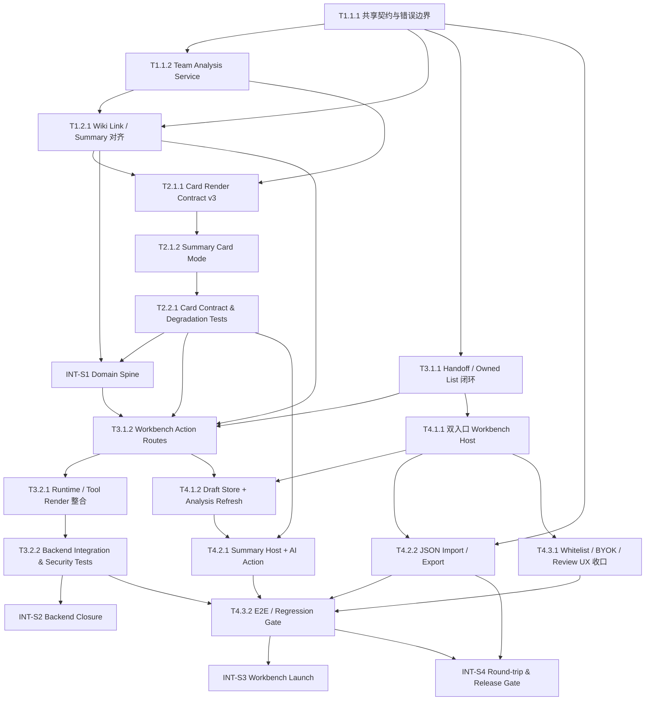

# 任务清单 (Task List)

> **生成来源**: `/blueprint`
> **目标版本**: `.anws/v3`
> **唯一事实源**: `.anws/v3/01_PRD.md`、`.anws/v3/02_ARCHITECTURE_OVERVIEW.md`、`.anws/v3/03_ADR/*.md`、`.anws/v3/04_SYSTEM_DESIGN/*.md`
> **规划原则**:
> - 验证驱动：每个任务必须有可执行验证说明
> - 需求追溯：每个任务关联 `[REQ-XXX]`
> - 适度粒度：每个 Level 3 任务控制在 2-8 小时
> - 冒烟测试默认仅收敛在 `INT-S{N}` 里程碑任务
>
> **说明**: 本清单以 v3 闭环交付为目标，聚焦当前代码基线下仍需完成或需要正式收口的任务，不重复拆分已明显完成的历史骨架性工作。

---

## 依赖图总览

---

## 📊 Sprint 路线图

| Sprint | 代号 | 核心任务 | 退出标准 | 预估 |
|--------|------|---------|---------|------|
| S1 | Domain Spine | `data-layer-system` + `spirit-card-system` 的 v3 共享契约、分析真理源与 Summary Card Mode 收口 | `analyze_team_draft()` 能返回稳定 `TeamAnalysisSnapshot`；`render_spirit_card(...summary_card)` 能返回 `summary_payload` 与 fallback；契约/降级验证通过 | 3-4d |
| S2 | Backend Closure | `agent-backend-system` 的 handoff、workbench action routes 与 runtime 集成收口 | `/v1/chat/completions`、`/v1/workbench/team-analysis`、`/v1/workbench/ai-review` 能对接 in-process domain services；session / quota / header / error mapping 通过 | 4-5d |
| S3 | Workbench Launch | `web-ui-system` 的双入口工作台、分析刷新、摘要宿主、AI 动作与白名单体验闭环 | 双入口可进入工作台；编辑后分析可刷新；summary / ai-review / wiki 深读 / import-export 可演示；关键路径 E2E 通过 | 4-5d |
| S4 | Round-trip Gate | JSON 回导、跨系统回放与发布门控验证 | Agent 生成队伍 → 进入工作台 → 编辑 → 导出 JSON → 再导入 → AI 分析 → Wiki 深读 全链路通过，且关键回归无破坏 | 3-4d |

---

## System 1: data-layer-system

### Phase 1: Foundation (基础契约)

- [x] **T1.1.1** [REQ-003]: 固化 v3 工作台共享契约在数据层的输入/输出边界
  - **描述**: 在 `data-layer-system` 中收口 `TeamDraft` 读取边界、`TeamAnalysisSnapshot` 输出结构、`TEAM_ANALYSIS_` 错误语义与 facade 对外契约，确保工作台、Agent 与摘要卡片围绕同一分析真理源演进。
  - **输入**: `.anws/v3/01_PRD.md` US-003 [REQ-003]；`.anws/v3/03_ADR/ADR_005_WORKBENCH_SHARED_CONTRACT.md` §决策；`.anws/v3/04_SYSTEM_DESIGN/data-layer-system.md` §5-§6
  - **输出**: `src/data_layer/app/contracts.py`、`src/data_layer/app/errors.py`、`src/data_layer/app/facade.py` 中的 v3 分析契约与错误边界
  - **📎 参考**: `ADR_005_WORKBENCH_SHARED_CONTRACT.md`；`data-layer-system.md` §6 数据模型
  - **验收标准**:
    - Given 合法 `TeamDraft` 输入，When 通过 facade 发起分析，Then 对外返回结构稳定的 `TeamAnalysisSnapshot`
    - Given 缺字段或无效草稿，When 发起分析，Then 返回 `TEAM_ANALYSIS_` 前缀的结构化错误，而不是裸异常
    - Given 工作台 UI 暂态字段混入输入，When 归一化处理，Then 只消费共享领域字段
  - **验证类型**: 单元测试
  - **验证说明**: 为 contracts / facade / error mapping 补充单测，验证合法输入、无效输入与错误前缀语义
  - **估时**: 6h
  - **依赖**: 无
  - **优先级**: P0

- [x] **T1.1.2** [REQ-003]: 实现 Team Analysis Service 与部分数据缺失降级逻辑
  - **描述**: 实现 `TeamDraft -> TeamAnalysisSnapshot` 的核心计算路径，输出攻向分布、攻击覆盖、防守侧重点、抗性较多、易被压制，并支持“可计算部分 + 不可用项”降级。
  - **输入**: `.anws/v3/01_PRD.md` US-003 [REQ-003]；`.anws/v3/02_ARCHITECTURE_OVERVIEW.md` §2 System 3；`.anws/v3/04_SYSTEM_DESIGN/data-layer-system.md` §4.2-§4.3、§5.1
  - **输出**: `src/data_layer/analysis/` 下的 `snapshot_builder.py`、`draft_normalizer.py`、相关 facade 接入与测试夹具
  - **📎 参考**: `ADR_001_TECH_STACK.md`；`data-layer-system.detail.md` §3
  - **验收标准**:
    - Given 有效单草稿，When 调用 `analyze_team_draft()`，Then 返回五类结构化分析区块
    - Given 队伍为空或成员不足，When 调用分析，Then 返回数据不足空状态而非误导性结论
    - Given 静态知识部分缺失，When 分析执行，Then 输出可计算部分并显式标记不可用项
  - **验证类型**: 集成测试
  - **验证说明**: 通过 in-process facade + 静态样本验证五类区块、空草稿和部分缺失三类场景
  - **估时**: 8h
  - **依赖**: T1.1.1
  - **优先级**: P0

### Phase 2: Integration (摘要与外链一致性)

- [x] **T1.2.1** [REQ-006]: 实现 Wiki 标识 / 深读链接与摘要字段对齐路径
  - **描述**: 让数据层输出的 Wiki 标识、`wiki_url`、摘要基础字段与工作台 summary / 外链深读保持同一命名解析结果，避免站内摘要和外链目标错位。
  - **输入**: `.anws/v3/01_PRD.md` US-006 [REQ-006]；`.anws/v3/02_ARCHITECTURE_OVERVIEW.md` §3.5 Shared Objects；`.anws/v3/04_SYSTEM_DESIGN/data-layer-system.md` §4.2、§5.1、§6
  - **输出**: `src/data_layer/analysis/wiki_link_resolver.py` 或等效模块；facade 对齐后的 spirit summary fields；相关测试
  - **📎 参考**: `data-layer-system.md` §5.2；`spirit-card-system.md` §5.3
  - **验收标准**:
    - Given 某只精灵存在站内摘要，When 生成 wiki 深读链接，Then 名称解析与摘要对象一致
    - Given Wiki 链接缺失或构造失败，When 请求摘要基础字段，Then 保留站内摘要字段并返回受控 `WIKI_LINK_` 失败语义
    - Given 重复请求同一对象，When 经过 facade，Then 命中缓存或等效复用路径
  - **验证类型**: 集成测试
  - **验证说明**: 使用固定样本验证 summary fields、wiki_url 一致性与失败降级路径
  - **估时**: 5h
  - **依赖**: T1.1.1, T1.1.2
  - **优先级**: P1

---

## System 2: spirit-card-system

### Phase 1: Core Components (统一渲染产物)

- [x] **T2.1.1** [REQ-006]: 扩展卡片渲染契约为 chat card / summary card 双模式
  - **描述**: 在 `spirit-card-system` 中收口 `RenderPolicy.render_target`、`RenderedSpiritCard.summary_payload` 与统一 metadata，确保聊天卡片与工作台摘要共享字段语义。
  - **输入**: `.anws/v3/01_PRD.md` US-006 [REQ-006]；`.anws/v3/02_ARCHITECTURE_OVERVIEW.md` §2 System 4；`.anws/v3/04_SYSTEM_DESIGN/spirit-card-system.md` §5-§6
  - **输出**: `src/spirit_card/app/contracts.py`、`src/spirit_card/app/facade.py`、`src/spirit_card/app/render_policy.py` 的 v3 render contract
  - **📎 参考**: `ADR_001_TECH_STACK.md`；`spirit-card-system.detail.md` §2-§3
  - **验收标准**:
    - Given `render_target=chat_card`，When 渲染，Then 返回 HTML + fallback + metadata
    - Given `render_target=summary_card`，When 渲染，Then 返回 `summary_payload` + fallback，并保持字段语义一致
    - Given 宿主条件不足，When 请求 summary mode，Then 仍可返回可读 fallback
  - **验证类型**: 单元测试
  - **验证说明**: 为 render policy / rendered result 增加单测，验证两种模式输出结构
  - **估时**: 5h
  - **依赖**: T1.1.2, T1.2.1
  - **优先级**: P1

- [x] **T2.1.2** [REQ-006]: 实现 Summary Card Mode 的展示字段、降级文本与 token 对齐
  - **描述**: 在不另起第二套展示协议的前提下，补齐工作台 summary payload 的字段选择、轻量视觉 token、fallback 与外链入口构造。
  - **输入**: `.anws/v3/01_PRD.md` US-006 [REQ-006]；`.anws/v3/04_SYSTEM_DESIGN/spirit-card-system.md` §4.2、§5.1、§7.2；T2.1.1 产出的 render contract
  - **输出**: `src/spirit_card/mapping/*`、`src/spirit_card/rendering/*`、`src/spirit_card/assets/inline_tokens.py` 中的 summary mode 实现
  - **📎 参考**: `spirit-card-system.md` §8.2-§8.5
  - **验收标准**:
    - Given 工作台摘要模式，When 渲染某只精灵，Then 返回 title、types、stats、skills、wiki link 等最小充分摘要字段
    - Given 图表或脚本增强不可用，When 渲染摘要，Then 不影响用户阅读关键字段
    - Given 同一精灵用于聊天卡片和工作台摘要，When 对比字段，Then 核心语义一致且不出现第二套命名
  - **验证类型**: 集成测试
  - **验证说明**: 使用结构化 spirit profile 样本验证 summary payload、fallback 和 token 输出
  - **估时**: 6h
  - **依赖**: T2.1.1
  - **优先级**: P1

### Phase 2: Polish (契约与降级验证)

- [x] **T2.2.1** [REQ-004]: 建立卡片渲染的契约测试与降级测试
  - **描述**: 为聊天 Rich UI 卡片与工作台 summary mode 建立合同测试、失败降级测试和渲染最小完整性检查。
  - **输入**: `.anws/v3/01_PRD.md` US-004 [REQ-004]；`.anws/v3/04_SYSTEM_DESIGN/spirit-card-system.md` §11；T2.1.1、T2.1.2 产出
  - **输出**: `tests/unit/`、`tests/integration/` 中与 `spirit_card` 相关的新增测试资产
  - **📎 参考**: `spirit-card-system.md` §11.2-§11.4
  - **验收标准**:
    - Given 合法结构化资料，When 渲染 chat card / summary card，Then `RenderedSpiritCard` 契约字段完整
    - Given HTML 渲染失败或脚本能力关闭，When 触发降级，Then fallback 文本仍可读
    - Given 工作台 summary mode，When 渲染，Then `summary_payload` 可被上游宿主直接消费
  - **验证类型**: 集成测试
  - **验证说明**: 运行 spirit-card unit/integration suite，验证 dual-mode render 与 degradation 行为
  - **估时**: 4h
  - **依赖**: T2.1.2
  - **优先级**: P1

- [x] **INT-S1** [MILESTONE]: S1 集成验证 — Domain Spine
  - **描述**: 验证 `data-layer-system` 与 `spirit-card-system` 已形成可复用的 v3 领域脊柱
  - **输入**: T1.1.1, T1.1.2, T1.2.1, T2.1.1, T2.1.2, T2.2.1 的产出
  - **输出**: `.anws/v3/INT_S1_VERIFICATION_REPORT.md`（新增或覆盖）
  - **验收标准**:
    - Given 数据层与卡片系统任务均完成，When 执行 TeamAnalysis + Summary Render 检查，Then `TeamAnalysisSnapshot` 与 `summary_payload` 都可稳定产出
    - Given 缺失部分静态知识或卡片增强能力，When 触发降级，Then 仍可输出可读 fallback
    - Given 同一精灵对象，When 同时用于摘要与外链构造，Then 名称解析与 Wiki 目标一致
  - **验证类型**: 集成测试
  - **验证说明**: 通过 in-process facade + renderer 逐条验证退出标准，并记录日志/截图证据
  - **估时**: 3h
  - **依赖**: T1.2.1, T2.2.1

---

## System 3: agent-backend-system

### Phase 1: Core Components (工作台动作后端)

- [x] **T3.1.1** [REQ-001]: 收口 handoff artifact 与已确认拥有列表的会话作用域闭环
  - **描述**: 完成 `WorkbenchHandOffPayload` 构造、`ConfirmedOwnedSpiritList` 的 chat-scope 写入/读取，以及后续推荐约束触发点，使聊天链路能稳定承接到工作台。
  - **输入**: `.anws/v3/01_PRD.md` US-001 [REQ-001], US-002 [REQ-002]；`.anws/v3/03_ADR/ADR_003_SESSION_MANAGEMENT.md`；`.anws/v3/04_SYSTEM_DESIGN/agent-backend-system.md` §5-§6
  - **输出**: `src/agent_backend/runtime/*`、`src/agent_backend/app/session_service.py`、相关 route/runtime adapters
  - **📎 参考**: `ADR_003_SESSION_MANAGEMENT.md`；`agent-backend-system.detail.md` §3.8-§3.10
  - **验收标准**:
    - Given Agent 输出可承接队伍，When 生成聊天结果，Then 响应中附带合法 `WorkbenchHandOffPayload`
    - Given 用户确认拥有列表，When 后续同会话继续推荐，Then 约束在当前 `user_id:chat_id` 内生效
    - Given 承接载荷缺失字段，When 尝试生成 artifact，Then 不返回伪造 payload
  - **验证类型**: 集成测试
  - **验证说明**: 使用会话夹具验证 handoff artifact、owned-list submit 与 follow-up recommendation 约束
  - **估时**: 6h
  - **依赖**: T1.1.1
  - **优先级**: P0

- [x] **T3.1.2** [REQ-004]: 实现 `/v1/workbench/team-analysis` 与 `/v1/workbench/ai-review` 工作台动作路由
  - **描述**: 为 `agent-backend-system` 增加受控 workbench action routes、请求归一化、session key 解析、data-layer / LLM 调用与结构化错误映射。
  - **输入**: `.anws/v3/01_PRD.md` US-003 [REQ-003], US-004 [REQ-004]；`.anws/v3/04_SYSTEM_DESIGN/agent-backend-system.md` §4.3、§5.1-§5.3；T1.2.1、T2.2.1、T3.1.1 产出
  - **输出**: `src/agent_backend/api/routes_workbench.py`、`schemas_workbench.py`、normalizer / formatter / client wiring
  - **📎 参考**: `agent-backend-system.detail.md` §3.11-§4.3
  - **验收标准**:
    - Given 合法 `TeamDraft`，When 调用 `/v1/workbench/team-analysis`，Then 返回结构化 `TeamAnalysisSnapshot`
    - Given 合法 `TeamDraft + TeamAnalysisSnapshot`，When 调用 `/v1/workbench/ai-review`，Then 返回结构化 AI 建议
    - Given 头部缺失、空草稿或上游失败，When 请求工作台动作，Then 返回受控 `TEAM_ANALYSIS_` / `TEAM_AI_` 错误
  - **验证类型**: 集成测试
  - **验证说明**: 新增 ASGI route tests，验证 team-analysis、ai-review 与 header/session 约束
  - **估时**: 8h
  - **依赖**: T1.2.1, T2.2.1, T3.1.1, INT-S1
  - **优先级**: P0

### Phase 2: Integration (运行时整合)

- [x] **T3.2.1** [REQ-004]: 把卡片渲染与工作台分析结果接入 Agent runtime / tool 响应
  - **描述**: 让 runtime 在资料查询和工作台路径中稳定消费 `spirit-card-system` 渲染结果与 `data-layer-system` 分析结果，输出聊天 Rich UI、summary 或 AI review 所需结构。
  - **输入**: `.anws/v3/01_PRD.md` US-004 [REQ-004], US-006 [REQ-006]；`.anws/v3/02_ARCHITECTURE_OVERVIEW.md` §4 关键闭环；T2.2.1、T3.1.2 产出
  - **输出**: `src/agent_backend/runtime/`、`src/agent_backend/integrations/` 中的 service wiring 与工具返回结构
  - **📎 参考**: `agent-backend-system.md` §4.3；`spirit-card-system.md` §5.3
  - **验收标准**:
    - Given 资料查询路径，When runtime 需要卡片，Then 可返回 `RenderedSpiritCard` 并保留 fallback
    - Given 工作台 AI review 路径，When runtime 收到分析快照，Then 使用已有快照而不是重复重算领域分析
    - Given 上游卡片或分析失败，When runtime 输出错误，Then 保持受控错误边界与草稿不丢失语义
  - **验证类型**: 集成测试
  - **验证说明**: 使用 fake runtime / in-process clients 验证 tool result、summary render 与 AI review 输入装配
  - **估时**: 6h
  - **依赖**: T3.1.2
  - **优先级**: P1

- [x] **T3.2.2** [REQ-001]: 建立后端关键路径的安全与集成测试门槛
  - **描述**: 为模型目录、Chat Completions、workbench actions、internal secret、header 转发、quota 与 session 隔离补齐集成/回归测试。
  - **输入**: `.anws/v3/03_ADR/ADR_003_SESSION_MANAGEMENT.md`；`.anws/v3/04_SYSTEM_DESIGN/agent-backend-system.md` §9-§11；T3.1.1、T3.1.2、T3.2.1 产出
  - **输出**: `tests/integration/test_agent_backend_routes.py` 及新增 workbench / security / quota 测试文件
  - **📎 参考**: `agent-backend-system.md` §11；`ADR_003_SESSION_MANAGEMENT.md`
  - **验收标准**:
    - Given 缺失或错误 internal secret，When 调用内部端点，Then 返回 403
    - Given 同一用户多个 chat_id，When 并行访问，Then session 不串写
    - Given workbench routes 调用，When data-layer / runtime 正常响应，Then HTTP / payload 与设计文档一致
  - **验证类型**: 集成测试
  - **验证说明**: 扩展 ASGI integration suite，覆盖安全头、组合 session key、workbench endpoints 与 quota
  - **估时**: 5h
  - **依赖**: T3.2.1
  - **优先级**: P0

- [x] **INT-S2** [MILESTONE]: S2 集成验证 — Backend Closure
  - **描述**: 验证 `agent-backend-system` 已能作为 v3 的内置轨道与工作台动作后端运行
  - **输入**: T3.1.1, T3.1.2, T3.2.1, T3.2.2 的产出
  - **输出**: `.anws/v3/INT_S2_VERIFICATION_REPORT.md`（新增或覆盖）
  - **验收标准**:
    - Given 后端任务已完成，When 执行 models / chat / confirmed-owned-list / team-analysis / ai-review 检查，Then 全部端点返回符合契约的响应
    - Given 安全头、session key 与 quota 被触发，When 执行负向验证，Then 失败模式与设计一致
    - Given handoff-ready 队伍，When 通过聊天路径生成结果，Then 可交给工作台承接
  - **验证类型**: 集成测试
  - **验证说明**: 基于 ASGI transport 逐条执行后端退出标准，输出通过/失败与 Bug 清单
  - **估时**: 3h
  - **依赖**: T3.2.2

---

## System 4: web-ui-system

### Phase 1: Core Components (工作台宿主)

- [x] **T4.1.1** [REQ-001]: 实现双入口 Team Workbench Host 与 handoff fallback 进入路径
  - **描述**: 在 `web-ui-system` 中实现侧边栏入口、聊天结果承接入口、空白草稿创建与 `HANDOFF_` 失败时的空草稿兜底。
  - **输入**: `.anws/v3/01_PRD.md` US-001 [REQ-001]；`.anws/v3/04_SYSTEM_DESIGN/web-ui-system.md` §4.2-§4.3、§5.1；T3.1.1 产出
  - **输出**: `src/web-ui-shell` 下的 workbench route / host / handoff hydration 相关前端模块
  - **📎 参考**: `web-ui-system.detail.md` §3.11；`ADR_004_WEB_UI_PRUNING_STRATEGY.md`
  - **验收标准**:
    - Given 用户点击侧边栏工作台入口，When 页面进入工作台，Then 创建或加载当前单草稿
    - Given 聊天结果包含合法 handoff payload，When 用户点击承接入口，Then 工作台加载该草稿
    - Given payload 缺失或损坏，When 承接失败，Then 提示错误并允许以空白草稿进入
  - **验证类型**: 手动验证
  - **验证说明**: 在本地壳层中验证侧边栏入口、hand-off 入口与空草稿 fallback；录屏保留证据
  - **估时**: 8h
  - **依赖**: T3.1.1
  - **优先级**: P0

- [x] **T4.1.2** [REQ-003]: 实现 TeamDraft Store、分析刷新编排与旧结果保护
  - **描述**: 实现工作台单草稿编辑态、分析刷新触发、loading / stale protection 与 `TeamAnalysisSnapshot` 回流展示，保证频繁编辑时以后一次有效结果为准。
  - **输入**: `.anws/v3/01_PRD.md` US-002 [REQ-002], US-003 [REQ-003]；`.anws/v3/04_SYSTEM_DESIGN/web-ui-system.md` §4.2、§5.1、§6；T4.1.1、T3.1.2 产出
  - **输出**: `src/web-ui-shell` 下的 draft store、analysis adapter、analysis view、local state guards
  - **📎 参考**: `web-ui-system.detail.md` §3.12-§3.13
  - **验收标准**:
    - Given 用户编辑精灵或技能，When 保存到当前草稿，Then UI 与草稿状态同步更新
    - Given 用户频繁连续编辑，When 多次刷新分析返回，Then 旧结果不会覆盖新草稿状态
    - Given 空草稿或数据不足，When 展示分析面板，Then 返回受控空状态而非误导性结论
  - **验证类型**: 集成测试
  - **验证说明**: 以前端 store + gateway mock 验证编辑、刷新、stale protection 与空状态
  - **估时**: 8h
  - **依赖**: T4.1.1, T3.1.2
  - **优先级**: P0

### Phase 2: Integration (摘要 / AI / 导入导出)

- [x] **T4.2.1** [REQ-004]: 实现 Summary Card Host、AI Action Bar 与 Wiki 深读交互
  - **描述**: 在工作台中接入 `summary_payload` 渲染宿主、AI 分析按钮、失败不丢草稿提示、Wiki 深读跳转与摘要区降级展示。
  - **输入**: `.anws/v3/01_PRD.md` US-004 [REQ-004], US-006 [REQ-006]；`.anws/v3/04_SYSTEM_DESIGN/web-ui-system.md` §4.2、§5.1；T2.2.1、T4.1.2 产出
  - **输出**: `src/web-ui-shell` 下的 summary host、ai action bar、wiki link UX、error states
  - **📎 参考**: `web-ui-system.md` §8.6；`spirit-card-system.md` §5.3
  - **验收标准**:
    - Given 当前精灵存在摘要信息，When 查看摘要区域，Then 渲染 summary card 或 fallback 文本
    - Given 用户点击 AI 分析评价与建议，When 请求返回成功或失败，Then 草稿保持不丢失并显示清晰状态
    - Given Wiki 链接缺失或失败，When 用户尝试深读，Then 保留站内摘要并给出受控提示
  - **验证类型**: 集成测试
  - **验证说明**: 通过前端宿主 + gateway mock 验证 summary render、ai action 与 wiki deep-read 三条路径
  - **估时**: 6h
  - **依赖**: T2.2.1, T4.1.2
  - **优先级**: P1

- [ ] **T4.2.2** [REQ-005]: 实现 JSON 主格式导入导出与 round-trip 校验 UX
  - **描述**: 按 ADR-005 为工作台实现 schemaVersion 校验、合法文件导入、非法文件拒绝、导出不含敏感信息与本地回放体验。
  - **输入**: `.anws/v3/01_PRD.md` US-005 [REQ-005]；`.anws/v3/03_ADR/ADR_005_WORKBENCH_SHARED_CONTRACT.md`；`.anws/v3/04_SYSTEM_DESIGN/web-ui-system.md` §5.1、§6
  - **输出**: `src/web-ui-shell` 下的 import/export parser、serializer、validation UX、本地持久化路径
  - **📎 参考**: `ADR_005_WORKBENCH_SHARED_CONTRACT.md`；`web-ui-system.detail.md` §3.15-§3.16
  - **验收标准**:
    - Given 当前草稿可导出，When 执行导出，Then JSON 含显式 `schemaVersion` 且不包含敏感运行时信息
    - Given 导入合法本产品导出文件，When 加载完成，Then 核心字段 round-trip 成功
    - Given 非法 schema / 缺字段文件，When 导入，Then 明确拒绝并提示具体原因
  - **验证类型**: 集成测试
  - **验证说明**: 使用 golden sample 和负向 sample 验证 round-trip、版本校验与错误提示
  - **估时**: 6h
  - **依赖**: T1.1.1, T4.1.1
  - **优先级**: P1

### Phase 3: Polish (白名单与发布门槛)

- [ ] **T4.3.1** [REQ-001]: 收口 whitelist、BYOK 差异提示与 recognition review UX
  - **描述**: 对齐 VisibleFeaturePolicy、内置/BYOK 轨道路由提示、截图识别 review 与“当前推荐基于已确认拥有列表”会话提示，使工作台与聊天主路径都符合受控壳层约束。
  - **输入**: `.anws/v3/03_ADR/ADR_004_WEB_UI_PRUNING_STRATEGY.md`；`.anws/v3/04_SYSTEM_DESIGN/web-ui-system.md` §1.3、§4.2、§8.7、§11；T4.1.1 产出
  - **输出**: `src/web-ui-shell/guards/feature-whitelist/*`、route selector / recognition review / byok UX 收口实现
  - **📎 参考**: `ADR_004_WEB_UI_PRUNING_STRATEGY.md`
  - **验收标准**:
    - Given 终端用户主路径，When 浏览导航与设置，Then 非白名单能力不可见、不可达、不可误触
    - Given 用户切换内置轨道 / BYOK 轨道，When 能力不完整，Then UI 明确展示差异，不静默承诺完整闭环
    - Given 截图识别候选待确认，When 用户确认后继续推荐，Then 会话提示与 owned-list 约束状态一致
  - **验证类型**: 回归测试
  - **验证说明**: 运行白名单快照/对比测试，并手动复验 BYOK / recognition review 提示文案与状态
  - **估时**: 5h
  - **依赖**: T4.1.1
  - **优先级**: P1

- [ ] **T4.3.2** [REQ-001]: 建立工作台关键路径 E2E / 回归测试门槛
  - **描述**: 为双入口进入、编辑刷新、summary / ai-review、JSON round-trip 与 whitelist regression 建立最小但足够的 E2E / 回归测试集。
  - **输入**: `.anws/v3/01_PRD.md` §8 Definition of Done；`.anws/v3/04_SYSTEM_DESIGN/web-ui-system.md` §11；T3.2.2、T4.2.1、T4.2.2、T4.3.1 产出
  - **输出**: `tests/e2e/` 与必要的 smoke / regression assets
  - **📎 参考**: `web-ui-system.md` §11.2；`ADR_004_WEB_UI_PRUNING_STRATEGY.md`
  - **验收标准**:
    - Given 侧边栏入口与 handoff 入口，When 执行关键路径 E2E，Then 两条入口都能进入工作台
    - Given 工作台编辑、摘要、AI 按钮、导入导出，When 执行回归集，Then 关键闭环全部通过
    - Given Open WebUI 升级或壳层变更，When 比对白名单基线，Then 禁止入口未重新暴露
  - **验证类型**: E2E测试
  - **验证说明**: 执行 Playwright 或等效 E2E 场景；输出截图/录屏/失败日志
  - **估时**: 8h
  - **依赖**: T3.2.2, T4.2.1, T4.2.2, T4.3.1
  - **优先级**: P0

- [ ] **INT-S3** [MILESTONE]: S3 集成验证 — Workbench Launch
  - **描述**: 验证工作台主路径已具备可演示的产品闭环
  - **输入**: T4.1.1, T4.1.2, T4.2.1, T4.3.1, T4.3.2 的产出
  - **输出**: `.anws/v3/INT_S3_VERIFICATION_REPORT.md`（新增或覆盖）
  - **验收标准**:
    - Given 用户从侧边栏或 handoff 入口进入，When 进入工作台，Then 单草稿宿主可用且不会因错误丢草稿
    - Given 用户编辑草稿、查看摘要、触发 AI 分析，When 执行完整操作，Then UI 状态、错误提示与分析结果符合设计
    - Given 白名单与 BYOK 差异策略，When 运行关键回归，Then 终端用户主路径保持受控
  - **验证类型**: 冒烟测试
  - **验证说明**: 在本地演示环境按退出标准逐条操作，辅以最小 E2E 回归与截图证据
  - **估时**: 4h
  - **依赖**: T4.3.2

- [ ] **INT-S4** [MILESTONE]: S4 集成验证 — Round-trip & Release Gate
  - **描述**: 验证导入导出、AI 分析与 Wiki 深读形成最终发布门槛闭环
  - **输入**: T4.2.2, T4.3.2, INT-S3 的产出
  - **输出**: `.anws/v3/INT_S4_VERIFICATION_REPORT.md`（新增或覆盖）
  - **验收标准**:
    - Given Agent 生成 handoff-ready 队伍，When 用户进入工作台、编辑、导出、再导入并触发 AI 分析，Then 全链路通过且核心字段不丢失
    - Given 工作台摘要与 Wiki 深读，When 用户查看并跳转，Then 站内摘要对象与外链目标一致
    - Given 发布前回归检查，When 执行关键路径验证，Then 无 blocker 级问题且记录完整验证报告
  - **验证类型**: 冒烟测试
  - **验证说明**: 以真实演示路径执行 round-trip / ai-review / wiki deep-read，并记录日志、截图与 Bug 清单
  - **估时**: 4h
  - **依赖**: T4.2.2, T4.3.2, INT-S3

---

## 🎯 User Story Overlay

### US-001: 双入口进入配队工作台 [REQ-001] (P0)
**涉及任务**: T3.1.1 → T4.1.1 → T4.3.1 → T4.3.2 → INT-S3  
**关键路径**: T3.1.1 → T4.1.1 → T4.3.2  
**独立可测**: ✅ S3 结束即可演示  
**覆盖状态**: ✅ 完整

### US-002: 单草稿编辑精灵、技能与分析视角 [REQ-002] (P0)
**涉及任务**: T1.1.1 → T1.1.2 → T3.1.1 → T4.1.2 → T4.3.2 → INT-S3  
**关键路径**: T1.1.1 → T1.1.2 → T4.1.2  
**独立可测**: ✅ S3 结束即可演示  
**覆盖状态**: ✅ 完整

### US-003: 结构化队伍分析视图 [REQ-003] (P0)
**涉及任务**: T1.1.1 → T1.1.2 → T1.2.1 → T3.1.2 → T4.1.2 → T4.3.2 → INT-S3  
**关键路径**: T1.1.2 → T3.1.2 → T4.1.2  
**独立可测**: ✅ S3 结束即可演示  
**覆盖状态**: ✅ 完整

### US-004: 工作台内发起 AI 分析评价与建议 [REQ-004] (P1)
**涉及任务**: T2.1.1 → T2.2.1 → T3.1.2 → T3.2.1 → T4.2.1 → T4.3.2 → INT-S3  
**关键路径**: T3.1.2 → T3.2.1 → T4.2.1  
**独立可测**: ✅ S3 结束即可演示  
**覆盖状态**: ✅ 完整

### US-005: 队伍配置 JSON 导入导出 [REQ-005] (P1)
**涉及任务**: T1.1.1 → T3.1.1 → T4.2.2 → T4.3.2 → INT-S4  
**关键路径**: T1.1.1 → T4.2.2 → INT-S4  
**独立可测**: ✅ S4 结束即可演示  
**覆盖状态**: ✅ 完整

### US-006: 站内卡片摘要与外链 Wiki 深读 [REQ-006] (P1)
**涉及任务**: T1.2.1 → T2.1.1 → T2.1.2 → T2.2.1 → T3.2.1 → T4.2.1 → INT-S4  
**关键路径**: T1.2.1 → T2.1.2 → T4.2.1  
**独立可测**: ✅ S3 结束可演示，S4 完成发布门槛验证  
**覆盖状态**: ✅ 完整

---

## 📊 任务统计

- **总任务数**: 20
- **P0 任务**: 7
- **P1 任务**: 9
- **P2 任务**: 0
- **里程碑任务**: 4
- **总预估工时**: 110h
- **Sprint 数**: 4
- **Wave 1 建议**: `T1.1.1`, `T1.1.2`, `T2.1.1`

---

## 下一步行动

1. 先执行 **Wave 1**：收口共享契约、队伍分析真理源与 Summary Card Mode
2. 每完成一个任务，更新勾选状态并立即运行对应验证
3. 每个 Sprint 必须经过 `INT-S{N}` 集成验证后才能结案
4. `INT-S4` 通过后再进入正式 `/forge` 的连续编码波次
